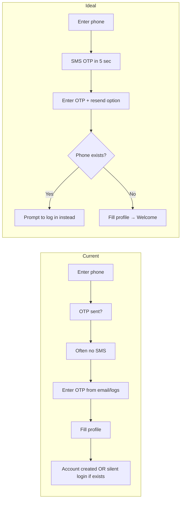
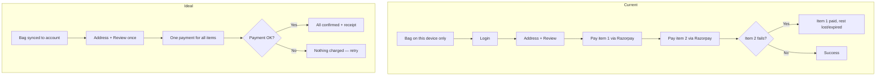
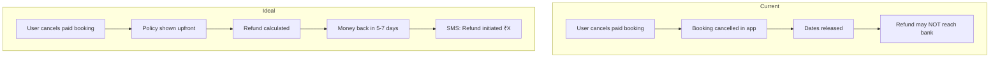

# Closiq — User Flow Gap Analysis

> **Purpose:** This document describes how Closiq works today from a **user's perspective**, how it **should** work for a smooth rental experience, and the **gaps** between the two. No technical/code detail — only what people see, do, and what breaks.

---

## Executive Summary

Closiq is a designer clothing **rental marketplace**. Users browse outfits, pick rental dates, pay (rent + deposit), receive delivery, optionally try at home, wear for the rental period, and return. Sellers list inventory; admins manage the platform.

**What works well today:** Browsing products, wishlist, account profile, rental booking with date selection, Razorpay payment, order tracking pages, seller dashboard basics, and admin oversight exist end-to-end.

**What hurts users most:**

| Priority | Gap | Who is affected |
| -------- | --- | --------------- |
| Critical | OTP arrives via server logs / email only — **no SMS** in production | Every new user |
| Critical | Suspended accounts can still log in via OTP | Blocked users |
| Critical | Paying for one item in a multi-item bag can succeed while others fail | Shoppers with multiple rentals |
| Critical | Cancelling a paid booking may not trigger a real money refund | Customers & sellers |
| High | Registering with an existing phone number silently logs you in instead of saying "account exists" | New sign-ups |
| High | Changing email does not require re-verification | Account holders |
| High | Password reset does not sign out other devices | Anyone resetting password |
| High | No dedicated "Resend OTP" — user must restart the flow | Anyone on OTP screens |

---

# Part 1 — Customer Journeys

---

## 1. Sign Up (New Customer)

### Current Flow — What the user experiences

```text
1. User opens Sign Up
2. Enters Indian mobile number (+91), optional email, accepts terms
3. Taps Continue → sees "OTP sent" screen
4. In reality:
   - If email was provided → OTP may arrive by email (if mail is enabled)
   - SMS is NOT sent — the OTP only appears in server logs (invisible to user)
5. User enters 6-digit OTP
6. User fills profile: username, password, name, gender
7. Account is created → user lands logged in
8. Optional welcome email may be sent
```

**Edge cases today:**

| Situation | What happens |
| --------- | -------------- |
| Phone already registered | Sign-up still sends OTP; after verification user is **logged into existing account** — no message saying "you already have an account" |
| Wrong OTP | Error; after 5 wrong tries, locked for 15 minutes |
| OTP expires (5 min) | Must go back and request again (by re-submitting sign-up) |
| No email provided | User has **no reliable way** to receive OTP unless SMS works |
| Username already taken | Error only at OTP step (after OTP already consumed) |

### Ideal Flow — What the user should experience

```text
1. Enter phone + accept terms
2. Receive OTP instantly on phone via SMS (email as backup only)
3. Clear message: "Code sent to +91 XXXXXX1234"
4. Enter OTP within 5 minutes
5. If phone already registered → "Account exists — log in instead?" (not silent login)
6. Complete profile once
7. Welcome message + land on home or onboarding
8. Resend OTP button with visible countdown (e.g. "Resend in 60s", max 3 resends)
```

### Gaps

| Gap | Current | Ideal | Severity |
| --- | ------- | ----- | -------- |
| No SMS delivery | OTP not received on phone | SMS always works | **Critical** |
| Silent duplicate registration | Existing phone → logs in without explanation | Clear "account exists" prompt | High |
| No resend button | Must restart entire sign-up | Dedicated resend with cooldown | High |
| OTP only after profile fields staged | User may waste time if username taken at end | Check username/email earlier OR validate before OTP | Medium |
| Email not verified at sign-up | Email stored but never confirmed | Optional verify-email step | Medium |

---

## 2. Log In

### Current Flow

**Option A — OTP login**

```text
1. Enter phone or email on Login
2. OTP sent (same SMS gap as sign-up)
3. Enter OTP → logged in
4. Suspended accounts CAN still log in via OTP
```

**Option B — Password login**

```text
1. Enter phone/email/username + password
2. If account is suspended → login blocked
3. Logged in immediately (no OTP step)
```

### Ideal Flow

```text
1. User chooses OTP or password
2. OTP always arrives on registered phone within seconds
3. Suspended/deleted accounts cannot log in by any method — clear message why
4. "Forgot password?" link always visible on password tab
5. After login → return to page user came from (e.g. checkout)
```

### Gaps

| Gap | Current | Ideal | Severity |
| --- | ------- | ----- | -------- |
| OTP delivery | Unreliable (no SMS) | Reliable SMS | **Critical** |
| Suspended account via OTP | Can still log in | Blocked with reason | **Critical** |
| Inconsistent rules | Password login respects suspension; OTP does not | Same rules for all login methods | **Critical** |
| Login identifier confusion | Email login sends OTP to phone, not email | Clear copy: "We'll text your phone" | Medium |

---

## 3. Forgot / Reset Password

### Current Flow

```text
1. User taps Forgot Password
2. Enters phone or email
3. If account exists → OTP sent (same delivery gap)
4. If account does NOT exist → "No account found" (reveals whether number is registered)
5. User enters OTP + new password on Reset screen
6. Logged in on this device
7. Other devices/browsers may STILL be logged in
```

**Note:** A "reset link by email" path exists in the product design but tokens are never actually emailed — only OTP works today.

### Ideal Flow

```text
1. Enter phone or email
2. Always show same message whether account exists or not ("If an account exists, we'll send instructions")
3. OTP via SMS (or secure email link)
4. Set new password
5. ALL other sessions signed out automatically
6. Confirmation: "Password updated — other devices signed out"
```

### Gaps

| Gap | Current | Ideal | Severity |
| --- | ------- | ----- | -------- |
| Account enumeration | "No account found" on unknown phone/email | Generic message always | Medium |
| Other sessions stay active | Only current device gets new session | All devices logged out | High |
| Email reset link | Not actually sent | Working email link option | Low |
| OTP delivery | Same SMS gap | SMS works | **Critical** |

---

## 4. Profile & Account Settings

### Current Flow

```text
View profile:
  - Name, email, phone, gender, avatar, size preferences, roles (customer/seller)

Update profile (self-service):
  - Can change: name, gender, email, alternate phone/email, avatar URL, shopping preferences
  - Cannot change: phone number, username, password (separate flows)

Email change:
  - User sets new email → saved immediately
  - Email marked "unverified" but no verification step follows
  - User never gets a "verified" badge through any flow

Delete account:
  - User can delete own account (not if admin)
  - Soft delete — account marked deleted, sessions revoked
```

### Ideal Flow

```text
- Change phone → OTP to old AND new number
- Change email → verification link/OTP before switch is final
- Change password → from settings, signs out other devices
- Username change → once, or never (clear policy)
- Avatar → upload with preview, not paste URL
- Delete account → confirm + explain active bookings impact
```

### Gaps

| Gap | Current | Ideal | Severity |
| --- | ------- | ----- | -------- |
| Phone number locked | Cannot update phone | OTP-verified phone change | High |
| Email change unverified | Saved without proof user owns it | Verify before applying | High |
| Email never marked verified | No path to "verified email" | Verification flow exists | Medium |
| Avatar via URL string | User pastes link | Proper image upload | Low |
| Delete with active bookings | Unclear what happens to rentals | Clear policy + block or warn | Medium |

---

## 5. Browse, Search & Discover

### Current Flow

```text
1. Home → featured, trending, recommendations (personalised if logged in)
2. Browse by category / occasion / audience (men, women, kids)
3. Search & filters (size, price, dates, etc.)
4. Product detail → images, reviews, rental price per day, deposit, min/max rental days
5. Pick size/variant + rental dates
6. Check availability for selected dates
7. Add to Bag OR Add to Wishlist
```

**No login required to browse.**

### Ideal Flow

Same as current — this area is largely complete for a rental shopper.

### Gaps

| Gap | Current | Ideal | Severity |
| --- | ------- | ----- | -------- |
| Availability shown but bag not synced | Dates picked on product page; bag is separate | Dates carry through consistently | Low |
| Out-of-stock after adding to bag | User may only discover at checkout | Real-time "no longer available" in bag | Medium |

---

## 6. Wishlist

### Current Flow

```text
1. Heart icon on product → added to wishlist (login required)
2. Wishlist page shows saved products
3. Remove item → gone
4. Max 100 items
5. Duplicate add → error "already in wishlist"
6. If product deleted/unpublished → item may show stale data
```

### Ideal Flow

Same core flow + notify when wishlisted item becomes available for user's dates or drops in price.

### Gaps

| Gap | Current | Ideal | Severity |
| --- | ------- | ----- | -------- |
| No availability alerts | Passive list only | "Available for your dates" notification | Low |
| Stale products | May linger if product removed | Auto-remove or "unavailable" label | Low |

**Overall wishlist status: Implemented — minor gaps only.**

---

## 7. Bag (Cart) & Checkout

### Current Flow

```text
Bag (local to this browser/device):
1. Add items from product pages with dates & size
2. Bag page → review items, edit dates
3. Login required to proceed (redirect back after login)

Checkout steps:
  Address → Review → Payment → Success

Address:
  - Select saved address or add new
  - Pincode must be serviceable for delivery

Review:
  - See rental breakdown (rent + deposit + delivery − coupon)
  - Apply coupon (optional)

Payment:
  - For EACH item in bag separately:
    a. System holds that item for ~15 minutes
    b. Razorpay payment window opens
    c. User pays
    d. Next item → repeat
  - If payment fails on item 2 of 3 → item 1 already paid, others may expire

Success:
  - Shows order/rental number
  - Bag cleared
```

**Important:** There is **no server-side cart**. Bag lives in browser storage — clearing browser data or switching devices loses the bag.

### Ideal Flow

```text
1. Bag syncs to account (works across phone & laptop)
2. Single checkout for all items:
   - One combined payment OR clear "pay per item" UX with progress
3. If any payment fails → nothing charged OR automatic refund of partial payments
4. Hold timer shown: "Complete payment in 14:32"
5. Address + coupon applied once for whole order
6. Failed checkout page (not just toast error)
7. Guest can calculate price; login only at payment
```

### Gaps

| Gap | Current | Ideal | Severity |
| --- | ------- | ----- | -------- |
| Bag not saved to account | Lost on new device / cleared browser | Synced cart | High |
| Multi-item partial payment | Can pay for 1 of 3 and fail on rest | All-or-one payment or auto-refund | **Critical** |
| Separate Razorpay popup per item | Confusing, slow | One payment for full bag | **Critical** |
| No checkout failure page | Toast error only | Dedicated retry page | Medium |
| 15-min hold not prominent | User may not know urgency | Visible countdown | Medium |
| Coupon on multi-item | Only first item gets coupon | Coupon applies to whole order | Medium |

---

## 8. Payment

### Current Flow

```text
1. User completes Razorpay (UPI/card/netbanking/wallet)
2. App verifies payment with Razorpay signature on server
3. Booking status → Confirmed
4. Seller notified of new booking
5. User sees success page with order number

If verification fails:
  - Payment marked failed
  - Booking stays "awaiting payment" until 15-min hold expires
  - Hold expires → booking auto-cancelled, dates released

Stub/test mode:
  - Default config may use test payment — real money not charged in dev
```

### Ideal Flow

```text
1. User pays once, sees clear receipt (rent + deposit breakdown)
2. Instant confirmation + email/SMS receipt
3. If payment pending → clear "complete payment" state in Orders
4. Refunds always return to original payment method
5. Deposit refund timeline shown after return
```

### Gaps

| Gap | Current | Ideal | Severity |
| --- | ------- | ----- | -------- |
| No payment receipt email/SMS | In-app only | Email/SMS receipt | Medium |
| Refunds not processed to bank | Refund "initiated" in system only — money may not move | Real refund to UPI/card | **Critical** |
| No payment failure page | User stuck on payment step | Retry or cancel with guidance | Medium |
| Test mode in production risk | Misconfiguration could fake payments | Production always uses live gateway | High (ops) |

---

## 9. My Orders / Rentals (After Purchase)

### Current Flow

```text
Orders page lists bookings by status:
  - Active, Upcoming, History, Returns

Each order shows:
  - Rental dates, product, amounts, timeline of events
  - Track delivery (when shipment exists)
  - Trial accept/reject (if product includes home trial)
  - Request return pickup

Cancel:
  - Before payment / while awaiting payment → can cancel freely
  - After confirmed → can cancel, inventory released
  - BUT: no automatic money refund to customer on cancel
```

### Ideal Flow

```text
1. Clear status pipeline: Confirmed → Seller preparing → Out for delivery → Delivered → Trial → Active rental → Return scheduled → Completed
2. Cancel before dispatch → full refund policy shown upfront
3. Cancel after dispatch → partial refund rules
4. Return → deposit refund timeline (e.g. "5–7 business days after inspection")
5. Push/email at each status change
6. Download invoice
```

### Gaps

| Gap | Current | Ideal | Severity |
| --- | ------- | ----- | -------- |
| Customer cancel after payment | No refund processed | Refund per cancellation policy | **Critical** |
| Deposit refund | Shown in UI conceptually; actual refund path unclear | Guaranteed deposit return flow | High |
| Status notifications | In-app notifications exist; SMS/email limited | SMS/email for key milestones | Medium |
| Invoice download | Not evident | PDF invoice | Low |

---

## 10. Home Trial Flow

### Current Flow

```text
(For products that include trial)

1. Item delivered → user notified "trial ready"
2. User can Accept trial → rental period starts
3. User can Reject trial → return initiated, booking cancelled path
4. Trial window is time-limited (product-specific duration)
```

### Ideal Flow

```text
1. Agent arrives → user tries outfit at door
2. Clear timer: "Accept within 30 minutes"
3. Reject → instant return pickup scheduled, deposit/rent refund policy shown
4. Accept → rental dates confirmed with confirmation message
```

### Gaps

| Gap | Current | Ideal | Severity |
| --- | ------- | ----- | -------- |
| Reject refund | Return initiated; refund handling same gap as cancel | Clear refund on reject | High |
| Trial timer visibility | Backend has duration; UX may not show countdown | Visible countdown to user | Medium |

---

## 11. Returns

### Current Flow

```text
1. User requests return pickup from order detail
2. Return scheduled notification
3. Logistics tracking (Shadowfax integration — largely stub/test)
4. After return → deposit refund notification may fire
```

### Ideal Flow

```text
1. One-tap "Schedule return" with date picker
2. Pickup tracking like delivery
3. Inspection status → deposit refunded or partial deduction with reason
4. User sees refund in bank within stated SLA
```

### Gaps

| Gap | Current | Ideal | Severity |
| --- | ------- | ----- | -------- |
| Real logistics tracking | Stub provider in default setup | Live courier tracking | High |
| Deposit refund to bank | Notification only; actual refund uncertain | Money returned | **Critical** |
| Damage/charge communication | Not clear in user flow | Itemised deduction if any | Medium |

---

## 12. Notifications (Customer)

### Current Flow

```text
In-app notification bell:
  - Booking confirmed, out for delivery, trial ready, return scheduled, deposit refunded, etc.
  - Mark read / mark all read

Email:
  - OTP, welcome email (if mail enabled)
  - No order confirmation email evident

SMS:
  - Not sent (OTP logged only)
```

### Ideal Flow

```text
- OTP always SMS
- Order confirmed → SMS + email
- Out for delivery → SMS with tracking link
- Return reminder before rental end date
- User controls preferences (SMS/email/push) — settings page exists partially
```

### Gaps

| Gap | Current | Ideal | Severity |
| --- | ------- | ----- | -------- |
| SMS | Not working | All critical events via SMS | **Critical** |
| Order emails | Missing | Confirmation + receipt emails | High |
| Rental ending reminder | Not evident | "Return due in 2 days" | Medium |

---

# Part 2 — Seller Journeys

---

## 13. Become a Seller

### Current Flow

```text
1. Logged-in user → "Become a seller"
2. Submit application (business details, GST/PAN, etc.)
3. Upload KYC documents (presigned upload flow)
4. Wait for admin approval
5. On approval → seller role + seller dashboard unlocked
```

### Ideal Flow

Same, with clear status: Submitted → Under review → Approved/Rejected with reason.

### Gaps

| Gap | Current | Ideal | Severity |
| --- | ------- | ----- | -------- |
| Rejection feedback | Admin can reject; user should see reason | Clear rejection reason + reapply | Medium |
| Application status UX | Backend tracks status | Prominent status on seller apply page | Low |

**Overall: Largely implemented.**

---

## 14. Seller — List & Manage Products

### Current Flow

```text
1. Create product (draft) → title, category, pricing, rental rules, images
2. Upload images via upload URL flow
3. Publish when ready → product goes live
4. Edit / unpublish / delete (delete blocked if future bookings exist)
5. Manage inventory per variant (stock units, blocks for maintenance)
```

### Ideal Flow

Same + bulk upload, duplicate product, preview as customer sees it.

### Gaps

| Gap | Current | Ideal | Severity |
| --- | ------- | ----- | -------- |
| Category management | Categories are fixed (seed data) — seller picks from list | Admin can add categories | Low (ops) |
| Image upload failures | If upload succeeds but save fails, orphan images possible | Retry + clear error | Medium |

**Overall: Core seller product flow works.**

---

## 15. Seller — Manage Bookings

### Current Flow

```text
1. New booking notification when customer pays
2. Seller accepts (with prep time estimate) OR rejects
3. Reject → booking cancelled, refund marked "pending" in system (may not reach customer's bank)
4. Mark ready for pickup → triggers logistics
5. View booking history & earnings summary
```

### Ideal Flow

```text
1. 24-hour SLA to accept (config exists) — user sees countdown
2. Reject only with valid reason → customer refunded automatically within X days
3. Accept → clear prep checklist
4. Earnings credited to wallet after rental completes
5. Payout to bank on request
```

### Gaps

| Gap | Current | Ideal | Severity |
| --- | ------- | ----- | -------- |
| Reject → customer refund | System records refund; money may not move | Customer gets money back | **Critical** |
| Accept SLA visibility | 24h SLA in config | Seller sees "Respond in 18h" | Medium |
| Wallet payout | Payout request exists | Clear payout timeline | Low |

---

## 16. Seller — Wallet & Payouts

### Current Flow

```text
1. Wallet shows available / pending / earned / withdrawn balances
2. Seller adds bank account
3. Requests payout → status tracked
4. Notification when payout initiated
```

### Ideal Flow

Same + payout history with UTR/reference, TDS info if applicable.

### Gaps

| Gap | Current | Ideal | Severity |
| --- | ------- | ----- | -------- |
| Payout to bank | Request created; actual transfer unclear in user flow | Confirmed bank credit with reference | Medium |

---

# Part 3 — Admin Journeys

---

## 17. Admin — User Management

### Current Flow

```text
1. List users (filter by status)
2. View user detail
3. Create user manually (no OTP — admin sets phone/name)
4. Suspend / change roles / soft-delete
5. Cannot suspend self or remove own admin role
```

### Ideal Flow

Same + audit log of admin actions, force logout on suspend.

### Gaps

| Gap | Current | Ideal | Severity |
| --- | ------- | ----- | -------- |
| Suspend does not kick user out | Suspended user may still use app if logged in via OTP | Immediate session termination | **Critical** |
| Force logout | Not available | "Sign out all devices" for any user | High |

---

## 18. Admin — Products, Reviews, Seller Applications

### Current Flow

```text
Products: list, patch status, delete
Reviews: list, moderate (approve/hide), delete
Seller applications: list, approve, reject
Dashboard: user counts, suspended count, etc.
```

### Ideal Flow

Same — adequate for MVP admin ops.

### Gaps

| Gap | Current | Ideal | Severity |
| --- | ------- | ----- | -------- |
| Category CRUD | Not in admin UI | Manage categories | Low |
| Refund oversight | No admin view of stuck refunds | Refund queue dashboard | High |

---

# Part 4 — Cross-Cutting User Concerns

---

## 19. Trust & Security (User-Facing)

| Concern | Current user experience | Ideal |
| ------- | ---------------------- | ----- |
| OTP privacy | OTP may appear in server logs | OTP never exposed outside user's phone |
| Session after password change | Old devices stay logged in | All devices signed out |
| Suspended account | May still access app via OTP | "Account suspended — contact support" |
| Payment security | Razorpay handles card/UPI; server verifies | Same — this part is good |

---

## 20. What Does NOT Exist (User-Facing)

These flows are **not available** to users today — not gaps in a broken flow, but **missing features**:

| Feature | Status |
| ------- | ------ |
| Server-synced shopping cart | Missing — bag is browser-only |
| SMS notifications | Missing |
| Real-time courier tracking (production) | Missing / stub |
| Email order confirmations | Missing |
| Phone number change | Missing |
| Email verification step | Missing |
| Dedicated OTP resend button | Missing |
| Checkout failure page | Missing |
| Payment methods saved on file | Placeholder page only |
| Deposits wallet (customer) | Placeholder page only |

---

# Part 5 — Journey Diagrams (User View)

## Sign Up — Current vs Ideal



## Checkout — Current vs Ideal



## Cancel / Refund — Current vs Ideal



---

# Part 6 — Priority Gap List (User Impact)

## P0 — Must fix before real users

| # | User-visible problem | Affected journey |
| - | -------------------- | ---------------- |
| 1 | OTP not received on phone (no SMS) | Sign up, Login, Reset password |
| 2 | Suspended users can still log in (OTP) | Login, Trust |
| 3 | Multi-item checkout can charge for some items but not all | Bag / Checkout |
| 4 | Cancelling or seller-rejecting paid booking does not reliably return money | Orders / Refunds |
| 5 | Admin suspend does not lock user out immediately | Admin / Trust |

## P1 — High impact on experience

| # | User-visible problem | Affected journey |
| - | -------------------- | ---------------- |
| 6 | Bag lost when switching device or clearing browser | Bag |
| 7 | Register with existing phone silently logs in | Sign up |
| 8 | Email changed without verification | Profile |
| 9 | Password reset leaves other devices logged in | Security |
| 10 | No order confirmation email/SMS | Payment / Orders |
| 11 | No real delivery tracking in production | Orders / Returns |
| 12 | 15-minute payment hold not clearly shown | Checkout |

## P2 — Polish & edge cases

| # | User-visible problem | Affected journey |
| - | -------------------- | ---------------- |
| 13 | No OTP resend button | Sign up / Login |
| 14 | No checkout failure page | Checkout |
| 15 | Coupon only on first bag item | Checkout |
| 16 | Username taken only after OTP wasted | Sign up |
| 17 | Placeholder pages (payment methods, deposits) | Account |

## P3 — Nice to have

| # | User-visible problem | Affected journey |
| - | -------------------- | ---------------- |
| 18 | Wishlist price/availability alerts | Wishlist |
| 19 | Admin category management | Seller / Admin |
| 20 | Invoice download | Orders |

---

# Part 7 — Flow Status Summary

| User journey | Works end-to-end? | Biggest user-facing gap |
| ------------ | ----------------- | ------------------------ |
| Browse & search products | Yes | Minor — stale availability in bag |
| Sign up | Partial | No SMS OTP |
| Log in | Partial | No SMS; suspended bypass via OTP |
| Reset password | Partial | No SMS; sessions stay alive |
| Profile update | Partial | Email unverified; can't change phone |
| Wishlist | Yes | Minor |
| Bag / cart | Partial | Device-only; multi-pay risk |
| Checkout & pay | Partial | Per-item payment; partial failure |
| Order tracking | Partial | Logistics stub; refund unclear |
| Cancel booking | Partial | No reliable refund |
| Trial accept/reject | Yes | Refund on reject unclear |
| Return pickup | Partial | Tracking + deposit refund unclear |
| Become a seller | Yes | Rejection UX |
| Seller products | Yes | Minor upload edge cases |
| Seller bookings | Partial | Reject refund to customer |
| Seller wallet | Partial | Payout confirmation |
| Admin users | Partial | Suspend doesn't lock out |
| Notifications | Partial | In-app OK; SMS/email weak |

---

*Document focus: user journeys only. For implementation-level traceability, a separate engineering audit can map each gap to backend/frontend behavior.*
