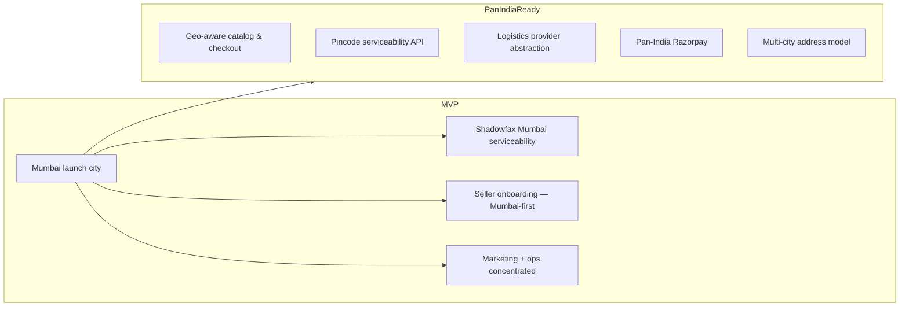
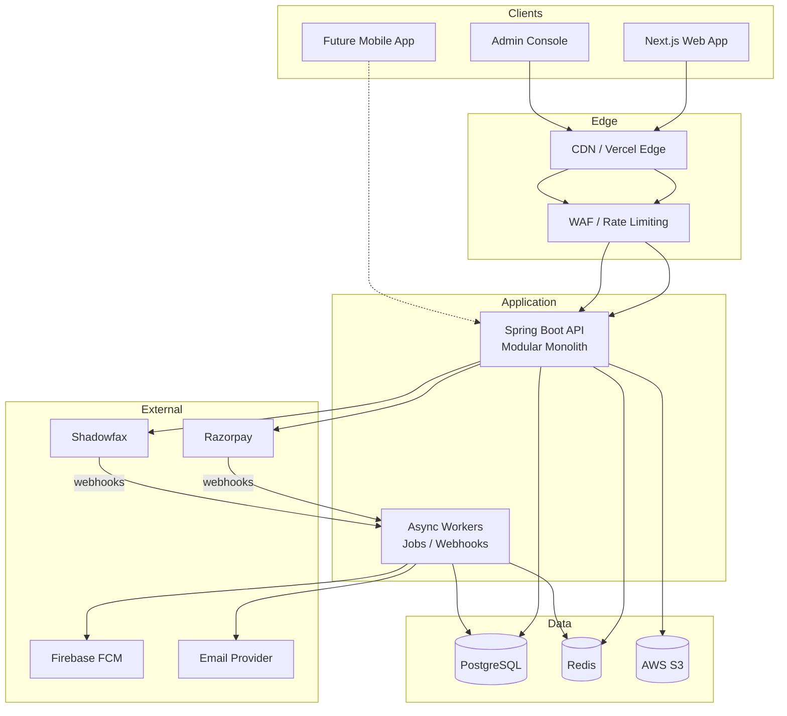
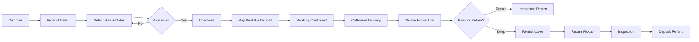
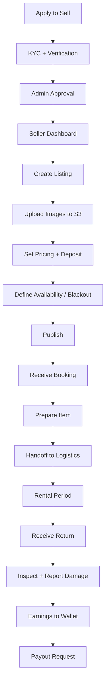
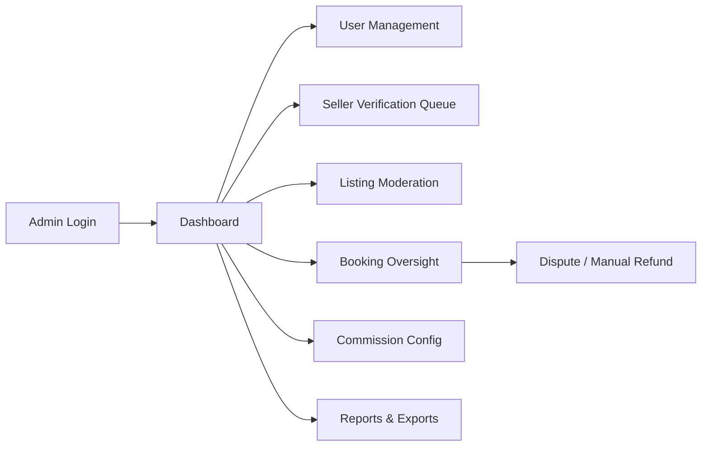
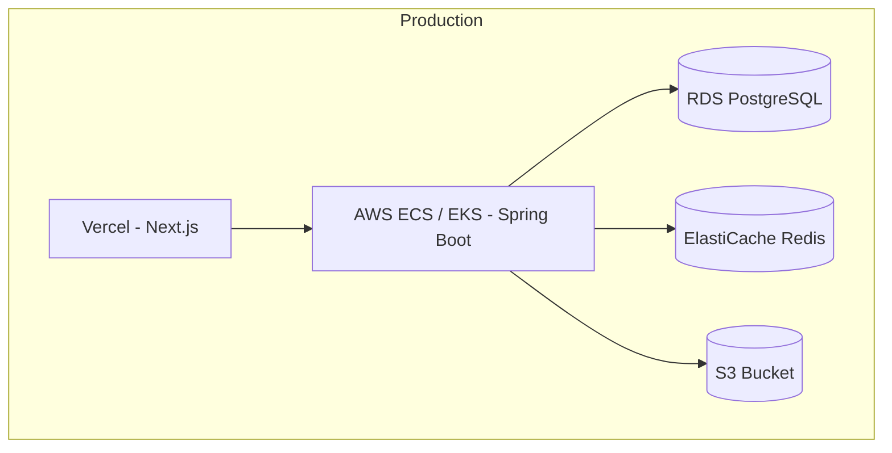
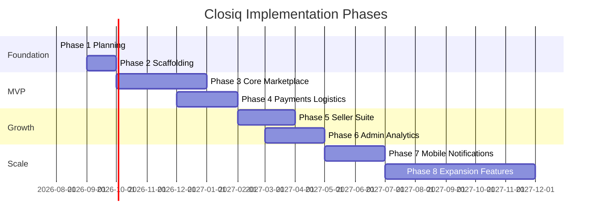
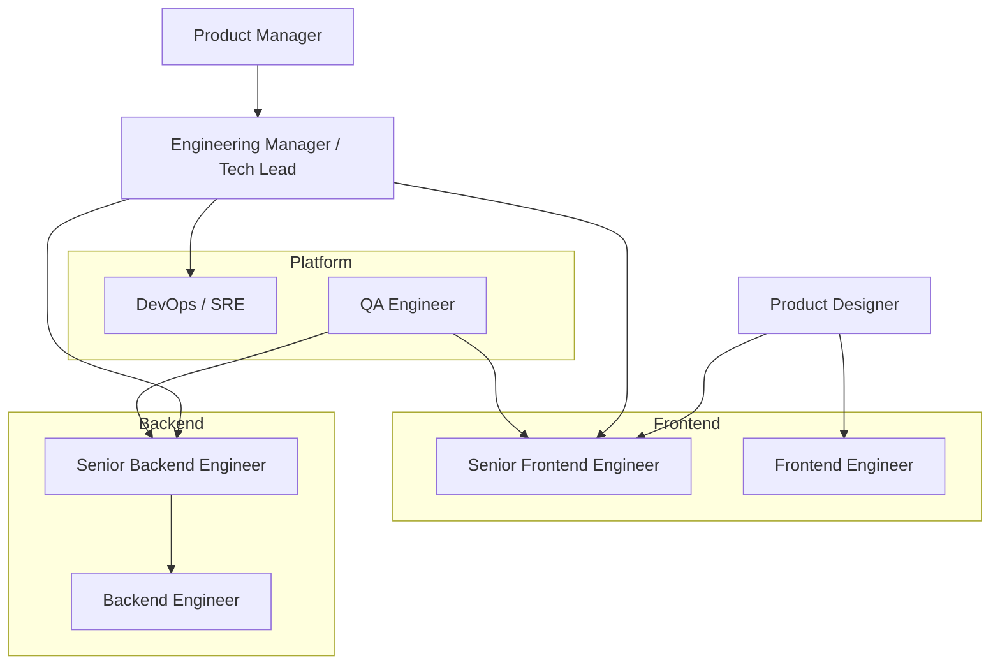
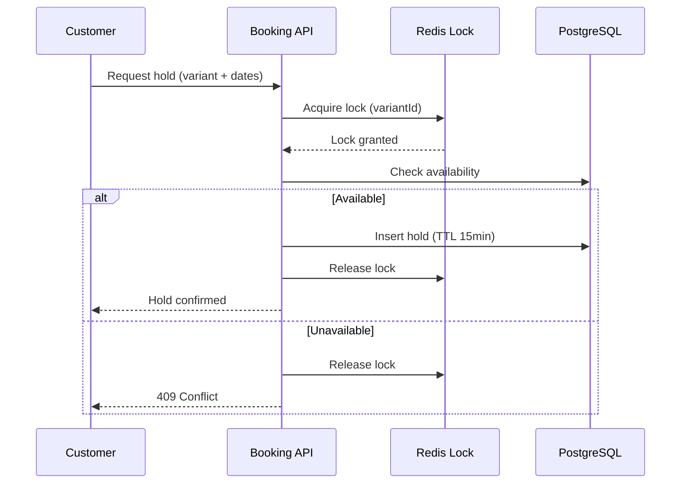
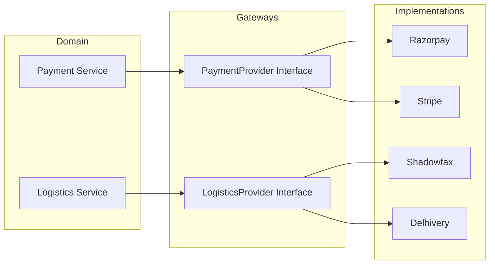

# Closiq — Phase 1: Foundation & Product Planning

**Document version:** 1.1  
**Date:** August 4, 2026  
**Status:** Planning (no implementation)  
**Product:** Premium peer-to-peer clothing rental marketplace

---

## Executive Summary

Closiq is a premium clothing rental marketplace where sellers own inventory and customers rent occasion wear for date-bound periods. The platform mediates trust, payments, logistics, and discovery — similar to Airbnb for fashion — with a design language inspired by luxury editorial retail (minimal, whitespace-rich, serif headlines, restrained gold accents).

This document defines architecture, project structure, standards, roadmap, team model, risks, and future readiness. **No APIs, database schemas, or application code are specified in this phase.**

### Design Reference (Prototype Insights)

The supplied HTML prototype ("Atelier") informs — but does not dictate — the product:

| Prototype Element | Design Intent | Recommended Improvement |
|---|---|---|
| Fraunces + Inter + IBM Plex Mono | Editorial luxury + readable UI + precise pricing/dates | Retain; map to Tailwind design tokens |
| Warm paper/ink/gold/rose palette | Premium, fashion-forward, not generic SaaS | Retain; extend to dark-mode tokens later |
| Occasion-based navigation | Discovery by intent (Wedding, Festival, etc.) | Add search + filters; keep occasion rails on home |
| Date calendar on PDP | Core rental UX; availability visibility | Server-authoritative availability; buffer days for cleaning |
| 15-minute home trial | Differentiating trust mechanism | First-class order state; agent app integration in Phase 3+ |
| Deposit + daily pricing | Standard rental economics | Clear breakdown at checkout; refund SLA messaging |
| Vertical order timeline | Uber-like tracking | Real-time updates via FCM + polling fallback |
| Ticket-style trial UI | Memorable, premium moment | Embed in order detail; push notification to open |

**Brand note:** Prototype uses "Atelier"; production brand is **Closiq** (confirmed).

### Stakeholder Decisions (August 2026)

| Decision | Status | Detail |
|---|---|---|
| **Brand name** | ✅ Confirmed | **Closiq** |
| **15-minute home trial** | ✅ Confirmed | **Mandatory platform-wide** for all clothing rentals; not seller opt-in |
| **Phone OTP at registration** | ✅ Confirmed | Required at signup (India market) |
| **Launch geography** | ✅ Confirmed | **Mumbai first**; architecture and ops designed for **pan-India** from day one |
| **Minimum rental period** | ⏳ Deferred | To be decided before checkout implementation |
| **Deposit refund SLA** | ⏳ Deferred | To be decided before payment/refund implementation |
| **Commission model** | ⏳ Open | Flat % vs category-based — decide in Phase 2 |

#### Launch Geography Strategy (Mumbai → Pan-India)



**Mumbai MVP constraints:**

- Delivery and pickup limited to Shadowfax-serviceable Mumbai pincodes.
- Seller onboarding initially targeted at Mumbai metro; listings outside service area remain hidden or marked "coming soon."
- Customer browse experience is pan-India; checkout validates serviceability at address entry.

**Pan-India readiness (built into MVP architecture):**

- Pincode-based serviceability check (abstracted — not hardcoded to Mumbai).
- User addresses store city, state, pincode; catalog filters by deliverability.
- Logistics gateway supports region-specific provider config (Mumbai = Shadowfax; future cities = same or alternate providers).
- No Mumbai-specific hacks in booking or payment domains.

---

## 1. Product Architecture

### 1.1 Overall Application Architecture

Closiq follows a **modular monolith backend** with a **BFF-oriented Next.js frontend**, designed to extract services later without redesign.



#### Layer Responsibilities

| Layer | Responsibility |
|---|---|
| **Presentation (Next.js)** | SSR/ISR catalog, client-heavy booking/checkout, seller dashboard, admin console |
| **API (Spring Boot)** | Auth, business rules, booking concurrency, payment orchestration, webhooks |
| **Workers** | Retry-heavy tasks: refund processing, notification fan-out, logistics polling |
| **PostgreSQL** | System of record: users, listings, bookings, payments, shipments |
| **Redis** | Session cache, availability locks, rate limits, hot catalog cache |
| **S3** | Product images, seller documents (KYC), inspection photos |

#### Domain Modules (Backend)

```
closiq-api/
├── identity/          # Auth, roles, profiles, addresses
├── catalog/           # Products, variants, categories, media
├── inventory/         # Date-based availability, buffers, holds
├── booking/           # Reservations, state machine, trial flow
├── payment/           # Razorpay orders, captures, refunds, wallet
├── logistics/         # Shadowfax integration, shipment lifecycle
├── notification/      # FCM, email, in-app
├── seller/            # Onboarding, verification, earnings
├── admin/             # Moderation, commissions, reports
└── shared/            # Cross-cutting: events, audit, idempotency
```

#### Cross-Cutting Concerns

- **Event-driven internal bus** (Spring ApplicationEvents → later Kafka): decouple booking confirmation from payment capture and logistics booking.
- **Idempotency keys** on all write APIs invoked by webhooks or retries.
- **Audit log** for admin actions and booking state transitions.
- **15-minute home trial** enforced platform-wide via booking state machine (not configurable per seller for clothing).
- **Feature flags** for gradual rollout (new categories, new cities).

---

### 1.2 Customer Flow



#### Customer Journey (Screen Map — Improved from Prototype)

| Stage | Screens | Notes |
|---|---|---|
| **Onboarding** | Landing, Register/Login, Profile setup | Social login optional in MVP+1 |
| **Discovery** | Home, Category/Occasion, Search results, Wishlist | Merge category nav + search into unified header |
| **Evaluation** | Product detail, Size guide, Reviews, Availability calendar | Sticky booking rail on desktop; bottom sheet on mobile |
| **Transaction** | Cart (optional), Checkout, Payment, Confirmation | Single-item checkout for MVP; cart in Phase 2 |
| **Fulfillment** | Order list, Order detail, Live tracking, Trial experience | Trial embedded in order detail (as prototype) |
| **Post-rental** | Return status, Refund status, Review seller/item | Prompt review after deposit released |

**UX improvements over prototype:**

1. **Unified account hub** — Wishlist, orders, profile, "Become a seller" in one account menu (prototype only shows nav icons).
2. **Availability-first PDP** — Disable unavailable dates before user selects; show "next available" hint.
3. **Guest browse** — Allow catalog browsing without login; gate at checkout.
4. **Progressive checkout** — Address → dates confirm → payment; fewer fields per step.
5. **Notification deep links** — Trial ready, out for delivery, refund processed open directly to order detail.

---

### 1.3 Seller Flow



#### Seller Journey (Screen Map)

| Stage | Screens |
|---|---|
| **Activation** | Seller landing, Application form, Document upload, Status pending |
| **Catalog** | Listings grid, Create/Edit listing, Media manager, Pricing & deposit |
| **Operations** | Calendar view (bookings + blocks), Booking detail, Prep checklist |
| **Finance** | Wallet, Earnings breakdown, Payout history, Commission visibility |
| **Insights** | Basic stats MVP; advanced analytics Phase 3 |

**UX principles:**

- Seller dashboard uses the same design tokens as customer UI — premium, not "admin gray."
- Calendar is the primary operational view (inventory is date-based).
- Mobile-responsive seller flows for quick booking acceptance and status updates.

---

### 1.4 Admin Flow



#### Admin Capabilities by Phase

| Capability | MVP | Phase 2 | Phase 3 |
|---|---|---|---|
| Seller verification | ✓ | | |
| User suspend/ban | ✓ | | |
| View bookings | ✓ | | |
| Manual booking override | | ✓ | |
| Commission rules | ✓ (flat) | Tiered | Dynamic |
| Financial reports | Basic | Full | BI integration |
| Content moderation | ✓ | ML-assisted | |

Admin console may be a **route group** in Next.js (`/admin/*`) with separate auth guard, or a submodule — same design system, denser data tables.

---

## 2. Project Structure

### 2.1 Monorepo Layout (Recommended)

```
closiq/                           # Monorepo root (rename from vatriq/ in Phase 2)
├── docs/                          # Architecture, ADRs, runbooks
├── frontend/                      # Next.js 15 application
├── backend/                       # Spring Boot application
├── infra/                         # Docker, Terraform, CI (Phase 1+)
├── scripts/                       # Dev utilities, seed helpers
└── README.md
```

---

### 2.2 Next.js Frontend Structure

```
frontend/
├── public/
│   ├── fonts/                     # Fraunces, Inter, IBM Plex Mono (self-hosted)
│   └── images/                    # Static marketing assets
├── src/
│   ├── app/                       # App Router
│   │   ├── (marketing)/           # Landing, about, seller pitch
│   │   ├── (shop)/                # Browse, search, product detail
│   │   ├── (checkout)/            # Checkout flow (minimal chrome)
│   │   ├── (account)/             # Orders, wishlist, profile, addresses
│   │   ├── (seller)/              # Seller dashboard (role-guarded)
│   │   ├── (admin)/               # Admin console (role-guarded)
│   │   ├── api/                   # Route handlers (BFF proxies if needed)
│   │   ├── layout.tsx
│   │   └── globals.css
│   ├── components/
│   │   ├── ui/                    # shadcn/ui primitives
│   │   ├── layout/                # Nav, footer, shell
│   │   ├── catalog/               # Product cards, grids, filters
│   │   ├── booking/               # Date picker, price breakdown
│   │   ├── orders/                # Timeline, trial UI, status pills
│   │   ├── seller/                # Dashboard widgets
│   │   └── shared/                # Loaders, empty states, errors
│   ├── features/                  # Feature-sliced logic (optional layer)
│   │   ├── auth/
│   │   ├── catalog/
│   │   ├── booking/
│   │   ├── checkout/
│   │   ├── orders/
│   │   └── seller/
│   ├── hooks/                     # useMediaQuery, useAuth, etc.
│   ├── lib/
│   │   ├── api/                   # Typed API client, fetch wrappers
│   │   ├── auth/                  # Session helpers
│   │   ├── utils/                 # cn(), formatters
│   │   └── validators/            # Shared Zod schemas (mirror backend DTOs)
│   ├── providers/                 # QueryClient, Theme, Auth providers
│   ├── styles/                    # Tailwind extensions, design tokens
│   └── types/                     # Shared TypeScript interfaces
├── components.json                # shadcn config
├── tailwind.config.ts
├── next.config.ts
├── tsconfig.json
└── package.json
```

#### Module Explanations (Frontend)

| Module | Purpose |
|---|---|
| `(marketing)` | Public pages; ISR for SEO; hero, occasions, social proof |
| `(shop)` | Catalog browsing, SSR/ISR product pages, search |
| `(checkout)` | Distraction-free payment flow |
| `(account)` | Authenticated customer area |
| `(seller)` | Seller-only routes; shared layout with sidebar |
| `(admin)` | Internal ops; data-dense tables |
| `components/ui` | shadcn primitives styled to Closiq tokens |
| `features/*` | Colocate hooks, components, and queries per domain |
| `lib/api` | Central HTTP client with auth injection and error mapping |
| `lib/validators` | Zod schemas shared with React Hook Form |

---

### 2.3 Spring Boot Backend Structure

```
backend/
├── src/main/java/com/closiq/
│   ├── ClosiqApplication.java
│   ├── config/                    # Security, Redis, S3, Jackson, OpenAPI
│   ├── common/
│   │   ├── exception/             # Global handler, error codes
│   │   ├── security/              # JWT, filters, role enums
│   │   ├── audit/                 # Audit aspect
│   │   ├── idempotency/           # Idempotency interceptor
│   │   └── util/                  # Date, money helpers
│   ├── identity/
│   │   ├── domain/
│   │   ├── repository/
│   │   ├── service/
│   │   ├── web/                   # Controllers + DTOs
│   │   └── event/
│   ├── catalog/
│   ├── inventory/
│   ├── booking/
│   ├── payment/
│   │   └── gateway/               # Razorpay adapter (interface + impl)
│   ├── logistics/
│   │   └── gateway/               # Shadowfax adapter
│   ├── notification/
│   │   └── channel/               # FCM, Email adapters
│   ├── seller/
│   ├── admin/
│   └── worker/                    # Scheduled jobs, webhook processors
├── src/main/resources/
│   ├── application.yml
│   ├── application-dev.yml
│   ├── application-prod.yml
│   └── db/migration/              # Flyway migrations (Phase 2+)
├── src/test/java/                 # Mirror package structure
├── pom.xml
└── Dockerfile
```

#### Module Explanations (Backend)

| Module | Purpose |
|---|---|
| `identity` | Registration with **phone OTP verification**, login, JWT refresh, addresses, role management (CUSTOMER, SELLER, ADMIN) |
| `catalog` | Product listings, variants (size), categories, occasion tags, image metadata |
| `inventory` | Per-variant date availability, cleaning buffers, blackout dates, hold TTL |
| `booking` | Reservation lifecycle, trial states, cancellation rules, history |
| `payment` | Payment intents, deposit handling, refunds, seller wallet ledger |
| `logistics` | Shipment creation, tracking, webhook ingestion, SLA monitoring |
| `notification` | Template rendering, multi-channel dispatch, delivery tracking |
| `seller` | Onboarding pipeline, verification docs, earnings views |
| `admin` | Operational endpoints, report generation, commission configuration |
| `worker` | Async processing detached from request thread |
| `*/gateway` | Provider abstraction — enables Razorpay/Shadowfax swaps |

**Package-by-feature** (not layer-by-feature) keeps domains cohesive and supports future extraction to microservices.

---

## 3. Architecture Decisions

### 3.1 Technology Choices

| Technology | Role | Rationale | Alternatives Considered |
|---|---|---|---|
| **Next.js 15** | Frontend framework | SSR/ISR for SEO catalog; App Router; React 19 support; Vercel deployment | Remix, Nuxt (rejected: team TS/React skill) |
| **React 19** | UI library | Ecosystem, concurrent features, shadcn compatibility | Vue 3 (rejected: smaller hiring pool for stack) |
| **TypeScript** | Language (FE) | Type safety across large codebase | JavaScript (rejected: scale risk) |
| **Tailwind CSS** | Styling | Rapid premium UI; design tokens; purging | CSS Modules, Styled Components |
| **shadcn/ui** | Component base | Accessible Radix primitives; fully owned source | MUI (rejected: generic look), Chakra |
| **TanStack Query** | Server state | Cache, retry, optimistic updates for booking | SWR, Apollo (no GraphQL planned MVP) |
| **React Hook Form + Zod** | Forms | Performance, schema validation shared with API | Formik + Yup |
| **Java 21** | Backend language | Virtual threads, mature ecosystem, enterprise hiring | Kotlin (viable alt), Go (rejected: JPA ecosystem) |
| **Spring Boot 3** | Backend framework | Security, JPA, validation, observability | Quarkus, Micronaut |
| **Spring Security** | Auth | JWT, role-based access, battle-tested | Custom auth (rejected: risk) |
| **Spring Data JPA** | ORM | Productivity for relational domain | jOOQ (consider for reporting later) |
| **PostgreSQL** | Primary DB | ACID, date ranges, JSONB for flexible attrs | MySQL (similar; PG preferred for extensions) |
| **Redis** | Cache + locks | Distributed locks for booking; session; rate limit | Hazelcast (heavier ops) |
| **AWS S3** | Object storage | Image storage, presigned uploads | Cloudflare R2 (cost alt for future) |
| **Razorpay** | Payments | India-first, UPI, deposits, refunds | Stripe India (alt if international) |
| **Shadowfax** | Logistics | Hyperlocal delivery, API-first | Delhivery, Porter (multi-provider later) |
| **Firebase FCM** | Push | Mobile-ready; reliable | OneSignal, SNS |
| **Email service** | Transactional email | SendGrid/SES/Resend — templated transactional | — |

### 3.2 Key Architectural Decisions (ADRs Summary)

| ADR | Decision | Why |
|---|---|---|
| ADR-001 | Modular monolith first | Faster MVP; clear module boundaries for later split |
| ADR-002 | Same user account, multiple roles | Business rule; JWT claims include roles array |
| ADR-003 | Server-authoritative availability | Prevent double booking; client calendar is read-only |
| ADR-004 | Redis lock + DB constraint for booking | Optimistic UX with pessimistic safety net |
| ADR-005 | Gateway pattern for payments/logistics | Future multi-provider without domain changes |
| ADR-006 | Webhook-driven state updates | Logistics and payments are async by nature |
| ADR-007 | S3 presigned uploads | Offload bandwidth; secure direct client upload |
| ADR-008 | Category-agnostic catalog model | Supports electronics, furniture expansion |
| ADR-009 | Next.js route groups by persona | Clear auth boundaries; shared design system |
| ADR-010 | Flyway for migrations | Versioned schema evolution (Phase 2 implementation) |
| ADR-011 | Platform-wide mandatory trial | Core trust differentiator; enforced in booking state machine |
| ADR-012 | Phone OTP at registration | India market trust; primary identity anchor alongside email |
| ADR-013 | Mumbai launch, pan-India architecture | Pincode serviceability abstraction; no city-specific domain logic |

### 3.3 Deployment Topology (Target)



**MVP simplification:** Single ECS service + RDS + ElastiCache; Vercel for frontend. Staging mirrors production at smaller scale.

---

## 4. Development Standards

### 4.1 Folder Conventions

| Rule | Convention |
|---|---|
| Frontend routes | kebab-case folders in `app/` |
| React components | PascalCase files: `ProductCard.tsx` |
| Hooks | camelCase with `use` prefix: `useBookingHold.ts` |
| Backend packages | lowercase: `com.closiq.booking` |
| Backend classes | PascalCase; interfaces without `I` prefix |
| Tests | Mirror source path: `ProductCard.test.tsx`, `BookingServiceTest.java` |

### 4.2 Naming Conventions

| Entity | Convention | Example |
|---|---|---|
| REST resources | Plural nouns, kebab-case paths | `/api/v1/bookings`, `/api/v1/products` |
| Query params | camelCase | `?occasion=wedding&size=M` |
| JSON fields | camelCase | `{ "rentalStartDate": "2026-08-14" }` |
| Enum values | SCREAMING_SNAKE (JSON) | `TRIAL_READY`, `RENTAL_ACTIVE` |
| Event names | dot.notation | `booking.confirmed`, `payment.captured` |
| Redis keys | colon-separated | `booking:hold:{variantId}:{dateRange}` |
| S3 keys | path pattern | `products/{sellerId}/{productId}/{uuid}.webp` |
| DB tables | snake_case (Phase 2) | `booking_items` |
| Git branches | type/ticket-slug | `feature/VQ-142-checkout-flow` |

### 4.3 API Design Standards (Guidelines Only — No Endpoints)

- **Versioning:** `/api/v1/` prefix; breaking changes → v2.
- **Auth:** Bearer JWT access token; refresh via HttpOnly cookie or dedicated endpoint.
- **Errors:** RFC 7807 Problem Details (`application/problem+json`).
- **Pagination:** Cursor-based for catalog; offset allowed for admin reports.
- **Idempotency:** `Idempotency-Key` header on POST that creates resources.
- **Dates:** ISO 8601 UTC in API; local display in frontend.

### 4.4 Branch Strategy

**Trunk-based development** with short-lived feature branches.

```
main (production-ready)
  └── develop (integration)
        └── feature/VQ-xxx-description
        └── fix/VQ-xxx-description
        └── chore/VQ-xxx-description
```

| Branch | Purpose | Merge target |
|---|---|---|
| `main` | Production releases; tagged | — |
| `develop` | Integration testing | `main` via release PR |
| `feature/*` | New features | `develop` |
| `fix/*` | Bug fixes | `develop` (cherry-pick to `main` if hotfix) |
| `release/*` | Release stabilization | `main` |

**Hotfix:** `fix/*` from `main` → merge to `main` and `develop`.

### 4.5 Commit Strategy

[Conventional Commits](https://www.conventionalcommits.org/):

```
feat(booking): add date hold with TTL
fix(payment): handle Razorpay webhook timeout
docs(architecture): add ADR for inventory locks
chore(ci): add backend test workflow
```

- Squash merge for feature branches.
- PR title = commit message on merge.
- Reference ticket: `feat(VQ-142): ...`

### 4.6 Coding Standards

#### TypeScript / React

- Strict mode enabled; no `any` without explicit eslint disable comment.
- Prefer server components; `'use client'` only when needed.
- Colocate feature code; avoid global state except auth/session.
- All user-facing strings ready for i18n (English MVP).
- Accessibility: WCAG 2.1 AA for checkout and booking flows.

#### Java / Spring

- Checkstyle or Spotless for formatting.
- Constructor injection only.
- DTOs at API boundary; never expose entities.
- `@Transactional` on service layer, not controllers.
- Money as `BigDecimal` + currency code; never `float`.
- All external calls wrapped with timeouts and circuit breakers (Resilience4j).

#### General

- PR size target: < 400 lines changed.
- Minimum 1 reviewer; 2 for payment/booking modules.
- Feature flags for incomplete flows.

---

## 5. Development Roadmap

### 5.1 Phase Overview



### 5.2 MVP Scope (Phases 2–4)

**MVP goal:** Customer can browse, book, pay, receive, and return a clothing rental; seller can list and fulfill; admin can verify sellers.

#### MVP Feature Matrix

| Feature | Priority | MVP | Notes |
|---|---|---|---|
| User register/login | P0 | ✓ | Phone OTP required at registration; email + password |
| Browse catalog | P0 | ✓ | Home, categories, product grid |
| Search | P1 | ✓ | Basic text search |
| Product detail + calendar | P0 | ✓ | Size selection, availability |
| Wishlist | P2 | | Phase 2 |
| Checkout + Razorpay | P0 | ✓ | Rental + deposit |
| Booking confirmation | P0 | ✓ | Email confirmation |
| Order tracking | P0 | ✓ | Status timeline |
| 15-min trial flow | P0 | ✓ | **Mandatory platform-wide**; core differentiator |
| Become seller + KYC | P0 | ✓ | Manual admin approval |
| Seller listing CRUD | P0 | ✓ | Images via S3 |
| Seller booking view | P0 | ✓ | Calendar + list |
| Seller wallet (basic) | P1 | ✓ | View earnings |
| Admin seller verification | P0 | ✓ | Approve/reject |
| Admin user management | P1 | ✓ | Suspend users |
| Commission (flat rate) | P0 | ✓ | Config in admin |
| Shadowfax integration | P0 | ✓ | Outbound + return; **Mumbai pincodes MVP** |
| Pincode serviceability | P0 | ✓ | Mumbai validation; pan-India-ready abstraction |
| FCM push | P2 | | Phase 3 post-MVP |
| Reviews | P2 | | Phase 2 |
| Multi-item cart | P3 | | Phase 2 |

### 5.3 Detailed Phase Breakdown

#### Phase 2 — Project Scaffolding (Weeks 1–4)

- Initialize monorepo, CI/CD pipelines
- Design system tokens in Tailwind (from prototype palette)
- shadcn/ui setup with Closiq theme
- Spring Boot skeleton with module packages
- PostgreSQL + Redis local via Docker Compose
- Auth scaffold (JWT + phone OTP via SMS provider e.g. MSG91 / AWS SNS)
- Flyway setup, initial migrations (Phase 2 implementation task)
- OpenAPI spec generation pipeline

#### Phase 3 — Core Marketplace (Weeks 5–12)

- Identity: registration with **phone OTP**, login, profile, addresses
- Geo: pincode serviceability service (Mumbai config for MVP)
- Catalog: product CRUD, categories, occasions, image upload
- Inventory: availability model, calendar API, cleaning buffers
- Customer UI: home, PLP, PDP, account shell
- Seller UI: dashboard shell, listing management
- Admin: seller verification queue

#### Phase 4 — Transactions & Fulfillment (Weeks 10–16, overlaps Phase 3)

- Booking engine with concurrency controls
- Checkout flow + Razorpay integration
- Booking state machine including trial states
- Shadowfax shipment creation + webhooks
- Order tracking UI (timeline, trial ticket UI)
- Email notifications (transactional)
- Deposit refund workflow

#### Phase 5 — Seller Suite Polish (Weeks 17–20)

- Earnings dashboard, payout requests
- Advanced calendar (blackout dates, bulk block)
- Listing analytics (views, conversion)
- Review system

#### Phase 6 — Admin & Operations (Weeks 18–22)

- Reports: GMV, bookings, seller performance
- Dispute management
- Commission tiers
- Audit log viewer

#### Phase 7 — Mobile & Real-time (Weeks 23–28)

- FCM push notifications
- Real-time tracking updates
- PWA considerations
- Optional React Native app evaluation

#### Phase 8 — Expansion (Weeks 29+)

- New verticals (electronics, furniture)
- AI recommendations
- Subscription plans
- International + multi-currency

---

## 6. Development Environment

### 6.1 Recommended IDE Setup

| Tool | Recommendation |
|---|---|
| **IDE** | IntelliJ IDEA Ultimate (backend) + Cursor/VS Code (frontend) — or full-stack in Cursor |
| **JDK** | Amazon Corretto 21 or Temurin 21 |
| **Node** | v22 LTS via fnm/nvm |
| **Package manager** | pnpm (frontend) |

### 6.2 Extensions (VS Code / Cursor)

| Extension | Purpose |
|---|---|
| ESLint | TS/React linting |
| Prettier | Formatting |
| Tailwind CSS IntelliSense | Class completion |
| Java Extension Pack | Spring development |
| Spring Boot Extension Pack | Boot tools, properties |
| REST Client / Thunder Client | API testing |
| GitLens | Git history |
| Error Lens | Inline errors |
| Docker | Container management |

### 6.3 Database & Infrastructure Tools

| Tool | Purpose |
|---|---|
| **Docker Desktop** | Local PostgreSQL, Redis |
| **DBeaver** or **pgAdmin** | SQL exploration |
| **Redis Insight** | Cache debugging |
| **LocalStack** (optional) | S3 emulation |
| **ngrok** or **Cloudflare Tunnel** | Webhook testing locally |

### 6.4 Testing Tools

| Layer | Tool |
|---|---|
| Frontend unit | Vitest + Testing Library |
| Frontend E2E | Playwright |
| Backend unit | JUnit 5 + Mockito |
| Backend integration | Testcontainers (PostgreSQL, Redis) |
| API contract | OpenAPI diff, Schemathesis (later) |
| Load | k6 (booking concurrency scenarios) |

### 6.5 Documentation Tools

| Tool | Purpose |
|---|---|
| **Markdown in `/docs`** | Architecture, ADRs |
| **Mermaid** | Diagrams in repo |
| **OpenAPI (Springdoc)** | API docs (Phase 2+) |
| **Storybook** (optional) | Component catalog |
| **Notion/Confluence** | Product specs (external) |
| **Linear/Jira** | Ticket tracking |

### 6.6 Local Dev Stack (Docker Compose)

Services for local development:

- `postgres:16`
- `redis:7`
- Optional: `mailhog` for email capture
- Optional: `localstack` for S3

Frontend → `localhost:8080` (API) → local services.

---

## 7. Team Structure

### 7.1 Recommended Team (MVP — 8–10 people)



### 7.2 Workstream Ownership

| Workstream | Primary | Secondary | Deliverables |
|---|---|---|---|
| **Design system & customer UI** | FE Senior | Designer | Tokens, components, shop flows |
| **Booking & inventory** | BE Senior | FE | Concurrency, calendar, PDP |
| **Payments & wallet** | BE Senior | BE | Razorpay, deposits, refunds |
| **Logistics & tracking** | BE | FE | Shadowfax, order timeline |
| **Seller experience** | FE | BE | Dashboard, listings, calendar |
| **Admin & ops** | BE | FE | Verification, reports |
| **Infrastructure & CI** | DevOps | BE Senior | AWS, pipelines, monitoring |
| **Quality** | QA | All | E2E suites, test plans |

### 7.3 Ceremonies

| Ceremony | Frequency | Participants |
|---|---|---|
| Sprint planning | Bi-weekly | Full team |
| Daily standup | Daily | Engineers |
| Design critique | Weekly | Design + FE |
| Architecture review | Bi-weekly | BE + Tech Lead |
| Demo | End of sprint | Full team + stakeholders |
| Incident retro | As needed | Platform + on-call |

### 7.4 Scaling Beyond MVP

Add: mobile engineer, data engineer, second QA, customer support ops (seller verification), content moderator.

---

## 8. Technical Risks

### 8.1 Risk Matrix

| Risk | Likelihood | Impact | Mitigation |
|---|---|---|---|
| Double booking | Medium | Critical | Redis distributed lock + DB exclusion constraint + hold TTL |
| Payment failure after hold | Medium | High | Idempotent payment; auto-release hold on timeout |
| Partial payment (deposit ok, rental fail) | Low | High | Single Razorpay order with splits; atomic confirmation |
| Logistics API downtime | Medium | High | Retry queue; manual fallback UI for admin; status polling |
| Webhook duplication | High | Medium | Idempotency store; event dedup by provider event ID |
| Refund delays | Medium | Medium | Clear SLA messaging; automated status updates |
| Seller fraud / fake listings | Medium | High | KYC, manual verification, image moderation |
| Image storage cost | Low | Medium | WebP compression; CDN; lifecycle policies |
| PII leakage | Low | Critical | Encrypt at rest; minimal data in logs; audit access |
| Calendar timezone bugs | High | Medium | Store UTC; display in user timezone; extensive tests |

### 8.2 Concurrency & Booking Conflicts

**Problem:** Two customers select overlapping dates for the same variant simultaneously.

**Strategy (layered defense):**



1. **Short-lived hold** (15 min) during checkout.
2. **Redis lock** per variant during hold creation.
3. **Database constraint** preventing overlapping confirmed bookings (Phase 2 implementation).
4. **Cleaning buffer** days between rentals (seller-configurable, platform minimum).

### 8.3 Payment Failures

- Use Razorpay order creation before redirect.
- On webhook `payment.captured` → confirm booking atomically.
- On timeout → release hold via scheduled job.
- Failed capture → notify customer; do not create shipment.
- Deposit refunds triggered only after return inspection workflow completes.

### 8.4 Logistics Failures

- Abstract `LogisticsProvider` interface.
- Retry with exponential backoff (3 attempts).
- Dead-letter queue for manual admin intervention.
- Customer-facing: honest status ("Delivery delayed — we're resolving").
- Seller notification on repeated failures.

### 8.5 Scalability

| Concern | MVP | Scale Path |
|---|---|---|
| Catalog read | PostgreSQL + Redis cache | Read replicas, Elasticsearch |
| Image delivery | S3 + CloudFront | Already scalable |
| Booking writes | Single PostgreSQL instance | Partition by date; CQRS for reads |
| Webhooks | In-process workers | Dedicated worker service → Kafka |
| Search | PostgreSQL full-text | Elasticsearch / Algolia |

**Target MVP load:** 1,000 concurrent users, 100 bookings/day — monolith is sufficient.

### 8.6 Security

| Area | Approach |
|---|---|
| Authentication | JWT (short-lived) + refresh rotation |
| Authorization | Role-based + resource ownership checks |
| API | HTTPS only; rate limiting via Redis |
| Uploads | Presigned URLs; content-type validation; size limits |
| Secrets | AWS Secrets Manager / Parameter Store |
| Compliance | PCI via Razorpay hosted checkout; minimize card data exposure |
| OWASP | Input validation, CSRF on cookie auth, security headers |

---

## 9. Future Readiness

### 9.1 Multi-Provider Architecture



- Provider selected by config per region/tenant.
- Webhook router normalizes events to internal domain events.
- No provider-specific logic in booking or order services.

### 9.2 Category Expansion (Clothing → Electronics → Furniture)

**Generic listing model:**

| Concept | Clothing | Electronics | Furniture |
|---|---|---|---|
| Item | Saree | Camera body | Sofa |
| Variant | Size | Model/SKU | Dimensions |
| Attributes | Fabric, fit | Megapixels, mount | Material, seats |
| Deposit | High | Very high | Medium |
| Trial | 15-min home trial | Power-on check | Not applicable |
| Logistics | Garment bag | Hard case | Large item handling |

- `category_id` drives attribute schema (JSONB validated by category template).
- UI renders dynamic attribute forms from schema.
- Business rules (deposit minimum, trial applicability) configured per category; **clothing trial is always mandatory platform-wide**.

### 9.3 AI Recommendations

- **Phase 1 (MVP):** Rule-based — occasion, trending, "similar listings."
- **Phase 2:** Collaborative filtering from wishlist/booking history.
- **Phase 3:** Embedding search (image + text); vector DB (pgvector or Pinecone).
- Event stream (`product.viewed`, `booking.completed`) feeds ML pipeline.

### 9.4 Subscription Plans

Potential models:

| Plan | Customer Value | Implementation Notes |
|---|---|---|
| **Closiq Pass** | Discounted rental days / waived delivery | Subscription entity; benefit rules engine |
| **Seller Pro** | Lower commission, analytics | Stripe/Razorpay subscriptions |
| **Priority access** | Early access to new drops | Feature flag + entitlement service |

Architecture: separate `subscription` module; entitlements checked at pricing service.

### 9.5 Warehouse Model (Platform-Owned Inventory)

Current model: seller-owned inventory, seller prepares item.

Future hybrid:

- `fulfillment_type`: `SELLER_DIRECT` | `PLATFORM_WAREHOUSE`
- Warehouse module: inbound QC, storage locations, pick/pack.
- Logistics origin changes; booking logic unchanged.

### 9.6 International Expansion

| Dimension | Approach |
|---|---|
| Currency | Multi-currency pricing; Razorpay/Stripe per region |
| Locale | i18n in Next.js; backend error messages keyed |
| Logistics | Region-specific provider in gateway config |
| Legal | Country-specific T&C, rental regulations |
| Tax | Tax service abstraction (GST MVP; VAT later) |

---

## Appendix A: Design System Tokens (from Prototype)

For implementation in Phase 2 — reference only.

| Token | Value | Usage |
|---|---|---|
| `--ink` | `#1E2A22` | Primary buttons, headings on light |
| `--paper` | `#FBF7F0` | Page background |
| `--paper-dim` | `#F1EADC` | Cards, gallery backgrounds |
| `--charcoal` | `#221C16` | Body text |
| `--charcoal-soft` | `#5C564C` | Secondary text |
| `--gold` | `#B8923F` | CTAs, accents, selected dates |
| `--gold-deep` | `#8C6C28` | USP badges |
| `--rose` / `--rose-deep` | `#A9525A` / `#7C3A41` | Brand accent, deposit notes |
| `--line` | `#DCD2C2` | Borders |

**Typography:**

- Headlines: Fraunces (serif)
- Body: Inter
- Data/prices/dates: IBM Plex Mono

**Spacing:** Generous — 48px page gutters desktop; 22px nav padding.

**Radius:** Minimal — 2px (sharp luxury, not bubbly).

---

## Appendix B: Glossary

| Term | Definition |
|---|---|
| **Listing** | A rentable product published by a seller |
| **Variant** | Size/SKU dimension of a listing |
| **Hold** | Temporary reservation during checkout (TTL) |
| **Booking** | Confirmed rental contract for date range |
| **Trial** | Supervised try-on window at delivery |
| **Deposit** | Refundable security amount |
| **Buffer days** | Non-rentable days for cleaning/repair |

---

## Appendix C: Decisions & Open Questions

### Confirmed

| # | Question | Decision |
|---|---|---|
| 1 | Brand name | **Closiq** |
| 2 | Trial flow | **Mandatory platform-wide** (all clothing rentals) |
| 3 | Launch geography | **Mumbai first**, pan-India-ready architecture |
| 4 | Phone OTP at registration | **Yes — required** |

### Deferred (Decide Before Implementation)

| # | Question | Target Phase | Notes |
|---|---|---|---|
| 5 | Minimum rental period | Phase 3 (checkout) | Options: 1 day vs 2 days vs occasion-based minimum |
| 6 | Deposit refund SLA | Phase 4 (payments) | Prototype suggests 2 days post-inspection; confirm with ops |

### Still Open

| # | Question | Notes |
|---|---|---|
| 7 | Commission model | Flat % vs category-based — decide in Phase 2 admin design |

---

*End of Phase 1 Foundation Document*
