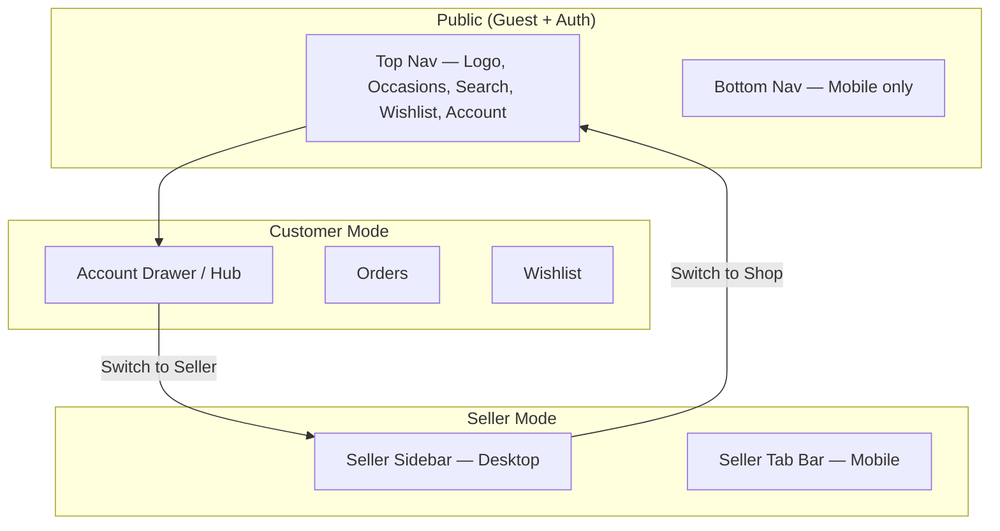
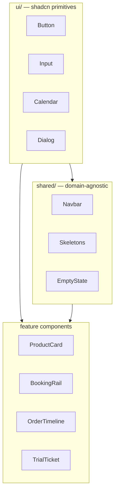
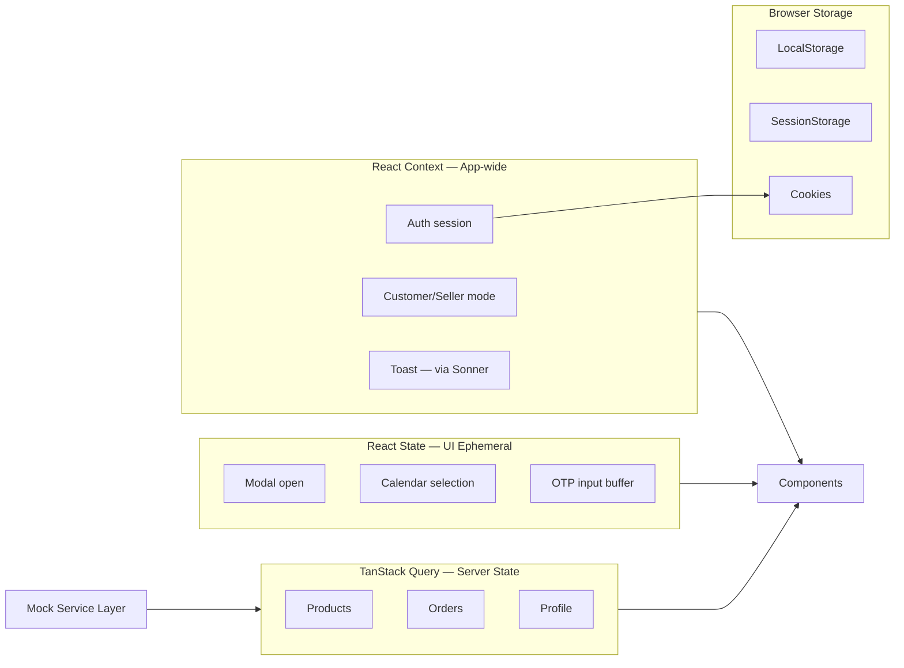
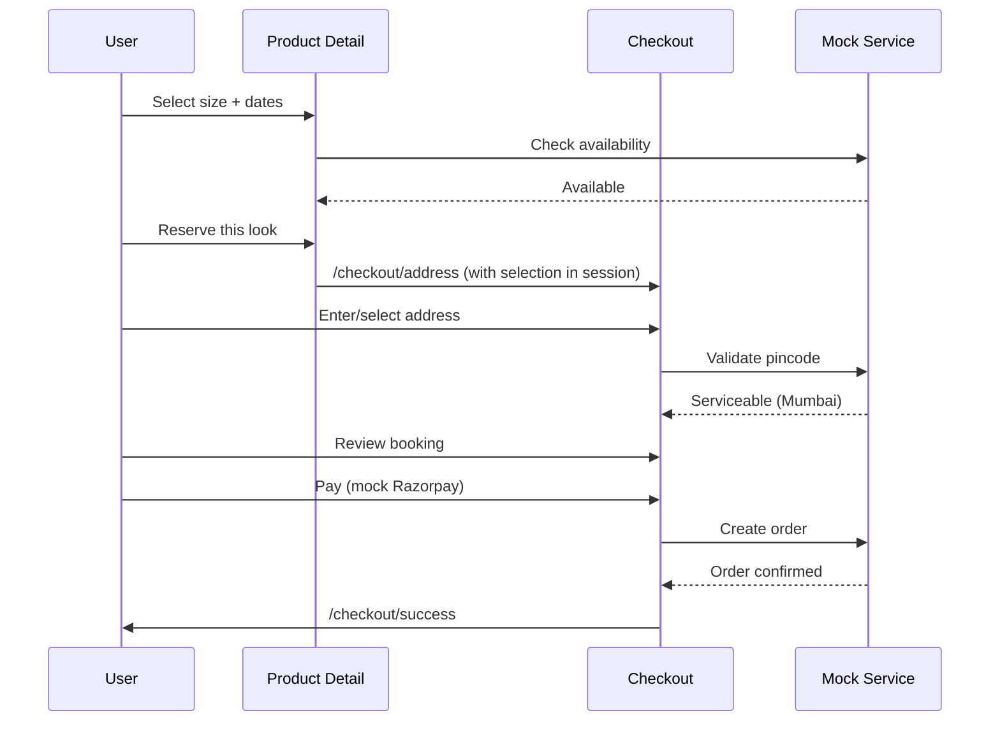

# Closiq — Phase 2: Frontend Architecture & UI Development

**Document version:** 1.0  
**Date:** August 4, 2026  
**Status:** Architecture (mock data; no backend)  
**Scope:** Customer + Seller web application (Admin is a separate app)

---

## Executive Summary

This document defines the production-ready frontend architecture for **Closiq**, a premium clothing rental marketplace. All data is mocked today; the service layer is designed so mock providers swap for API calls without restructuring components.

**Inherited from Phase 1:**

- Brand: **Closiq** — premium minimal, Fraunces + Inter + IBM Plex Mono
- **15-minute home trial** mandatory platform-wide
- **Phone OTP** required at registration
- **Mumbai launch**, pan-India-ready (pincode gate at checkout)
- Admin is **out of scope** for this application

**Tech stack:** Next.js 15 · React 19 · TypeScript · Tailwind CSS · shadcn/ui · TanStack Query · React Hook Form · Zod · Lucide Icons · Framer Motion

---

## 1. Complete Screen List

### 1.1 Screen Inventory

Every screen is mapped to a route, layout, and auth requirement.

#### System & Auth

| Screen | Route | Auth | Layout | Notes |
|---|---|---|---|---|
| Splash / Brand moment | `/` (first visit overlay) | Public | None | Optional 1.2s brand fade; skip if returning |
| Login | `/login` | Guest | Auth minimal | Phone-first |
| Signup | `/signup` | Guest | Auth minimal | Phone OTP → profile |
| OTP Verification | `/signup/verify` | Guest | Auth minimal | 6-digit OTP input |
| Forgot password | `/login/forgot` | Guest | Auth minimal | Phase 2+ if email auth added |
| Session expired | Modal overlay | — | — | Re-auth prompt |

#### Discovery (Customer)

| Screen | Route | Auth | Layout |
|---|---|---|---|
| Home | `/` | Public | Shop |
| Search | `/search` | Public | Shop |
| Search results | `/search?q=` | Public | Shop |
| Category / Occasion | `/occasions/[slug]` | Public | Shop |
| Product listing (PLP) | `/products` | Public | Shop |
| Product detail (PDP) | `/products/[slug]` | Public | Shop |
| Size guide | `/products/[slug]/size-guide` | Public | Shop drawer/modal |
| Wishlist | `/wishlist` | Protected | Shop |
| Reviews (full) | `/products/[slug]/reviews` | Public | Shop |

#### Booking & Checkout

| Screen | Route | Auth | Layout |
|---|---|---|---|
| Availability calendar | Embedded in PDP | Public | — |
| Checkout — Address | `/checkout/address` | Protected | Checkout |
| Checkout — Review | `/checkout/review` | Protected | Checkout |
| Checkout — Payment | `/checkout/payment` | Protected | Checkout |
| Payment processing | `/checkout/processing` | Protected | Checkout |
| Booking confirmed | `/checkout/success` | Protected | Checkout |
| Pincode not serviceable | Inline / `/checkout/unavailable` | Protected | Checkout |
| Payment failed | `/checkout/failed` | Protected | Checkout |

#### Orders & Tracking

| Screen | Route | Auth | Layout |
|---|---|---|---|
| My orders | `/orders` | Protected | Account |
| Order detail | `/orders/[id]` | Protected | Account |
| Trial experience | Embedded in order detail | Protected | — |
| Return tracking | `/orders/[id]/return` | Protected | Account |
| Leave review | `/orders/[id]/review` | Protected | Account |

#### Account & Profile

| Screen | Route | Auth | Layout |
|---|---|---|---|
| Account hub | `/profile` | Protected | Account |
| Edit profile | `/profile/edit` | Protected | Account |
| Addresses | `/profile/addresses` | Protected | Account |
| Add / Edit address | `/profile/addresses/[id]` | Protected | Account |
| Payment methods | `/profile/payments` | Protected | Account |
| Settings | `/profile/settings` | Protected | Account |
| Notifications prefs | `/profile/settings/notifications` | Protected | Account |
| Become a seller | `/seller/apply` | Protected | Account |
| Seller application status | `/seller/apply/status` | Protected | Account |

#### Seller

| Screen | Route | Auth | Layout |
|---|---|---|---|
| Seller dashboard | `/seller` | Seller | Seller |
| My listings | `/seller/products` | Seller | Seller |
| Create listing | `/seller/products/new` | Seller | Seller |
| Edit listing | `/seller/products/[id]/edit` | Seller | Seller |
| Listing preview | `/seller/products/[id]/preview` | Seller | Seller |
| Bookings | `/seller/bookings` | Seller | Seller |
| Booking detail | `/seller/bookings/[id]` | Seller | Seller |
| Inventory calendar | `/seller/inventory` | Seller | Seller |
| Block dates | `/seller/inventory/block` | Seller | Seller |
| Wallet | `/seller/wallet` | Seller | Seller |
| Payout request | `/seller/wallet/payout` | Seller | Seller |
| Analytics | `/seller/analytics` | Seller | Seller |
| Seller settings | `/seller/settings` | Seller | Seller |

#### Support & Notifications

| Screen | Route | Auth | Layout |
|---|---|---|---|
| Notifications | `/notifications` | Protected | Account |
| Support / Help | `/support` | Public | Shop |
| FAQ | `/support/faq` | Public | Shop |
| Contact | `/support/contact` | Protected | Shop |

#### Utility States (Not Routes — Components)

| State | Used On | Component |
|---|---|---|
| 404 Not Found | Unknown routes | `NotFoundPage` |
| 500 Error | Error boundary | `ErrorPage` |
| Empty wishlist | `/wishlist` | `EmptyWishlist` |
| Empty orders | `/orders` | `EmptyOrders` |
| Empty seller listings | `/seller/products` | `EmptyListings` |
| Loading skeleton | All data screens | Domain skeletons |
| Offline | Global | `OfflineBanner` |
| Search no results | `/search` | `EmptySearch` |

**Total: 52 routed screens + 8 utility state patterns**

---

## 2. Navigation Architecture

### 2.1 Navigation Model Overview



Closiq uses **one app, two modes** (Customer ↔ Seller). Mode switch lives in account hub — not a separate login.

### 2.2 Top Navigation (Desktop & Tablet)

**Layout:** Sticky top bar, `paper` background, 1px `line` bottom border.

| Zone | Content |
|---|---|
| Left | Logo `Closiq.` (serif, rose italic dot) |
| Center | Occasion links: Wedding · Festival · Office · Party · New in |
| Right | Search icon → opens search overlay · Wishlist (badge) · Account avatar |

**Behavior:**

- Occasions link to `/occasions/[slug]`
- Search opens full-width overlay (not navigation away on desktop)
- Wishlist requires auth → redirect `/login?returnUrl=/wishlist`
- Account opens drawer (logged in) or `/login` (guest)

### 2.3 Bottom Navigation (Mobile — Customer Mode)

Visible on shop/account routes. Hidden on checkout, seller mode, auth screens.

| Tab | Icon | Route | Badge |
|---|---|---|---|
| Home | Home | `/` | — |
| Search | Search | `/search` | — |
| Wishlist | Heart | `/wishlist` | Count |
| Orders | Package | `/orders` | Active order dot |
| Profile | User | `/profile` | — |

**Height:** 64px + safe area · **Style:** Paper bg, uppercase micro-labels, gold active indicator.

### 2.4 Account Drawer

Slides from right on desktop/tablet; full sheet on mobile.

| Section | Items |
|---|---|
| User | Avatar, name, phone |
| Shop | Orders, Wishlist, Addresses |
| Seller | "Seller dashboard" (if seller) · "Become a seller" (if not) |
| Mode switch | Toggle: **Shopping** ↔ **Selling** (sellers only) |
| Other | Notifications, Support, Settings, Sign out |

### 2.5 Seller Navigation

#### Desktop: Left Sidebar (240px)

| Item | Route | Icon |
|---|---|---|
| Dashboard | `/seller` | LayoutDashboard |
| Listings | `/seller/products` | Shirt |
| Bookings | `/seller/bookings` | CalendarCheck |
| Inventory | `/seller/inventory` | CalendarRange |
| Wallet | `/seller/wallet` | Wallet |
| Analytics | `/seller/analytics` | BarChart3 |
| — | — | — |
| Back to shop | `/` | ArrowLeft |
| Settings | `/seller/settings` | Settings |

#### Mobile: Seller Tab Bar

Dashboard · Bookings · Inventory · Wallet · More (sheet with rest)

### 2.6 Authentication Flow

```mermaid
flowchart TD
    A[Guest visits protected route] --> B{Authenticated?}
    B -->|No| C[Redirect /login?returnUrl=...]
    C --> D[Enter phone]
    D --> E[Receive OTP]
    E --> F{Existing user?}
    F -->|Yes| G[Login success → returnUrl]
    F -->|No| H[/signup/verify → profile form]
    H --> I[Signup success → returnUrl or /]
    B -->|Yes| J[Allow access]
    J --> K{Seller route?}
    K -->|Yes| L{Has seller role?}
    L -->|No| M[Redirect /seller/apply]
    L -->|Yes| N[Seller access]
```

### 2.7 Route Protection Matrix

| Route pattern | Guest | Customer | Seller | Redirect if unauthorized |
|---|---|---|---|---|
| `/`, `/products/*`, `/search`, `/occasions/*`, `/support` | ✅ | ✅ | ✅ | — |
| `/login`, `/signup/*` | ✅ | ↪ `/` | ↪ `/` | Logged-in users redirected home |
| `/wishlist`, `/orders/*`, `/profile/*`, `/checkout/*` | ❌ | ✅ | ✅ | `/login?returnUrl=...` |
| `/seller/*` (except apply) | ❌ | ❌ | ✅ | `/seller/apply` or `/login` |
| `/seller/apply` | ❌ | ✅ | ✅ | `/login` |

**Implementation:** Next.js middleware checks session cookie; layout-level guards for seller role; client fallback for hydration edge cases.

---

## 3. Routing Structure

### 3.1 App Router Map

```
src/app/
├── (auth)/
│   ├── login/page.tsx
│   ├── signup/
│   │   ├── page.tsx
│   │   └── verify/page.tsx
│   └── layout.tsx                    # Minimal chrome, centered card
│
├── (shop)/
│   ├── layout.tsx                    # Top nav + bottom nav (mobile)
│   ├── page.tsx                      # Home
│   ├── search/page.tsx
│   ├── products/
│   │   ├── page.tsx
│   │   └── [slug]/
│   │       ├── page.tsx
│   │       ├── reviews/page.tsx
│   │       └── size-guide/page.tsx
│   ├── occasions/[slug]/page.tsx
│   ├── wishlist/page.tsx
│   ├── support/
│   │   ├── page.tsx
│   │   ├── faq/page.tsx
│   │   └── contact/page.tsx
│   └── notifications/page.tsx
│
├── (checkout)/
│   ├── layout.tsx                    # Minimal header, progress stepper
│   └── checkout/
│       ├── address/page.tsx
│       ├── review/page.tsx
│       ├── payment/page.tsx
│       ├── processing/page.tsx
│       ├── success/page.tsx
│       ├── failed/page.tsx
│       └── unavailable/page.tsx
│
├── (account)/
│   ├── layout.tsx                    # Account sub-nav (desktop)
│   ├── profile/
│   │   ├── page.tsx
│   │   ├── edit/page.tsx
│   │   ├── addresses/
│   │   │   ├── page.tsx
│   │   │   └── [id]/page.tsx
│   │   ├── payments/page.tsx
│   │   └── settings/
│   │       ├── page.tsx
│   │       └── notifications/page.tsx
│   └── orders/
│       ├── page.tsx
│       └── [id]/
│           ├── page.tsx
│           ├── return/page.tsx
│           └── review/page.tsx
│
├── (seller)/
│   ├── layout.tsx                    # Seller sidebar / tab bar
│   ├── seller/
│   │   ├── page.tsx                  # Dashboard
│   │   ├── apply/
│   │   │   ├── page.tsx
│   │   │   └── status/page.tsx
│   │   ├── products/
│   │   │   ├── page.tsx
│   │   │   ├── new/page.tsx
│   │   │   └── [id]/
│   │   │       ├── edit/page.tsx
│   │   │       └── preview/page.tsx
│   │   ├── bookings/
│   │   │   ├── page.tsx
│   │   │   └── [id]/page.tsx
│   │   ├── inventory/
│   │   │   ├── page.tsx
│   │   │   └── block/page.tsx
│   │   ├── wallet/
│   │   │   ├── page.tsx
│   │   │   └── payout/page.tsx
│   │   ├── analytics/page.tsx
│   │   └── settings/page.tsx
│
├── not-found.tsx
├── error.tsx
├── loading.tsx
└── layout.tsx                        # Root: fonts, providers, metadata
```

### 3.2 Route Conventions

| Pattern | Example | Notes |
|---|---|---|
| Slug for SEO | `/products/emerald-draped-saree` | Not numeric IDs in URL |
| Query for search | `/search?q=saree&occasion=wedding` | Shareable filters |
| returnUrl | `/login?returnUrl=/checkout/address` | Post-auth redirect |
| Parallel routes | Not used in MVP | Consider `@modal` for quick-view later |
| Route groups | `(shop)`, `(seller)` | Shared layouts without URL segment |

### 3.3 Metadata & SEO

| Page | Title pattern | OG |
|---|---|---|
| Home | `Closiq — Rent the look` | Hero image |
| PDP | `{Product} — Closiq` | Product image |
| Category | `{Occasion} edit — Closiq` | Category image |
| Seller | `noindex` | — |

---

## 4. Component Library

### 4.1 Component Hierarchy



### 4.2 Complete Component Catalog

#### Layout

| Component | Path | Description |
|---|---|---|
| `RootLayout` | `app/layout.tsx` | Providers, fonts, metadata |
| `ShopLayout` | `(shop)/layout.tsx` | TopNav + BottomNav + main |
| `CheckoutLayout` | `(checkout)/layout.tsx` | Minimal header, stepper |
| `SellerLayout` | `(seller)/layout.tsx` | Sidebar + main |
| `AuthLayout` | `(auth)/layout.tsx` | Centered auth card |
| `TopNav` | `shared/layout/TopNav` | Logo, occasions, actions |
| `BottomNav` | `shared/layout/BottomNav` | Mobile customer tabs |
| `SellerSidebar` | `shared/layout/SellerSidebar` | Desktop seller nav |
| `SellerTabBar` | `shared/layout/SellerTabBar` | Mobile seller nav |
| `AccountDrawer` | `shared/layout/AccountDrawer` | User menu + mode switch |
| `Footer` | `shared/layout/Footer` | Minimal legal links |
| `PageHeader` | `shared/layout/PageHeader` | Title + breadcrumb |
| `Container` | `shared/layout/Container` | Max-width + gutters |

#### Navigation & Search

| Component | Description |
|---|---|
| `SearchOverlay` | Full-screen search with recent + trending |
| `SearchBar` | Inline search input with icon |
| `OccasionRail` | Horizontal occasion cards (home) |
| `Breadcrumb` | PDP / account breadcrumbs |
| `BackLink` | "← Back to orders" pattern |

#### Buttons & Inputs

| Component | Variants |
|---|---|
| `Button` | primary (ink), secondary (outline), gold (CTA), ghost, destructive (rose) |
| `IconButton` | Circular, for nav actions |
| `Input` | Default, with label, with error |
| `PhoneInput` | +91 prefix, 10-digit validation |
| `OtpInput` | 6 cells, auto-advance, paste support |
| `Textarea` | Listing description |
| `Select` | Size, occasion, city |
| `Checkbox` | Terms acceptance |
| `Switch` | Notification toggles |
| `Label` | Uppercase micro-label pattern |

#### Cards & Display

| Component | Description |
|---|---|
| `ProductCard` | Thumb, badge, title, meta, price, trial USP |
| `OccasionCard` | Image overlay + tag |
| `OrderCard` | Thumb, status pill, meta, arrow |
| `BookingCard` | Seller booking row |
| `ReviewCard` | Image, quote, attribution |
| `NotificationCard` | Icon, title, body, unread dot |
| `StatCard` | Seller dashboard metric |
| `PriceDisplay` | Mono font, /day suffix |
| `PriceBreakdown` | Line items + total |
| `DepositNote` | Rose accent refund messaging |
| `UspBadge` | "Includes 15-min home trial" |
| `SellerCard` | Seller info on PDP |

#### Badges & Status

| Component | Variants |
|---|---|
| `Badge` | default, trending, low-stock, trial |
| `StatusPill` | trial-ready, in-transit, active, returned, refunded |
| `Rating` | Stars + count |
| `Avatar` | User / seller image or initials |

#### Booking & Calendar

| Component | Description |
|---|---|
| `AvailabilityCalendar` | Mini cal with unavailable/booked/range states |
| `DateRangePicker` | Delivery + return pickup fields |
| `BookingRail` | Sticky PDP booking panel |
| `BookingSummary` | Checkout review card |
| `SizeSelector` | Chip group XS–XL |
| `SizeGuideDrawer` | Measurements table |
| `PincodeChecker` | Serviceability inline validation |

#### Order & Trial

| Component | Description |
|---|---|
| `OrderTimeline` | Vertical step indicator |
| `TrialTicket` | Perforated ticket + countdown |
| `TrialCtaCard` | "Agent has arrived" prompt |
| `CountdownTimer` | MM:SS mono display |
| `ReturnTracker` | Return shipment status |

#### Media

| Component | Description |
|---|---|
| `ImageGallery` | Main + thumbnail strip |
| `ImageUpload` | Seller multi-image upload (mock) |
| `ImagePlaceholder` | Paper-dim fallback |

#### Feedback

| Component | Description |
|---|---|
| `EmptyState` | Icon + title + CTA |
| `ErrorState` | Retry action |
| `SuccessScreen` | Booking confirmed illustration |
| `LoadingSkeleton` | Base skeleton |
| `ProductCardSkeleton` | PLP loading |
| `OrderCardSkeleton` | Orders loading |
| `PageSkeleton` | Full page placeholder |
| `Toast` | shadcn Sonner |
| `AlertBanner` | Inline warning (pincode, deposit) |
| `OfflineBanner` | Network status |

#### Overlays

| Component | Description |
|---|---|
| `Modal` | Dialog wrapper |
| `Drawer` | Sheet from bottom/right |
| `ConfirmDialog` | Destructive action confirm |
| `FilterDrawer` | Mobile PLP filters |

#### Filters & Lists

| Component | Description |
|---|---|
| `FilterBar` | Size, price, occasion chips |
| `SortSelect` | Newest, price, trending |
| `Pagination` | Cursor/page based |
| `InfiniteScroll` | PLP load more |

**Total: 72 components** (including shadcn primitives)

---

## 5. Design System

### 5.1 Color Tokens

Mapped to Tailwind CSS variables in `globals.css`:

```css
/* Semantic tokens */
--background:  #FBF7F0;   /* paper */
--foreground:  #221C16;   /* charcoal */
--muted:       #F1EADC;   /* paper-dim */
--muted-fg:    #5C564C;   /* charcoal-soft */
--primary:     #1E2A22;   /* ink */
--primary-fg:  #FBF7F0;
--accent:      #B8923F;   /* gold */
--accent-fg:   #241A08;
--destructive: #A9525A;   /* rose */
--border:      #DCD2C2;   /* line */
--ring:        #B8923F;
```

| Token | Hex | Usage |
|---|---|---|
| `ink` | `#1E2A22` | Primary buttons, dark sections |
| `ink-soft` | `#2A392F` | Review cards on dark bg |
| `paper` | `#FBF7F0` | Page background |
| `paper-dim` | `#F1EADC` | Cards, gallery bg |
| `charcoal` | `#221C16` | Body text |
| `charcoal-soft` | `#5C564C` | Secondary text |
| `gold` | `#B8923F` | CTAs, selected dates, active nav |
| `gold-deep` | `#8C6C28` | USP badges |
| `gold-light` | `#F4E9D2` | Trial-ready pill bg |
| `rose` | `#A9525A` | Brand accent |
| `rose-deep` | `#7C3A41` | Deposit notes, reject actions |
| `line` | `#DCD2C2` | Borders |
| `line-dark` | `#3A4A3D` | Dark section borders |
| `success` | `#2A5C45` | Confirmed, active rental |
| `warning` | `#8C6C28` | Pending, trial ready |
| `error` | `#7C3A41` | Failed payment, unserviceable |

### 5.2 Status Colors

| Status | Background | Text | Use |
|---|---|---|---|
| `trial_ready` | `#F4E9D2` | `#8C6C28` | Agent at door |
| `in_transit` | `#F1EADC` | `#5C564C` | Shipping |
| `rental_active` | `#E4EAE2` | `#2A392F` | Active rental |
| `return_scheduled` | `#F1EADC` | `#5C564C` | Pickup booked |
| `completed` | `#E4EAE2` | `#2A5C45` | Done |
| `cancelled` | `#F1EADC` | `#7C3A41` | Cancelled |
| `refunded` | `#E4EAE2` | `#2A5C45` | Deposit returned |

### 5.3 Typography

| Role | Font | Weight | Size (desktop) | Tracking |
|---|---|---|---|---|
| Display | Fraunces | 400 | 52px (hero), 34px (PDP) | -0.01em |
| Heading 1 | Fraunces | 400 | 28–34px | normal |
| Heading 2 | Fraunces | 400 | 24px | normal |
| Heading 3 | Inter | 500 | 16px | normal |
| Body | Inter | 400 | 14px | normal |
| Body small | Inter | 400 | 13px | normal |
| Label | Inter | 500 | 11–12px | 0.06–0.18em, uppercase |
| Data / Price | IBM Plex Mono | 400–600 | 13–24px | 0.02em |
| Countdown | IBM Plex Mono | 400 | 56px | 0.02em |

**Loading:** Self-host via `next/font` — Fraunces, Inter, IBM Plex Mono.

### 5.4 Spacing Scale

Base unit: **4px**. Prefer generous whitespace.

| Token | Value | Usage |
|---|---|---|
| `page-x` | 48px desktop / 20px mobile | Horizontal gutters |
| `section-y` | 56px | Section vertical padding |
| `nav-y` | 22px | Nav vertical padding |
| `card-p` | 16–22px | Card internal padding |
| `grid-gap` | 20–28px | Product grid |

### 5.5 Grid

| Breakpoint | Product grid | Occasion grid |
|---|---|---|
| Mobile (<640) | 2 columns | 2 columns |
| Tablet (640–1024) | 3 columns | 2 columns |
| Desktop (>1024) | 4 columns | 4 columns |
| PDP | 1 col mobile / 2 col desktop (1.1 + 0.9) | — |

### 5.6 Radius & Elevation

| Token | Value | Usage |
|---|---|---|
| `radius-sm` | 2px | Cards, images, inputs — sharp luxury |
| `radius-md` | 2px | Same — no large radii |
| `radius-full` | 9999px | Status pills, avatars |
| `shadow-sm` | `0 1px 0 var(--line)` | Booking rail |
| `shadow-md` | `0 4px 24px rgba(34,28,22,0.08)` | Drawers, modals |
| `shadow-none` | Default for cards | Border-only elevation |

**No heavy shadows.** Elevation via borders and background shifts.

### 5.7 Button Variants

| Variant | Background | Text | Border | Use |
|---|---|---|---|---|
| `primary` | ink | paper | none | Rent CTA, confirm |
| `gold` | gold | `#241A08` | none | Hero CTA |
| `secondary` | transparent | ink | 1px ink | Trial actions |
| `outline` | transparent | charcoal | 1px line | Cancel, filter |
| `ghost` | transparent | charcoal-soft | none | Nav, icon |
| `destructive` | transparent | rose-deep | 1px rose-deep | Return now, reject trial |

**Sizes:** `sm` (32px), `md` (42–44px), `lg` (52px full-width checkout)

### 5.8 Input Styles

- Background: `paper`
- Border: 1px `line`
- Focus: ring 2px `gold`
- Label: uppercase 10px, `charcoal-soft`, above field
- Error: border `rose`, message below in 12px rose-deep
- Phone input: +91 prefix in mono, 10-digit field

### 5.9 Card Styles

| Card | Border | Background | Notes |
|---|---|---|---|
| Product | none | transparent | Image carries weight |
| Order | 1px line | paper | Hover: subtle bg shift |
| Booking rail | 1px line | paper | shadow-sm |
| Trial ticket | none | paper | Perforated pseudo-elements |
| Review (dark) | 1px line-dark | ink-soft | On ink section |
| Stat | 1px line | paper-dim | Seller dashboard |

### 5.10 Animations (Framer Motion)

| Animation | Duration | Easing | Use |
|---|---|---|---|
| Page enter | 300ms | ease-out | Route transitions |
| Fade in | 200ms | ease | Content reveal |
| Slide up | 350ms | `[0.22, 1, 0.36, 1]` | Drawers, bottom sheets |
| Stagger children | 50ms delay | — | Product grids |
| Hero text | 500ms | ease-out | Home hero load |
| Trial countdown | 1s interval | linear | Timer (not FM) |
| Skeleton pulse | 1.5s | ease-in-out | Loading |
| Wishlist heart | 200ms | spring | Toggle feedback |

**Principle:** Subtle, never playful. Luxury = restraint.

### 5.11 Responsive Breakpoints

| Name | Min width | Nav behavior |
|---|---|---|
| `xs` | 0 | Bottom nav, single column |
| `sm` | 640px | 2-col product grid |
| `md` | 768px | Search bar inline optional |
| `lg` | 1024px | Top nav only, sidebar seller |
| `xl` | 1280px | Max container 1440px |
| `2xl` | 1536px | Extra gutter space |

### 5.12 Icon Usage (Lucide)

| Context | Size | Stroke |
|---|---|---|
| Nav | 20px | 1.5 |
| Inline | 16px | 1.5 |
| Empty state | 48px | 1 |
| Button | 16–18px | 1.5 |

Prefer outline icons. Fill only for active wishlist heart.

---

## 6. State Management

### 6.1 State Strategy Overview



### 6.2 When to Use What

| State type | Tool | Examples | Persist? |
|---|---|---|---|
| **Server data** | TanStack Query | Products, orders, wishlist, wallet | Cache in memory; staleTime config |
| **Auth session** | Context + cookie | User, roles, tokens | HttpOnly cookie (future API) |
| **UI ephemeral** | `useState` | Modal open, accordion, carousel index | No |
| **Multi-step form** | React Hook Form | Checkout, listing create, signup | SessionStorage draft (optional) |
| **Booking selection** | RHF + Zod | Dates, size on PDP → checkout | SessionStorage through checkout |
| **App mode** | Context | Customer vs Seller view | LocalStorage preference |
| **Cart/hold** | TanStack Query + SS | Checkout hold TTL | SessionStorage |
| **Recent searches** | LocalStorage | Search overlay history | LocalStorage |
| **Theme** | LocalStorage | Dark mode (future) | LocalStorage |
| **returnUrl** | URL param | Post-login redirect | URL |
| **Splash seen** | LocalStorage | First visit splash | LocalStorage |

### 6.3 TanStack Query Key Conventions

```typescript
// Query key factory pattern
const queryKeys = {
  products: {
    all: ['products'] as const,
    list: (filters: ProductFilters) => ['products', 'list', filters] as const,
    detail: (slug: string) => ['products', 'detail', slug] as const,
    availability: (id: string, variantId: string) =>
      ['products', 'availability', id, variantId] as const,
  },
  orders: {
    all: ['orders'] as const,
    detail: (id: string) => ['orders', 'detail', id] as const,
  },
  seller: {
    dashboard: ['seller', 'dashboard'] as const,
    bookings: (filters?: BookingFilters) => ['seller', 'bookings', filters] as const,
    wallet: ['seller', 'wallet'] as const,
    analytics: (period: string) => ['seller', 'analytics', period] as const,
  },
  wishlist: ['wishlist'] as const,
  notifications: ['notifications'] as const,
  profile: ['profile'] as const,
};
```

### 6.4 Mock → API Swap Strategy

```typescript
// features/products/services/product.service.ts
export interface ProductService {
  getProducts(filters: ProductFilters): Promise<Product[]>;
  getProductBySlug(slug: string): Promise<Product>;
  getAvailability(productId: string, variantId: string): Promise<Availability>;
}

// Mock implementation (Phase 2)
export const productService: ProductService = new MockProductService();

// Future: swap via env
// export const productService = process.env.NEXT_PUBLIC_USE_MOCK === 'true'
//   ? new MockProductService()
//   : new ApiProductService();
```

Components import `productService` — never import JSON directly in UI layer.

---

## 7. Mock Data

### 7.1 Mock Data Location

```
docs/mock-data/           # Source of truth (Phase 2 planning)
├── products.json
├── categories.json
├── orders.json
├── bookings.json
├── wishlist.json
├── seller-dashboard.json
├── reviews.json
├── notifications.json
├── user-profile.json
├── wallet.json
├── analytics.json
└── availability.json

# After frontend scaffold — copy/symlink to:
frontend/src/mocks/data/
```

### 7.2 Entity Summary

| File | Records | Key fields |
|---|---|---|
| `products.json` | 4 | slug, pricePerDay, deposit, variants, includesTrial |
| `categories.json` | 5 | wedding, festival, office, party, new-in |
| `orders.json` | 3 | timeline, trial_ready + rental_active + refunded |
| `bookings.json` | 3 | Seller view of bookings + blocked dates |
| `wishlist.json` | 3 items | productId references |
| `seller-dashboard.json` | 1 | Summary, tasks, verification |
| `reviews.json` | 4 | With customer photos |
| `notifications.json` | 5 | trial_ready, delivery, seller_booking |
| `user-profile.json` | 1 | Dual role customer+seller, Mumbai addresses |
| `wallet.json` | 1 | Earnings, payouts, commission |
| `analytics.json` | 1 | Views, conversion, top products |
| `availability.json` | 2 | Unavailable dates, booked ranges |

### 7.3 TypeScript Types (Reference)

Types live in `features/*/types/` — shared entities in `shared/types/`:

```typescript
// shared/types/product.types.ts (reference — implement in Phase 2)
interface Product {
  id: string;
  slug: string;
  title: string;
  designer: string;
  pricePerDay: number;
  deposit: number;
  currency: 'INR';
  variants: ProductVariant[];
  includesTrial: true; // always true for clothing
  // ...
}

type OrderStatus =
  | 'confirmed'
  | 'out_for_delivery'
  | 'trial_ready'
  | 'rental_active'
  | 'return_scheduled'
  | 'returned'
  | 'deposit_refunded'
  | 'cancelled';
```

### 7.4 Mock Service Latency

Simulate network for realistic UX testing:

| Service | Delay | Error rate |
|---|---|---|
| Products list | 300ms | 0% |
| Product detail | 200ms | 0% |
| Availability | 400ms | 0% |
| Orders | 350ms | 0% |
| Checkout submit | 800ms | 5% (configurable) |
| OTP send | 600ms | 0% |

---

## 8. Folder Structure

### 8.1 Complete Frontend Structure

```
frontend/
├── public/
│   └── fonts/                          # Self-hosted fallbacks
├── src/
│   ├── app/                            # Next.js App Router (see §3)
│   │
│   ├── features/
│   │   ├── auth/
│   │   │   ├── components/             # LoginForm, OtpForm, PhoneInput
│   │   │   ├── hooks/                  # useAuth, useOtp
│   │   │   ├── services/               # auth.service.ts, mock-auth.service.ts
│   │   │   ├── schemas/                # login.schema.ts, signup.schema.ts
│   │   │   └── types/
│   │   │
│   │   ├── home/
│   │   │   ├── components/             # Hero, OccasionRail, ReviewsStrip
│   │   │   └── hooks/                  # useHomeData
│   │   │
│   │   ├── products/
│   │   │   ├── components/             # ProductCard, ProductGrid, FilterBar
│   │   │   ├── hooks/                  # useProducts, useProduct
│   │   │   ├── services/               # product.service.ts
│   │   │   └── types/
│   │   │
│   │   ├── booking/
│   │   │   ├── components/             # BookingRail, AvailabilityCalendar, SizeSelector
│   │   │   ├── hooks/                  # useAvailability, useBookingSelection
│   │   │   ├── services/               # availability.service.ts
│   │   │   ├── schemas/                # booking.schema.ts
│   │   │   └── types/
│   │   │
│   │   ├── checkout/
│   │   │   ├── components/             # CheckoutStepper, PincodeChecker, PaymentForm
│   │   │   ├── hooks/                  # useCheckout
│   │   │   ├── services/               # checkout.service.ts
│   │   │   ├── schemas/                # address.schema.ts, checkout.schema.ts
│   │   │   └── types/
│   │   │
│   │   ├── orders/
│   │   │   ├── components/             # OrderCard, OrderTimeline, TrialTicket
│   │   │   ├── hooks/                  # useOrders, useOrder, useTrial
│   │   │   ├── services/               # order.service.ts
│   │   │   └── types/
│   │   │
│   │   ├── wishlist/
│   │   │   ├── components/
│   │   │   ├── hooks/                  # useWishlist
│   │   │   └── services/
│   │   │
│   │   ├── seller/
│   │   │   ├── components/             # DashboardStats, ListingForm, InventoryCalendar
│   │   │   ├── hooks/
│   │   │   ├── services/               # seller.service.ts
│   │   │   ├── schemas/                # listing.schema.ts
│   │   │   └── types/
│   │   │
│   │   ├── profile/
│   │   │   ├── components/
│   │   │   ├── hooks/
│   │   │   ├── services/
│   │   │   └── schemas/
│   │   │
│   │   ├── notifications/
│   │   │   ├── components/
│   │   │   ├── hooks/
│   │   │   └── services/
│   │   │
│   │   └── search/
│   │       ├── components/             # SearchOverlay, SearchResults
│   │       ├── hooks/
│   │       └── services/
│   │
│   ├── shared/
│   │   ├── components/
│   │   │   ├── layout/                 # TopNav, BottomNav, Footer, etc.
│   │   │   ├── feedback/               # EmptyState, ErrorState, Skeletons
│   │   │   └── media/                  # ImageGallery, ImagePlaceholder
│   │   ├── hooks/                      # useMediaQuery, useDebounce, useLocalStorage
│   │   ├── types/                      # Common types, API wrappers
│   │   └── constants/                  # Routes, order statuses, occasions
│   │
│   ├── components/
│   │   └── ui/                         # shadcn/ui primitives
│   │
│   ├── lib/
│   │   ├── api/                        # apiClient.ts (future fetch wrapper)
│   │   ├── auth/                       # session.ts, middleware helpers
│   │   ├── query/                      # QueryClient config, queryKeys
│   │   ├── utils/                      # cn(), formatCurrency(), formatDate()
│   │   └── motion/                     # Framer Motion variants
│   │
│   ├── providers/
│   │   ├── QueryProvider.tsx
│   │   ├── AuthProvider.tsx
│   │   └── AppModeProvider.tsx
│   │
│   ├── mocks/
│   │   ├── data/                       # JSON files (from docs/mock-data)
│   │   ├── services/                   # MockProductService, etc.
│   │   └── utils/                      # delay(), simulateError()
│   │
│   ├── styles/
│   │   └── globals.css                 # Tailwind + CSS variables
│   │
│   └── middleware.ts                   # Auth + seller route guards
│
├── components.json
├── tailwind.config.ts
├── next.config.ts
├── tsconfig.json
└── package.json
```

### 8.2 Feature Module Anatomy

Each feature follows the same internal structure:

```
features/{feature}/
├── components/     # UI specific to this feature
├── hooks/          # TanStack Query hooks wrapping services
├── services/       # Data access (mock → API)
├── schemas/        # Zod validation (forms)
└── types/          # Feature-specific TypeScript types
```

**Rule:** Features may import from `shared/` and `components/ui/`. Features must **not** import from other features directly — use `shared/` for cross-feature needs.

---

## 9. UX Improvements

Improvements over the prototype while preserving the premium design language.

### 9.1 Loading States

| Screen | Pattern | Component |
|---|---|---|
| Home | Hero skeleton + 4 product skeletons | `HomeSkeleton` |
| PLP | 8 `ProductCardSkeleton` in grid | Stagger fade-in on load |
| PDP | Gallery rectangle + booking rail skeleton | Preserve layout shift-free |
| Orders | 3 `OrderCardSkeleton` | — |
| Checkout | Disable form + spinner on submit | Button loading state |
| Seller dashboard | 4 stat skeletons + list | — |

**Principle:** Skeleton shapes match final content dimensions — no generic spinners on full pages.

### 9.2 Empty States

| Screen | Message | CTA |
|---|---|---|
| Wishlist | "Nothing saved yet" | Browse the edit → |
| Orders | "No rentals yet" | Explore occasions → |
| Search | "No matches for '{query}'" | Clear filters |
| Seller listings | "Your closet is empty" | Create first listing → |
| Seller bookings | "No bookings this week" | Share listings → |
| Notifications | "All caught up" | — |

**Visual:** Single Lucide icon (48px, charcoal-soft), Fraunces heading, ghost CTA.

### 9.3 Error States

| Scenario | UX |
|---|---|
| Network error | Inline banner + "Try again" button; TanStack Query retry |
| Payment failed | Dedicated `/checkout/failed` with reason + retry |
| Pincode unserviceable | Inline at address step; suggest "Notify me when available" |
| OTP expired | Clear message + resend countdown (30s) |
| 404 | Branded not-found with search + home links |
| 500 | Error boundary with support link |

### 9.4 Success Screens

| Flow | Screen | Details |
|---|---|---|
| Booking confirmed | `/checkout/success` | Order number, dates, trial reminder, "Track order" CTA |
| Trial accepted | Inline in order detail | Confirmation note + rental end date |
| Trial rejected | Inline in order detail | "No charges applied" + support link |
| Listing published | Toast + redirect | Seller products list |
| Profile updated | Toast | — |
| Payout requested | Success banner on wallet | ETA messaging |

### 9.5 Booking Journey Improvements

| Step | Prototype | Improved |
|---|---|---|
| Size select | Chips only | Unavailable sizes disabled with tooltip |
| Calendar | Static mock | Live unavailable dates from mock service |
| Price | Static breakdown | Updates on date/size change in real time |
| Checkout | Direct from PDP | 3-step: Address → Review → Payment |
| Pincode | Not shown | Validate Mumbai serviceability before payment |
| Trial | On order detail | Push-style notification card + deep link |

### 9.6 Order Tracking Improvements

- **Live dot** on active timeline step (gold ring, as prototype)
- **Trial ticket** embedded — not separate page
- **Return tab** on order detail when rental active
- **Deposit status** as final timeline step with amount
- **Share order** link for customer support (copy ID)

### 9.7 Seller Dashboard Improvements

- **Today strip:** "Prepare by 6 PM" tasks at top
- **Calendar default view** for inventory (not just list)
- **Quick actions:** Block dates, edit listing from booking row
- **Earnings clarity:** Show commission breakdown per booking
- **Mode switch** prominent — return to shop in one tap

### 9.8 Profile & Navigation Improvements

- **Account hub** replaces scattered nav icons
- **Phone number** displayed as primary identity
- **Default address** surfaced for faster checkout
- **Seller application** progress tracker (steps: Apply → Review → Approved)
- **Unified notifications** bell in top nav with unread count

---

## 10. Frontend Best Practices

### 10.1 Naming Conventions

| Entity | Convention | Example |
|---|---|---|
| Component files | PascalCase | `ProductCard.tsx` |
| Hook files | camelCase, `use` prefix | `useProducts.ts` |
| Service files | kebab-case | `product.service.ts` |
| Schema files | kebab-case | `booking.schema.ts` |
| Types files | kebab-case | `product.types.ts` |
| Constants | SCREAMING_SNAKE | `ORDER_STATUS` |
| Route paths | kebab-case | `/seller/products/new` |
| CSS variables | kebab-case | `--charcoal-soft` |

### 10.2 Component Conventions

```typescript
// 1. Named exports for components
export function ProductCard({ product }: ProductCardProps) { ... }

// 2. Props interface suffix: ComponentNameProps
interface ProductCardProps {
  product: Product;
  onSelect?: (slug: string) => void;
}

// 3. Colocate small sub-components in same file if <30 lines
// 4. Server Components by default; 'use client' only when needed:
//    - hooks, event handlers, Framer Motion, browser APIs
// 5. No business logic in components — delegate to hooks/services
```

### 10.3 Hooks Guidelines

| Hook | Responsibility |
|---|---|
| `useProducts(filters)` | TanStack Query wrapper for product list |
| `useProduct(slug)` | Single product + enabled when slug present |
| `useBookingSelection()` | RHF context for PDP → checkout flow |
| `useAuth()` | Current user, login/logout, role checks |
| `useAppMode()` | Customer/seller mode toggle |
| `useMediaQuery(breakpoint)` | Responsive behavior |
| `usePincodeCheck(pincode)` | Debounced serviceability check |

**Rule:** One hook per query/mutation. Compose in components, don't mega-hook.

### 10.4 Service Layer

```typescript
// Pattern: interface + mock + api implementations
// features/products/services/product.service.ts

export interface ProductService {
  getProducts(filters: ProductFilters): Promise<Product[]>;
  getProductBySlug(slug: string): Promise<Product>;
}

// features/products/services/index.ts — barrel export
export { productService } from './product.service.impl';
```

- All mock delays/errors in mock services, not components
- Service methods return typed domain objects, not raw JSON
- Map API responses in `ApiProductService` — not in hooks

### 10.5 Constants

```
shared/constants/
├── routes.ts           # ROUTES.HOME, ROUTES.SELLER.DASHBOARD
├── order-status.ts     # ORDER_STATUS labels + colors
├── occasions.ts        # OCCASIONS list for nav
├── pincodes.ts         # MUMBAI_SERVICEABLE_PINCODES (mock)
└── config.ts           # CHECKOUT_HOLD_TTL, OTP_LENGTH
```

### 10.6 Environment Variables

```bash
# .env.local (future)
NEXT_PUBLIC_APP_URL=http://localhost:3000
NEXT_PUBLIC_USE_MOCK=true              # Toggle mock services
NEXT_PUBLIC_API_URL=                   # Empty in Phase 2
NEXT_PUBLIC_RAZORPAY_KEY=              # Phase 4 integration
```

**Phase 2:** Only `NEXT_PUBLIC_USE_MOCK=true` required.

### 10.7 Theme Structure

```
styles/
├── globals.css         # @tailwind + CSS variables
tailwind.config.ts      # Maps vars to Tailwind utilities
components.json         # shadcn theming aligned to Closiq tokens
lib/utils/cn.ts         # clsx + tailwind-merge
```

shadcn components customized once at install — override `--primary`, `--radius`, fonts.

### 10.8 Responsive Strategy

| Approach | Detail |
|---|---|
| Mobile-first | Base styles for mobile; `md:` `lg:` enhancements |
| Navigation | Bottom nav (mobile) → top nav (desktop) |
| PDP booking | Bottom sheet (mobile) → sticky rail (desktop) |
| Seller nav | Tab bar (mobile) → sidebar (desktop) |
| Touch targets | Minimum 44×44px |
| Images | `next/image` with responsive sizes |

### 10.9 Accessibility

| Requirement | Implementation |
|---|---|
| WCAG 2.1 AA | Color contrast on all text/background pairs |
| Keyboard | Focus trap in modals; visible focus rings (gold) |
| Screen readers | aria-labels on icon buttons; live regions for OTP/trial |
| Forms | Label association, error announcements |
| Motion | `prefers-reduced-motion` disables Framer animations |
| Images | Descriptive alt text on product images |

### 10.10 Performance Optimizations

| Optimization | Where |
|---|---|
| Server Components | Home, PLP, PDP static shell |
| ISR | Product pages (revalidate 60s when on API) |
| Image optimization | next/image, WebP, lazy below fold |
| Code splitting | Dynamic import TrialTicket, SellerCalendar |
| Query staleTime | Products: 5min; Orders: 30s |
| Prefetch | Link hover prefetch for PDP |
| Font subsetting | next/font with display: swap |
| Bundle | Analyze with @next/bundle-analyzer in CI |

---

## Appendix A: Checkout Flow Diagram



---

## Appendix B: Document Index

| Document | Purpose |
|---|---|
| [PHASE-1-FOUNDATION.md](./PHASE-1-FOUNDATION.md) | Product & backend planning |
| [PHASE-2-FRONTEND-ARCHITECTURE.md](./PHASE-2-FRONTEND-ARCHITECTURE.md) | This document |
| [PHASE-2-SUMMARY.md](./PHASE-2-SUMMARY.md) | Phase 2 deliverables summary |
| [mock-data/](./mock-data/) | JSON mock datasets |

---

*End of Phase 2 Frontend Architecture Document*
