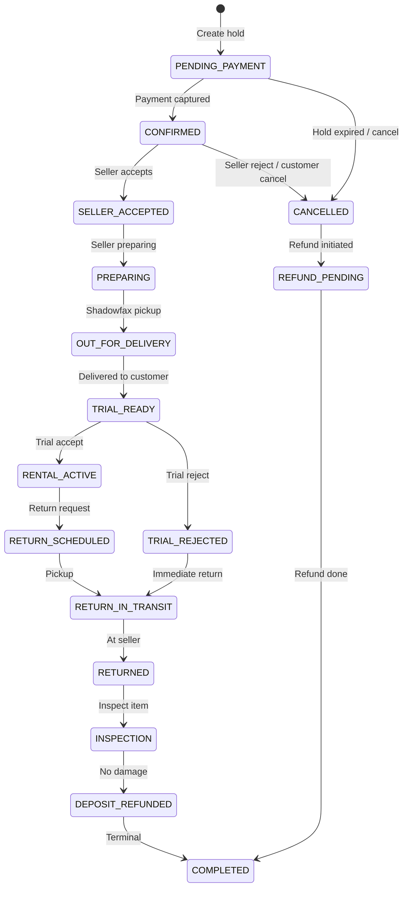

# Closiq — Phase 3: API Contract Specification

**Document version:** 1.0  
**Date:** August 4, 2026  
**Status:** Contract (documentation only — no implementation)  
**Audience:** Frontend team, Backend team, QA, Integration partners  
**Base URL:** `https://api.closiq.com/api/v1`

---

## Executive Summary

This document is the **single source of truth** for all REST APIs between the Closiq customer/seller web application (Next.js) and the backend (Spring Boot). It inherits product decisions from Phase 1 and screen/service mappings from Phase 2.

**Inherited constraints:**

| Decision | API impact |
|---|---|
| Brand: **Closiq** | Resource naming, error copy, order prefix `VQ-` |
| **15-minute home trial** mandatory | Booking state machine; trial accept/reject endpoints |
| **Phone OTP** at registration | Auth flow is phone-first; email optional |
| **Mumbai launch**, pan-India-ready | Pincode serviceability abstraction |
| Same user = Customer + Seller | JWT `roles[]`; seller routes require `SELLER` |
| Admin is separate app | Admin APIs out of scope (separate contract) |
| MVP: single-item checkout | No cart resource in v1 |
| Integrations | Razorpay (payments), Shadowfax (logistics), AWS S3 (media) |

**Explicitly out of scope for this document:**

- Spring Boot source code, SQL schemas, Java entities
- Frontend implementation
- Admin application APIs (Phase 6)
- Webhook receiver implementation details (referenced, not specified)

---

## Table of Contents

1. [Global Standards](#1-global-standards)
2. [Authentication Model](#2-authentication-model)
3. [Common Types & Enums](#3-common-types--enums)
4. [Error Catalog](#4-error-catalog)
5. [Authentication APIs](#5-authentication-apis)
6. [User APIs](#6-user-apis)
7. [Seller APIs](#7-seller-apis)
8. [Home & Discovery APIs](#8-home--discovery-apis)
9. [Product APIs](#9-product-apis)
10. [Booking APIs](#10-booking-apis)
11. [Checkout APIs](#11-checkout-apis)
12. [Payment APIs](#12-payment-apis)
13. [Shipment APIs](#13-shipment-apis)
14. [Review APIs](#14-review-apis)
15. [Notification APIs](#15-notification-apis)
16. [Seller Product Management APIs](#16-seller-product-management-apis)
17. [Seller Booking Management APIs](#17-seller-booking-management-apis)
18. [Appendix](#18-appendix)

---

## 1. Global Standards

### 1.1 Versioning Strategy

| Rule | Detail |
|---|---|
| URL prefix | All endpoints under `/api/v1/` |
| Breaking changes | New major version `/api/v2/`; v1 maintained ≥ 6 months |
| Deprecation header | `Deprecation: true` + `Sunset: <RFC 7231 date>` on deprecated endpoints |
| Non-breaking additions | New optional JSON fields, new query params, new endpoints |

### 1.2 Request Headers (Global)

| Header | Required | Description |
|---|---|---|
| `Authorization` | Conditional | `Bearer <access_token>` — required on protected routes |
| `Content-Type` | Conditional | `application/json` on requests with body |
| `Accept` | Recommended | `application/json` |
| `Accept-Language` | Optional | BCP 47 tag, e.g. `en-IN` (default `en-IN`) |
| `X-Request-Id` | Optional | Client-generated UUID; echoed in response for tracing |
| `Idempotency-Key` | Conditional | UUID v4 — required on resource-creating POSTs (see §1.10) |
| `X-Client-Platform` | Optional | `web`, `ios`, `android` — analytics only |

### 1.3 Response Wrapper

All successful JSON responses use this envelope:

```json
{
  "success": true,
  "data": { },
  "meta": {
    "requestId": "550e8400-e29b-41d4-a716-446655440000",
    "timestamp": "2026-08-04T06:57:00.000Z"
  }
}
```

| Field | Type | Description |
|---|---|---|
| `success` | boolean | Always `true` for 2xx |
| `data` | object \| array \| null | Payload |
| `meta.requestId` | string | Correlation ID |
| `meta.timestamp` | string | ISO 8601 UTC response time |
| `meta.pagination` | object | Present on paginated list responses (see §1.4) |

### 1.4 Pagination Format

**Cursor-based (default)** — catalog, notifications, booking history:

```json
{
  "success": true,
  "data": [ ],
  "meta": {
    "requestId": "...",
    "timestamp": "...",
    "pagination": {
      "type": "cursor",
      "limit": 20,
      "nextCursor": "eyJpZCI6InByb2RfMDA0In0=",
      "prevCursor": null,
      "hasMore": true,
      "totalCount": null
    }
  }
}
```

| Query param | Type | Default | Description |
|---|---|---|---|
| `limit` | integer | 20 | Page size; max 100 |
| `cursor` | string | — | Opaque cursor from previous response |

**Offset-based (allowed)** — seller reports, wallet transactions:

| Query param | Type | Default | Description |
|---|---|---|---|
| `page` | integer | 1 | 1-indexed |
| `limit` | integer | 20 | Max 100 |
| `totalCount` | integer | — | Included in `meta.pagination` when cheap to compute |

### 1.5 Sorting

| Query param | Format | Example |
|---|---|---|
| `sort` | `<field>:<direction>` | `sort=pricePerDay:asc` |
| Multiple | Comma-separated | `sort=createdAt:desc,pricePerDay:asc` |

Default sorts documented per endpoint. Invalid sort fields → `400 VALIDATION_ERROR`.

### 1.6 Filtering

Filters are query parameters using camelCase. Multi-value filters use comma separation or repeated params (both supported):

```
GET /api/v1/products?occasion=wedding,party&size=S,M&minPrice=500&maxPrice=3000&city=Mumbai
```

Boolean filters: `?featured=true`, `?includesTrial=true`.

### 1.7 Error Format (RFC 7807)

Errors return `Content-Type: application/problem+json`:

```json
{
  "type": "https://api.closiq.com/errors/validation-error",
  "title": "Validation failed",
  "status": 400,
  "code": "VALIDATION_ERROR",
  "detail": "One or more fields are invalid.",
  "instance": "/api/v1/bookings",
  "requestId": "550e8400-e29b-41d4-a716-446655440000",
  "timestamp": "2026-08-04T06:57:00.000Z",
  "errors": [
    {
      "field": "rentalStartDate",
      "code": "INVALID_DATE_RANGE",
      "message": "Rental start must be at least 2 days from today."
    }
  ]
}
```

| Field | Description |
|---|---|
| `code` | Machine-readable Closiq error code (SCREAMING_SNAKE) |
| `errors[]` | Present for validation errors; omitted for single-field business errors |
| `type` | Stable URI identifying error category |

### 1.8 Validation Error Format

Validation errors always include `errors[]` with:

| Field | Type | Description |
|---|---|---|
| `field` | string | JSON path, e.g. `address.pincode` |
| `code` | string | Specific validation code |
| `message` | string | Human-readable message (English MVP) |
| `rejectedValue` | any | Optional; omitted for sensitive fields |

### 1.9 Date & Time Format

| Context | Format | Example |
|---|---|---|
| API timestamps | ISO 8601 UTC with milliseconds | `2026-08-04T06:57:00.000Z` |
| Rental dates (date-only) | ISO 8601 date | `2026-08-14` |
| Display | Frontend converts to `Asia/Kolkata` | — |
| Duration | ISO 8601 duration or explicit minutes | `trialDurationMinutes: 15` |

### 1.10 Currency & Money Format

All monetary amounts are **integers in whole INR (rupees)** matching Phase 2 mock data. Backend stores `BigDecimal`; API serializes as integer rupees.

```json
{
  "pricePerDay": 1299,
  "deposit": 3500,
  "currency": "INR"
}
```

| Rule | Detail |
|---|---|
| Currency code | ISO 4217 — `INR` only in MVP |
| Display formatting | Frontend responsibility (`₹1,299`) |
| Razorpay bridge | Backend converts rupees → paise at payment gateway boundary |
| Negative amounts | Wallet debits/payouts use negative integers |

### 1.11 File Upload Convention

Direct-to-S3 presigned upload pattern:

1. Client requests presigned URL from API
2. Client uploads binary directly to S3
3. Client confirms upload via API (associates URL with resource)

| Property | Value |
|---|---|
| Allowed MIME types | `image/jpeg`, `image/png`, `image/webp` |
| Max file size | 10 MB per image |
| Max images per product | 8 |
| S3 key pattern | `products/{sellerId}/{productId}/{uuid}.webp` |
| KYC documents | `kyc/{userId}/{documentType}/{uuid}.pdf` — max 5 MB |

Presigned URL response:

```json
{
  "uploadId": "upl_abc123",
  "uploadUrl": "https://closiq-media.s3.ap-south-1.amazonaws.com/...",
  "method": "PUT",
  "headers": { "Content-Type": "image/webp" },
  "expiresAt": "2026-08-04T07:07:00.000Z",
  "publicUrl": "https://cdn.closiq.com/products/seller_001/prod_001/abc.webp"
}
```

### 1.12 Idempotency Rules

| Endpoint category | Idempotency-Key required |
|---|---|
| POST creating bookings, payments, reviews, payouts | **Yes** |
| POST auth OTP send | No (rate-limited instead) |
| PUT/PATCH/DELETE | No (inherently idempotent by HTTP semantics) |

Behavior:

- Same key + same body within 24h → return original response (200/201)
- Same key + different body → `409 IDEMPOTENCY_CONFLICT`
- Key stored in Redis with TTL 24h

### 1.13 Rate Limiting Recommendations

| Endpoint group | Limit | Window | Response header |
|---|---|---|---|
| Auth OTP send | 5 | 15 min / phone | `Retry-After` |
| Auth OTP verify | 10 | 15 min / phone | `Retry-After` |
| Public catalog | 120 | 1 min / IP | `X-RateLimit-Remaining` |
| Authenticated reads | 300 | 1 min / user | `X-RateLimit-Remaining` |
| Write operations | 60 | 1 min / user | `X-RateLimit-Remaining` |
| Payment verify | 10 | 1 min / user | `Retry-After` |

Exceeded limit → `429 RATE_LIMIT_EXCEEDED`.

### 1.14 HTTP Status Code Usage

| Code | Usage |
|---|---|
| 200 | Successful GET, PATCH, PUT, DELETE, idempotent replay |
| 201 | Resource created |
| 204 | Successful with no body (e.g. logout, delete) |
| 400 | Validation error, malformed request |
| 401 | Missing or invalid access token |
| 403 | Authenticated but insufficient role/ownership |
| 404 | Resource not found (or hidden due to auth) |
| 409 | Conflict — double booking, idempotency, state transition |
| 422 | Business rule violation (valid syntax, invalid semantics) |
| 429 | Rate limit exceeded |
| 500 | Unexpected server error |
| 503 | Dependency unavailable (Razorpay, Shadowfax) |

---

## 2. Authentication Model

### 2.1 Token Strategy

| Token | Lifetime | Storage | Transport |
|---|---|---|---|
| Access token (JWT) | 15 minutes | Memory (frontend) | `Authorization: Bearer` header |
| Refresh token | 30 days | HttpOnly Secure SameSite=Strict cookie | Automatic on refresh endpoint |

JWT claims:

```json
{
  "sub": "user_001",
  "roles": ["CUSTOMER", "SELLER"],
  "sellerId": "seller_001",
  "phoneVerified": true,
  "iat": 1722759420,
  "exp": 1722760320
}
```

### 2.2 Role Matrix

| Role | Description | How acquired |
|---|---|---|
| `CUSTOMER` | Default on registration | Automatic |
| `SELLER` | Can manage listings and bookings | Admin approves seller application |
| `ADMIN` | Separate admin app | Out of scope for this contract |

A user may hold `[CUSTOMER, SELLER]` simultaneously.

### 2.3 Authorization Rules

| Pattern | Rule |
|---|---|
| `/users/me/*` | Owner only |
| `/bookings/*` (customer) | Booking owner (customer) |
| `/seller/*` | Requires `SELLER` role + resource ownership |
| Public catalog | No auth; personalized fields omitted for guests |
| Checkout & payment | Requires `CUSTOMER` role |

---

## 3. Common Types & Enums

### 3.1 User

```json
{
  "id": "user_001",
  "phone": "+919876543210",
  "phoneVerified": true,
  "email": "ananya@example.com",
  "emailVerified": false,
  "firstName": "Ananya",
  "lastName": "Sharma",
  "displayName": "Ananya S.",
  "avatarUrl": null,
  "roles": ["CUSTOMER", "SELLER"],
  "createdAt": "2026-05-01T10:00:00.000Z"
}
```

### 3.2 Address

```json
{
  "id": "addr_001",
  "label": "Home",
  "line1": "14 Altamount Road",
  "line2": "Flat 3B",
  "city": "Mumbai",
  "state": "Maharashtra",
  "pincode": "400026",
  "isDefault": true,
  "serviceable": true
}
```

### 3.3 Money (inline pattern)

```json
{ "amount": 1299, "currency": "INR" }
```

### 3.4 Product (summary)

See §9 for full schema. Key fields: `id`, `slug`, `title`, `pricePerDay`, `deposit`, `variants[]`, `includesTrial`.

### 3.5 Booking / Order Status Enum

Customer-facing `status` values (SCREAMING_SNAKE in API):

| Status | Description |
|---|---|
| `PENDING_PAYMENT` | Hold created; awaiting payment |
| `CONFIRMED` | Payment captured; awaiting seller acceptance |
| `SELLER_ACCEPTED` | Seller confirmed; preparing item |
| `PREPARING` | Seller preparing for handoff |
| `OUT_FOR_DELIVERY` | Shadowfax outbound in progress |
| `TRIAL_READY` | Agent at customer door; 15-min trial active |
| `TRIAL_REJECTED` | Customer rejected during trial; immediate return |
| `RENTAL_ACTIVE` | Trial accepted; rental period running |
| `RETURN_SCHEDULED` | Return pickup booked |
| `RETURN_IN_TRANSIT` | Item in return transit |
| `RETURNED` | Item received; inspection pending |
| `INSPECTION` | Seller/platform inspecting item |
| `DEPOSIT_REFUNDED` | Deposit returned to customer |
| `COMPLETED` | Terminal success state |
| `CANCELLED` | Cancelled before or during fulfillment |
| `REFUND_PENDING` | Refund initiated |

### 3.6 Timeline Event

```json
{
  "status": "TRIAL_READY",
  "label": "Trial ready — agent at your door",
  "timestamp": "2026-08-14T04:11:00.000Z",
  "completed": false,
  "current": true
}
```

---

## 4. Error Catalog

| HTTP | Code | When |
|---|---|---|
| 400 | `VALIDATION_ERROR` | Invalid input |
| 400 | `INVALID_OTP` | OTP wrong or expired |
| 401 | `UNAUTHORIZED` | Missing/invalid token |
| 401 | `TOKEN_EXPIRED` | Access token expired |
| 403 | `FORBIDDEN` | Wrong role or not owner |
| 403 | `SELLER_NOT_VERIFIED` | Seller application pending/rejected |
| 404 | `NOT_FOUND` | Resource does not exist |
| 409 | `ALREADY_EXISTS` | Duplicate registration, wishlist item |
| 409 | `BOOKING_CONFLICT` | Date range unavailable |
| 409 | `IDEMPOTENCY_CONFLICT` | Same key, different payload |
| 409 | `INVALID_STATE_TRANSITION` | Action not allowed in current status |
| 422 | `PINCODE_NOT_SERVICEABLE` | Delivery pincode outside service area |
| 422 | `MIN_RENTAL_PERIOD` | Rental shorter than minimum (TBD — default 1 day) |
| 422 | `PAYMENT_FAILED` | Razorpay payment failed |
| 422 | `COUPON_INVALID` | Coupon expired or inapplicable |
| 429 | `RATE_LIMIT_EXCEEDED` | Too many requests |
| 503 | `PAYMENT_PROVIDER_UNAVAILABLE` | Razorpay down |
| 503 | `LOGISTICS_PROVIDER_UNAVAILABLE` | Shadowfax down |

---

## 5. Authentication APIs

### 5.1 Register (Initiate)

| Property | Value |
|---|---|
| **Endpoint** | `POST /api/v1/auth/register` |
| **HTTP Method** | POST |
| **Purpose** | Start registration — send OTP to phone number |
| **Authentication Required** | No |
| **Roles Allowed** | Public (guest) |

**Headers:** `Content-Type: application/json`

**Request Body:**

| Field | Type | Required | Validation |
|---|---|---|---|
| `phone` | string | Yes | E.164 format; India `+91` followed by 10 digits |
| `acceptTerms` | boolean | Yes | Must be `true` |

**Response Body (200):**

```json
{
  "success": true,
  "data": {
    "otpSessionId": "otp_sess_abc123",
    "phone": "+919876543210",
    "expiresInSeconds": 300,
    "resendAvailableInSeconds": 60,
    "isExistingUser": false
  },
  "meta": { "requestId": "...", "timestamp": "..." }
}
```

**Validation Rules:** Phone must be valid Indian mobile; not already registered with verified phone (returns `isExistingUser: true` hint → use login).

**Error Codes:** `VALIDATION_ERROR`, `RATE_LIMIT_EXCEEDED`, `ALREADY_EXISTS`

**Business Rules:**
- OTP valid 5 minutes
- Max 3 resends per session
- If phone already registered → suggest login flow (do not leak account existence aggressively; return generic success with `isExistingUser: true` only after OTP verify)

**Example Request:**
```http
POST /api/v1/auth/register HTTP/1.1
Content-Type: application/json

{ "phone": "+919876543210", "acceptTerms": true }
```

---

### 5.2 Verify OTP

| Property | Value |
|---|---|
| **Endpoint** | `POST /api/v1/auth/verify-otp` |
| **HTTP Method** | POST |
| **Purpose** | Verify OTP — complete registration or login |
| **Authentication Required** | No |
| **Roles Allowed** | Public |

**Request Body:**

| Field | Type | Required | Validation |
|---|---|---|---|
| `otpSessionId` | string | Yes | Valid session ID |
| `otp` | string | Yes | 6 digits |
| `purpose` | string | Yes | `REGISTER`, `LOGIN`, `RESET_PASSWORD` |
| `profile` | object | Conditional | Required when `purpose=REGISTER` and new user |

`profile` (registration completion):

| Field | Type | Required | Validation |
|---|---|---|---|
| `firstName` | string | Yes | 1–50 chars |
| `lastName` | string | Yes | 1–50 chars |
| `email` | string | No | Valid email |

**Response Body (200):**

```json
{
  "success": true,
  "data": {
    "accessToken": "eyJhbGciOiJIUzI1NiIs...",
    "expiresIn": 900,
    "tokenType": "Bearer",
    "user": { "id": "user_001", "phone": "+919876543210", "roles": ["CUSTOMER"], "phoneVerified": true },
    "isNewUser": true
  },
  "meta": { "requestId": "...", "timestamp": "..." }
}
```

**Set-Cookie:** `refreshToken=...; HttpOnly; Secure; SameSite=Strict; Path=/api/v1/auth; Max-Age=2592000`

**Error Codes:** `INVALID_OTP`, `VALIDATION_ERROR`, `RATE_LIMIT_EXCEEDED`

**Business Rules:** 5 failed attempts lock session for 15 minutes.

---

### 5.3 Login (Initiate)

| Property | Value |
|---|---|
| **Endpoint** | `POST /api/v1/auth/login` |
| **HTTP Method** | POST |
| **Purpose** | Send OTP to registered phone for login |
| **Authentication Required** | No |
| **Roles Allowed** | Public |

**Request Body:** `{ "phone": "+919876543210" }`

**Response Body (200):** Same shape as §5.1 register response with `isExistingUser: true`.

**Error Codes:** `VALIDATION_ERROR`, `NOT_FOUND` (optional — may use generic response), `RATE_LIMIT_EXCEEDED`

**Business Rules:** Unregistered phone → `404 NOT_FOUND` or redirect to register (product decision: return `404` with code `PHONE_NOT_REGISTERED`).

---

### 5.4 Logout

| Property | Value |
|---|---|
| **Endpoint** | `POST /api/v1/auth/logout` |
| **HTTP Method** | POST |
| **Purpose** | Invalidate refresh token and end session |
| **Authentication Required** | Yes |
| **Roles Allowed** | CUSTOMER, SELLER |

**Headers:** `Authorization: Bearer <token>`

**Request Body:** None (optional `{ "allDevices": false }` to logout all sessions)

**Response:** `204 No Content` — clears refresh token cookie.

**Error Codes:** `UNAUTHORIZED`

---

### 5.5 Refresh Token

| Property | Value |
|---|---|
| **Endpoint** | `POST /api/v1/auth/refresh` |
| **HTTP Method** | POST |
| **Purpose** | Issue new access token using refresh cookie |
| **Authentication Required** | Refresh cookie only |
| **Roles Allowed** | Any authenticated user |

**Headers:** Cookie `refreshToken=...`

**Response Body (200):**

```json
{
  "success": true,
  "data": {
    "accessToken": "eyJhbGciOiJIUzI1NiIs...",
    "expiresIn": 900,
    "tokenType": "Bearer"
  },
  "meta": { "requestId": "...", "timestamp": "..." }
}
```

**Error Codes:** `UNAUTHORIZED`, `TOKEN_EXPIRED`

**Business Rules:** Refresh token rotation — new refresh token issued on each refresh.

---

### 5.6 Forgot Password

| Property | Value |
|---|---|
| **Endpoint** | `POST /api/v1/auth/forgot-password` |
| **HTTP Method** | POST |
| **Purpose** | Initiate password reset (email users only; phone-first users use OTP login) |
| **Authentication Required** | No |
| **Roles Allowed** | Public |

**Request Body:** `{ "email": "ananya@example.com" }`

**Response Body (200):** Generic success regardless of email existence (security).

```json
{ "success": true, "data": { "message": "If an account exists, reset instructions were sent." }, "meta": {} }
```

**Error Codes:** `VALIDATION_ERROR`, `RATE_LIMIT_EXCEEDED`

**Business Rules:** MVP is phone-first; this endpoint supports optional email+password auth added later.

---

### 5.7 Reset Password

| Property | Value |
|---|---|
| **Endpoint** | `POST /api/v1/auth/reset-password` |
| **HTTP Method** | POST |
| **Purpose** | Set new password using reset token or OTP session |
| **Authentication Required** | No |
| **Roles Allowed** | Public |

**Request Body:**

| Field | Type | Required |
|---|---|---|
| `resetToken` | string | Conditional — email flow |
| `otpSessionId` + `otp` | string | Conditional — phone flow |
| `newPassword` | string | Yes — min 8 chars, 1 upper, 1 digit |

**Response:** `200` with success message or auto-login tokens.

**Error Codes:** `INVALID_OTP`, `VALIDATION_ERROR`, `NOT_FOUND`

---

### 5.8 Current User

| Property | Value |
|---|---|
| **Endpoint** | `GET /api/v1/auth/me` |
| **HTTP Method** | GET |
| **Purpose** | Return authenticated user profile summary |
| **Authentication Required** | Yes |
| **Roles Allowed** | CUSTOMER, SELLER |

**Response Body (200):** Full `User` object (§3.1) plus optional `sellerProfile` stub if SELLER.

**Error Codes:** `UNAUTHORIZED`

**Example Response:**
```json
{
  "success": true,
  "data": {
    "id": "user_001",
    "phone": "+919876543210",
    "phoneVerified": true,
    "firstName": "Ananya",
    "lastName": "Sharma",
    "displayName": "Ananya S.",
    "roles": ["CUSTOMER", "SELLER"],
    "sellerProfile": {
      "sellerId": "seller_001",
      "businessName": "House of Meera",
      "verificationStatus": "VERIFIED"
    }
  },
  "meta": { "requestId": "...", "timestamp": "..." }
}
```

---

## 6. User APIs

### 6.1 Get Profile

| Property | Value |
|---|---|
| **Endpoint** | `GET /api/v1/users/me` |
| **HTTP Method** | GET |
| **Purpose** | Full profile including preferences |
| **Authentication Required** | Yes |
| **Roles Allowed** | CUSTOMER, SELLER |

**Response includes:** User, `preferences`, `sellerProfile` (if applicable).

---

### 6.2 Update Profile

| Property | Value |
|---|---|
| **Endpoint** | `PATCH /api/v1/users/me` |
| **HTTP Method** | PATCH |
| **Purpose** | Update name, email, avatar, preferences |
| **Authentication Required** | Yes |
| **Roles Allowed** | CUSTOMER, SELLER |

**Request Body (partial):**

| Field | Type | Validation |
|---|---|---|
| `firstName` | string | 1–50 chars |
| `lastName` | string | 1–50 chars |
| `email` | string | Valid email; triggers verification |
| `avatarUrl` | string | Valid CDN URL from prior upload |
| `preferences.size` | string | XS, S, M, L, XL, XXL |
| `preferences.occasions` | string[] | Valid occasion slugs |

**Error Codes:** `VALIDATION_ERROR`, `ALREADY_EXISTS` (email taken)

---

### 6.3 List Addresses

| Property | Value |
|---|---|
| **Endpoint** | `GET /api/v1/users/me/addresses` |
| **HTTP Method** | GET |
| **Purpose** | List saved delivery addresses |
| **Authentication Required** | Yes |
| **Roles Allowed** | CUSTOMER, SELLER |

**Response:** Array of `Address` (§3.2).

---

### 6.4 Create Address

| Property | Value |
|---|---|
| **Endpoint** | `POST /api/v1/users/me/addresses` |
| **HTTP Method** | POST |
| **Purpose** | Add delivery address |
| **Authentication Required** | Yes |
| **Roles Allowed** | CUSTOMER, SELLER |

**Request Body:**

| Field | Required | Validation |
|---|---|---|
| `label` | Yes | Home, Office, Other — max 20 chars |
| `line1` | Yes | Max 100 chars |
| `line2` | No | Max 100 chars |
| `city` | Yes | Max 50 chars |
| `state` | Yes | Indian state |
| `pincode` | Yes | 6 digits |
| `isDefault` | No | boolean |

**Response (201):** Created `Address` with computed `serviceable` flag.

**Business Rules:** Max 10 addresses per user. Setting `isDefault: true` clears other defaults.

---

### 6.5 Update Address

| Property | Value |
|---|---|
| **Endpoint** | `PATCH /api/v1/users/me/addresses/{addressId}` |
| **HTTP Method** | PATCH |
| **Path Parameters** | `addressId` — e.g. `addr_001` |
| **Authentication Required** | Yes |
| **Roles Allowed** | Owner |

**Error Codes:** `NOT_FOUND`, `VALIDATION_ERROR`, `FORBIDDEN`

---

### 6.6 Delete Address

| Property | Value |
|---|---|
| **Endpoint** | `DELETE /api/v1/users/me/addresses/{addressId}` |
| **HTTP Method** | DELETE |
| **Purpose** | Remove address |
| **Authentication Required** | Yes |
| **Roles Allowed** | Owner |

**Response:** `204 No Content`

**Business Rules:** Cannot delete last address if active booking references it.

---

### 6.7 Check Pincode Serviceability

| Property | Value |
|---|---|
| **Endpoint** | `GET /api/v1/serviceability/pincodes/{pincode}` |
| **HTTP Method** | GET |
| **Purpose** | Check if pincode is serviceable for delivery (Mumbai MVP) |
| **Authentication Required** | No |
| **Roles Allowed** | Public |

**Path Parameters:** `pincode` — 6 digits

**Response (200):**

```json
{
  "success": true,
  "data": {
    "pincode": "400026",
    "serviceable": true,
    "city": "Mumbai",
    "state": "Maharashtra",
    "estimatedDeliveryDays": 1,
    "launchPhase": "MUMBAI"
  },
  "meta": {}
}
```

**Error Codes:** `VALIDATION_ERROR` (invalid pincode format)

---

### 6.8 List Wishlist

| Property | Value |
|---|---|
| **Endpoint** | `GET /api/v1/users/me/wishlist` |
| **HTTP Method** | GET |
| **Purpose** | List wishlisted products |
| **Authentication Required** | Yes |
| **Roles Allowed** | CUSTOMER, SELLER |

**Query Parameters:** `limit`, `cursor` (cursor pagination)

**Response:** Array of wishlist items with embedded product summary.

---

### 6.9 Add to Wishlist

| Property | Value |
|---|---|
| **Endpoint** | `POST /api/v1/users/me/wishlist` |
| **HTTP Method** | POST |
| **Purpose** | Add product to wishlist |
| **Authentication Required** | Yes |
| **Roles Allowed** | CUSTOMER, SELLER |

**Request Body:** `{ "productId": "prod_001" }`

**Response (201):** Wishlist item. **Error Codes:** `NOT_FOUND`, `ALREADY_EXISTS`

**Business Rules:** Max 100 wishlist items.

---

### 6.10 Remove from Wishlist

| Property | Value |
|---|---|
| **Endpoint** | `DELETE /api/v1/users/me/wishlist/{productId}` |
| **HTTP Method** | DELETE |
| **Authentication Required** | Yes |
| **Roles Allowed** | Owner |

**Response:** `204 No Content`

---

### 6.11 Get Notification Preferences

| Property | Value |
|---|---|
| **Endpoint** | `GET /api/v1/users/me/settings/notifications` |
| **HTTP Method** | GET |
| **Purpose** | Get notification channel preferences |
| **Authentication Required** | Yes |
| **Roles Allowed** | CUSTOMER, SELLER |

**Response:**

```json
{
  "success": true,
  "data": {
    "emailEnabled": true,
    "smsEnabled": true,
    "pushEnabled": false,
    "orderUpdates": true,
    "promotions": false,
    "sellerBookingAlerts": true
  },
  "meta": {}
}
```

---

### 6.12 Update Notification Preferences

| Property | Value |
|---|---|
| **Endpoint** | `PATCH /api/v1/users/me/settings/notifications` |
| **HTTP Method** | PATCH |
| **Authentication Required** | Yes |
| **Roles Allowed** | Owner |

**Request Body:** Partial of preferences object above.

---

### 6.13 Get Account Settings

| Property | Value |
|---|---|
| **Endpoint** | `GET /api/v1/users/me/settings` |
| **HTTP Method** | GET |
| **Purpose** | Account settings (language, privacy) |
| **Authentication Required** | Yes |
| **Roles Allowed** | CUSTOMER, SELLER |

---

### 6.14 Update Account Settings

| Property | Value |
|---|---|
| **Endpoint** | `PATCH /api/v1/users/me/settings` |
| **HTTP Method** | PATCH |
| **Request Body:** | `{ "language": "en-IN", "marketingOptIn": false }` |

---

## 7. Seller APIs

### 7.1 Become Seller (Apply)

| Property | Value |
|---|---|
| **Endpoint** | `POST /api/v1/seller/applications` |
| **HTTP Method** | POST |
| **Purpose** | Submit seller application |
| **Authentication Required** | Yes |
| **Roles Allowed** | CUSTOMER (not yet SELLER) |

**Headers:** `Idempotency-Key` recommended

**Request Body:**

| Field | Type | Required | Validation |
|---|---|---|---|
| `businessName` | string | Yes | 2–100 chars |
| `businessType` | string | Yes | `INDIVIDUAL`, `PROPRIETORSHIP`, `PARTNERSHIP`, `PRIVATE_LIMITED` |
| `city` | string | Yes | Max 50 chars |
| `description` | string | No | Max 500 chars |
| `gstNumber` | string | No | Valid GSTIN format if provided |
| `panNumber` | string | Yes | Valid PAN format |

**Response (201):**

```json
{
  "success": true,
  "data": {
    "applicationId": "sap_001",
    "status": "PENDING",
    "submittedAt": "2026-08-04T06:57:00.000Z"
  },
  "meta": {}
}
```

**Error Codes:** `ALREADY_EXISTS` (pending/approved application), `VALIDATION_ERROR`, `FORBIDDEN` (already SELLER)

---

### 7.2 Get Seller Application Status

| Property | Value |
|---|---|
| **Endpoint** | `GET /api/v1/seller/applications/me` |
| **HTTP Method** | GET |
| **Purpose** | Check KYC / verification status |
| **Authentication Required** | Yes |
| **Roles Allowed** | CUSTOMER, SELLER |

**Response:**

```json
{
  "success": true,
  "data": {
    "applicationId": "sap_001",
    "status": "VERIFIED",
    "businessName": "House of Meera",
    "submittedAt": "2026-05-10T10:00:00.000Z",
    "reviewedAt": "2026-05-15T14:00:00.000Z",
    "rejectionReason": null,
    "documents": [
      { "type": "PAN", "status": "APPROVED", "uploadedAt": "2026-05-10T10:05:00.000Z" },
      { "type": "ADDRESS_PROOF", "status": "APPROVED", "uploadedAt": "2026-05-10T10:06:00.000Z" }
    ]
  },
  "meta": {}
}
```

**Status enum:** `DRAFT`, `PENDING`, `UNDER_REVIEW`, `VERIFIED`, `REJECTED`, `SUSPENDED`

---

### 7.3 Upload KYC Document (Presigned)

| Property | Value |
|---|---|
| **Endpoint** | `POST /api/v1/seller/applications/me/kyc-documents/upload-url` |
| **HTTP Method** | POST |
| **Purpose** | Get presigned URL for KYC document upload |
| **Authentication Required** | Yes |
| **Roles Allowed** | Applicant |

**Request Body:**

| Field | Required | Values |
|---|---|---|
| `documentType` | Yes | `PAN`, `ADDRESS_PROOF`, `GST_CERTIFICATE`, `BANK_STATEMENT` |
| `contentType` | Yes | `application/pdf`, `image/jpeg`, `image/png` |
| `fileName` | Yes | Original filename |

**Response (200):** Presigned upload object (§1.11)

**Follow-up:** `POST /api/v1/seller/applications/me/kyc-documents/confirm` with `{ "uploadId": "...", "documentType": "PAN" }`

---

### 7.4 Seller Dashboard

| Property | Value |
|---|---|
| **Endpoint** | `GET /api/v1/seller/dashboard` |
| **HTTP Method** | GET |
| **Purpose** | Summary metrics, tasks, recent bookings |
| **Authentication Required** | Yes |
| **Roles Allowed** | SELLER |

**Query Parameters:** None

**Response (200):**

```json
{
  "success": true,
  "data": {
    "summary": {
      "activeListings": 12,
      "pendingBookings": 2,
      "earningsThisMonth": 45200,
      "currency": "INR"
    },
    "tasks": [
      { "type": "ACCEPT_BOOKING", "bookingId": "bkg_seller_003", "dueBy": "2026-08-13T12:00:00.000Z" },
      { "type": "PREP_ITEM", "bookingId": "bkg_seller_001", "dueBy": "2026-08-13T12:30:00.000Z" }
    ],
    "recentBookings": [ ]
  },
  "meta": {}
}
```

**Error Codes:** `FORBIDDEN`, `SELLER_NOT_VERIFIED`

---

### 7.5 Seller Wallet

| Property | Value |
|---|---|
| **Endpoint** | `GET /api/v1/seller/wallet` |
| **HTTP Method** | GET |
| **Purpose** | Wallet balances and recent transactions |
| **Authentication Required** | Yes |
| **Roles Allowed** | SELLER |

**Query Parameters:** `page`, `limit` for transaction pagination

**Response (200):** Matches mock `wallet.json` structure — `availableBalance`, `pendingBalance`, `transactions[]`.

---

### 7.6 Request Payout

| Property | Value |
|---|---|
| **Endpoint** | `POST /api/v1/seller/wallet/payouts` |
| **HTTP Method** | POST |
| **Purpose** | Request withdrawal to bank account |
| **Authentication Required** | Yes |
| **Roles Allowed** | SELLER |

**Headers:** `Idempotency-Key` required

**Request Body:**

| Field | Required | Validation |
|---|---|---|
| `amount` | Yes | Integer INR; ≤ availableBalance; min 500 |
| `payoutMethodId` | Yes | Valid bank account ID |

**Response (201):** `{ "payoutId": "pay_out_001", "status": "PROCESSING", "amount": 15000 }`

**Error Codes:** `VALIDATION_ERROR`, `FORBIDDEN`, `422` insufficient balance

**Business Rules:** Payouts processed T+2 business days (MVP).

---

### 7.7 List Bank Accounts

| Property | Value |
|---|---|
| **Endpoint** | `GET /api/v1/seller/bank-accounts` |
| **HTTP Method** | GET |
| **Authentication Required** | Yes |
| **Roles Allowed** | SELLER |

---

### 7.8 Add Bank Account

| Property | Value |
|---|---|
| **Endpoint** | `POST /api/v1/seller/bank-accounts` |
| **HTTP Method** | POST |
| **Purpose** | Add payout bank account |
| **Authentication Required** | Yes |
| **Roles Allowed** | SELLER |

**Request Body:**

| Field | Required | Validation |
|---|---|---|
| `accountHolderName` | Yes | Match KYC name |
| `accountNumber` | Yes | 9–18 digits |
| `ifscCode` | Yes | Valid IFSC |
| `bankName` | No | Auto-resolved from IFSC |

**Response (201):** Masked account `{ "id": "payout_001", "label": "HDFC Bank ···4821", "isDefault": true }`

**Business Rules:** Penny-drop verification async; status `PENDING_VERIFICATION` → `VERIFIED`.

---

### 7.9 Delete Bank Account

| Property | Value |
|---|---|
| **Endpoint** | `DELETE /api/v1/seller/bank-accounts/{accountId}` |
| **HTTP Method** | DELETE |
| **Business Rules:** Cannot delete default if other accounts exist without reassigning default. |

---

### 7.10 Seller Analytics

| Property | Value |
|---|---|
| **Endpoint** | `GET /api/v1/seller/analytics` |
| **HTTP Method** | GET |
| **Purpose** | Views, conversion, top products |
| **Authentication Required** | Yes |
| **Roles Allowed** | SELLER |

**Query Parameters:**

| Param | Type | Default | Description |
|---|---|---|---|
| `period` | string | `30d` | `7d`, `30d`, `90d`, `custom` |
| `startDate` | date | — | Required if `period=custom` |
| `endDate` | date | — | Required if `period=custom` |

**Response (200):**

```json
{
  "success": true,
  "data": {
    "period": "30d",
    "views": 2840,
    "uniqueVisitors": 1920,
    "bookings": 18,
    "conversionRate": 0.009,
    "revenue": 48600,
    "currency": "INR",
    "topProducts": [
      { "productId": "prod_001", "title": "Emerald draped saree", "views": 820, "bookings": 7 }
    ]
  },
  "meta": {}
}
```

---

## 8. Home & Discovery APIs

### 8.1 Featured Products

| Property | Value |
|---|---|
| **Endpoint** | `GET /api/v1/home/featured-products` |
| **HTTP Method** | GET |
| **Purpose** | Curated featured products for home hero / rails |
| **Authentication Required** | No |
| **Roles Allowed** | Public |

**Query Parameters:** `limit` (default 8, max 20)

**Response:** Array of product summary cards.

---

### 8.2 Trending Products

| Property | Value |
|---|---|
| **Endpoint** | `GET /api/v1/home/trending-products` |
| **HTTP Method** | GET |
| **Purpose** | Trending products based on views + bookings (7-day window) |
| **Authentication Required** | No |

**Query Parameters:** `limit` (default 12)

---

### 8.3 Categories

| Property | Value |
|---|---|
| **Endpoint** | `GET /api/v1/categories` |
| **HTTP Method** | GET |
| **Purpose** | List occasion/category navigation |
| **Authentication Required** | No |

**Query Parameters:** `featured` (boolean, optional)

**Response (200):** Array matching `categories.json` — `id`, `slug`, `name`, `description`, `image`, `productCount`, `featured`, `sortOrder`.

---

### 8.4 Category Products

| Property | Value |
|---|---|
| **Endpoint** | `GET /api/v1/categories/{slug}/products` |
| **HTTP Method** | GET |
| **Purpose** | Products within an occasion category |
| **Authentication Required** | No |

**Path Parameters:** `slug` — e.g. `wedding`, `new-in`

**Query Parameters:** Same as product list (§9.1)

---

### 8.5 Offers

| Property | Value |
|---|---|
| **Endpoint** | `GET /api/v1/offers` |
| **HTTP Method** | GET |
| **Purpose** | Active promotional offers for home banners |
| **Authentication Required** | No |

**Response:**

```json
{
  "success": true,
  "data": [
    {
      "id": "offer_001",
      "title": "First rental — ₹500 off",
      "description": "Use code FIRST500 at checkout",
      "code": "FIRST500",
      "discountType": "FIXED",
      "discountValue": 500,
      "validUntil": "2026-09-30T23:59:59.000Z",
      "imageUrl": "https://cdn.closiq.com/offers/first500.webp"
    }
  ],
  "meta": {}
}
```

---

### 8.6 Recommendations

| Property | Value |
|---|---|
| **Endpoint** | `GET /api/v1/home/recommendations` |
| **HTTP Method** | GET |
| **Purpose** | Personalized product recommendations |
| **Authentication Required** | Optional |
| **Roles Allowed** | Public (generic if guest); personalized if authenticated |

**Query Parameters:** `limit` (default 8)

**Business Rules:** Guest → trending + occasion affinity from cookies. Auth → based on wishlist, orders, preferences.

---

## 9. Product APIs

### 9.1 List Products

| Property | Value |
|---|---|
| **Endpoint** | `GET /api/v1/products` |
| **HTTP Method** | GET |
| **Purpose** | Paginated product listing with filters |
| **Authentication Required** | No |
| **Roles Allowed** | Public |

**Query Parameters:**

| Param | Type | Description |
|---|---|---|
| `occasion` | string | Comma-separated slugs: `wedding,party` |
| `categoryId` | string | Category ID filter |
| `size` | string | Comma-separated: `S,M` |
| `minPrice` | integer | Min price per day (INR) |
| `maxPrice` | integer | Max price per day |
| `city` | string | Seller city |
| `featured` | boolean | Featured only |
| `trending` | boolean | Trending only |
| `sort` | string | `createdAt:desc`, `pricePerDay:asc`, `rating:desc` |
| `limit`, `cursor` | — | Cursor pagination |

**Response (200):** Paginated product summaries.

**Example Request:**
```http
GET /api/v1/products?occasion=wedding&size=S&sort=pricePerDay:asc&limit=20
```

**Example Response:**
```json
{
  "success": true,
  "data": [
    {
      "id": "prod_001",
      "slug": "emerald-draped-saree",
      "title": "Emerald draped saree",
      "designer": "House of Meera",
      "images": ["https://cdn.closiq.com/..."],
      "pricePerDay": 1299,
      "deposit": 3500,
      "currency": "INR",
      "rating": 4.9,
      "reviewCount": 47,
      "badges": ["LOW_STOCK", "INCLUDES_TRIAL"],
      "includesTrial": true,
      "city": "Mumbai"
    }
  ],
  "meta": { "pagination": { "type": "cursor", "limit": 20, "hasMore": true, "nextCursor": "..." } }
}
```

---

### 9.2 Product Details

| Property | Value |
|---|---|
| **Endpoint** | `GET /api/v1/products/{slug}` |
| **HTTP Method** | GET |
| **Purpose** | Full product detail for PDP |
| **Authentication Required** | No |
| **Roles Allowed** | Public |

**Path Parameters:** `slug` — SEO slug, e.g. `emerald-draped-saree`

**Response (200):** Full product object including `description`, `variants[]`, `seller`, `deliverablePincodes`, `includesTrial`, `sizeGuide`.

**Error Codes:** `NOT_FOUND`

---

### 9.3 Search Products

| Property | Value |
|---|---|
| **Endpoint** | `GET /api/v1/products/search` |
| **HTTP Method** | GET |
| **Purpose** | Full-text search across title, designer, description, tags |
| **Authentication Required** | No |

**Query Parameters:**

| Param | Required | Description |
|---|---|---|
| `q` | Yes | Search query; min 2 chars |
| `occasion`, `size`, `minPrice`, `maxPrice` | No | Same filters as list |
| `limit`, `cursor` | No | Pagination |

**Response:** Same as list + `meta.searchMeta`: `{ "query": "saree", "totalCount": 42, "tookMs": 12 }`

---

### 9.4 Product Filters (Facets)

| Property | Value |
|---|---|
| **Endpoint** | `GET /api/v1/products/filters` |
| **HTTP Method** | GET |
| **Purpose** | Available filter facets for PLP / search UI |
| **Authentication Required** | No |

**Query Parameters:** Same filter context as list (optional `occasion`, `q`) to get contextual counts.

**Response (200):**

```json
{
  "success": true,
  "data": {
    "occasions": [{ "slug": "wedding", "name": "Wedding", "count": 128 }],
    "sizes": [{ "value": "S", "count": 89 }],
    "priceRange": { "min": 500, "max": 5000 },
    "cities": [{ "value": "Mumbai", "count": 420 }]
  },
  "meta": {}
}
```

---

### 9.5 Availability Calendar

| Property | Value |
|---|---|
| **Endpoint** | `GET /api/v1/products/{slug}/availability` |
| **HTTP Method** | GET |
| **Purpose** | Server-authoritative unavailable/booked dates for variant |
| **Authentication Required** | No |
| **Roles Allowed** | Public |

**Query Parameters:**

| Param | Required | Description |
|---|---|---|
| `variantId` | Yes | e.g. `var_001_s` |
| `startDate` | No | Default today |
| `endDate` | No | Default +90 days |

**Response (200):**

```json
{
  "success": true,
  "data": {
    "productId": "prod_001",
    "variantId": "var_001_s",
    "minRentalDays": 1,
    "maxRentalDays": 14,
    "bufferDaysAfterReturn": 1,
    "unavailableDates": ["2026-08-15", "2026-08-16"],
    "bookedRanges": [
      { "start": "2026-08-20", "end": "2026-08-22", "reason": "BOOKED" }
    ],
    "blockedRanges": [
      { "start": "2026-08-25", "end": "2026-08-26", "reason": "SELLER_BLOCKED" }
    ],
    "nextAvailableDate": "2026-08-17"
  },
  "meta": {}
}
```

**Business Rules:** Client calendar is read-only; server validates on booking create. Buffer day after return for cleaning.

---

### 9.6 Related Products

| Property | Value |
|---|---|
| **Endpoint** | `GET /api/v1/products/{slug}/related` |
| **HTTP Method** | GET |
| **Purpose** | Similar products (same occasion, designer, price band) |
| **Authentication Required** | No |

**Query Parameters:** `limit` (default 4, max 12)

---

### 9.7 Product Reviews

| Property | Value |
|---|---|
| **Endpoint** | `GET /api/v1/products/{slug}/reviews` |
| **HTTP Method** | GET |
| **Purpose** | Paginated reviews for product |
| **Authentication Required** | No |

**Query Parameters:** `limit`, `cursor`, `sort=rating:desc|createdAt:desc`

**Response:** Reviews with `rating`, `comment`, `customerDisplayName`, `photos[]`, `createdAt`, `verifiedRental: true`.

---

### 9.8 Product Images

| Property | Value |
|---|---|
| **Endpoint** | `GET /api/v1/products/{slug}/images` |
| **HTTP Method** | GET |
| **Purpose** | Ordered image gallery URLs |
| **Authentication Required** | No |

**Response:** `{ "images": [{ "id": "img_001", "url": "...", "sortOrder": 0, "alt": "..." }] }`

---

## 10. Booking APIs

### 10.1 Create Booking (Hold)

| Property | Value |
|---|---|
| **Endpoint** | `POST /api/v1/bookings` |
| **HTTP Method** | POST |
| **Purpose** | Create booking hold and initiate checkout session |
| **Authentication Required** | Yes |
| **Roles Allowed** | CUSTOMER |

**Headers:** `Authorization`, `Idempotency-Key`, `Content-Type`

**Request Body:**

| Field | Type | Required | Validation |
|---|---|---|---|
| `productId` | string | Yes | Active product |
| `variantId` | string | Yes | Available variant |
| `rentalStartDate` | date | Yes | ISO date; ≥ today + 2 days (configurable) |
| `rentalEndDate` | date | Yes | > rentalStartDate; min rental days |
| `deliveryAddressId` | string | No | Required before payment; optional at hold |
| `customerNotes` | string | No | Max 200 chars |

**Response (201):**

```json
{
  "success": true,
  "data": {
    "bookingId": "bkg_001",
    "bookingNumber": "BK-2026-000482",
    "status": "PENDING_PAYMENT",
    "holdExpiresAt": "2026-08-04T07:12:00.000Z",
    "checkoutSessionId": "chk_sess_abc",
    "product": { "id": "prod_001", "title": "Emerald draped saree", "variantSize": "S" },
    "rentalStartDate": "2026-08-14",
    "rentalEndDate": "2026-08-17",
    "rentalDays": 3,
    "includesTrial": true,
    "trialDurationMinutes": 15,
    "pricing": {
      "rentalAmount": 3897,
      "depositAmount": 3500,
      "deliveryFee": 0,
      "discountAmount": 0,
      "totalAmount": 7397,
      "currency": "INR"
    }
  },
  "meta": {}
}
```

**Validation Rules:** Dates must pass availability check; variant must be available; no overlapping holds.

**Error Codes:** `BOOKING_CONFLICT`, `VALIDATION_ERROR`, `NOT_FOUND`, `PINCODE_NOT_SERVICEABLE` (if address provided)

**Business Rules:**
- Redis lock + DB constraint (Phase 1 ADR-004)
- Hold TTL: 15 minutes
- Single-item checkout — one booking per checkout session

**Example Request:**
```http
POST /api/v1/bookings HTTP/1.1
Authorization: Bearer eyJ...
Idempotency-Key: 7c9e6679-7425-40de-944b-e07fc1f90ae7
Content-Type: application/json

{
  "productId": "prod_001",
  "variantId": "var_001_s",
  "rentalStartDate": "2026-08-14",
  "rentalEndDate": "2026-08-17"
}
```

---

### 10.2 Get Booking Details

| Property | Value |
|---|---|
| **Endpoint** | `GET /api/v1/bookings/{bookingId}` |
| **HTTP Method** | GET |
| **Purpose** | Full booking/order detail for customer |
| **Authentication Required** | Yes |
| **Roles Allowed** | Booking owner (CUSTOMER) |

**Path Parameters:** `bookingId` — e.g. `bkg_001` or booking number `BK-2026-000482`

**Response (200):** Full order object matching `orders.json` — status, timeline, pricing, delivery address, trial info.

**Error Codes:** `NOT_FOUND`, `FORBIDDEN`

---

### 10.3 Booking History

| Property | Value |
|---|---|
| **Endpoint** | `GET /api/v1/bookings` |
| **HTTP Method** | GET |
| **Purpose** | Customer booking history |
| **Authentication Required** | Yes |
| **Roles Allowed** | CUSTOMER |

**Query Parameters:**

| Param | Description |
|---|---|
| `status` | Filter by status enum |
| `sort` | `createdAt:desc` (default) |
| `limit`, `cursor` | Cursor pagination |

---

### 10.4 Cancel Booking

| Property | Value |
|---|---|
| **Endpoint** | `POST /api/v1/bookings/{bookingId}/cancel` |
| **HTTP Method** | POST |
| **Purpose** | Cancel booking per cancellation policy |
| **Authentication Required** | Yes |
| **Roles Allowed** | Booking owner |

**Request Body:** `{ "reason": "CHANGE_OF_PLANS", "comment": "optional" }`

**Reason enum:** `CHANGE_OF_PLANS`, `FOUND_ALTERNATIVE`, `PRICE_CONCERN`, `OTHER`

**Response (200):** Updated booking with `status: CANCELLED`, `refundDetails`.

**Error Codes:** `INVALID_STATE_TRANSITION`, `NOT_FOUND`

**Business Rules:**
- `PENDING_PAYMENT` → free cancel
- `CONFIRMED` before seller acceptance → full refund
- After `SELLER_ACCEPTED` → partial refund per policy (TBD)
- Not cancellable after `OUT_FOR_DELIVERY`

---

### 10.5 Trial Accept

| Property | Value |
|---|---|
| **Endpoint** | `POST /api/v1/bookings/{bookingId}/trial/accept` |
| **HTTP Method** | POST |
| **Purpose** | Customer accepts item during 15-min home trial |
| **Authentication Required** | Yes |
| **Roles Allowed** | Booking owner |

**Request Body:** None (optional `{ "feedback": "Perfect fit" }`)

**Response (200):** `{ "status": "RENTAL_ACTIVE", "rentalActiveAt": "..." }`

**Error Codes:** `INVALID_STATE_TRANSITION` (not TRIAL_READY), `FORBIDDEN`

**Business Rules:** Only valid when `status=TRIAL_READY` and within 15-minute window from `trialStartedAt`.

---

### 10.6 Trial Reject

| Property | Value |
|---|---|
| **Endpoint** | `POST /api/v1/bookings/{bookingId}/trial/reject` |
| **HTTP Method** | POST |
| **Purpose** | Customer rejects item during trial — immediate return, rental fee refunded |
| **Authentication Required** | Yes |
| **Roles Allowed** | Booking owner |

**Request Body:** `{ "reason": "SIZE_ISSUE", "comment": "Blouse too tight" }`

**Reason enum:** `SIZE_ISSUE`, `QUALITY_ISSUE`, `NOT_AS_DESCRIBED`, `CHANGED_MIND`, `OTHER`

**Response (200):** `{ "status": "TRIAL_REJECTED", "refundAmount": 3897, "depositRefundAmount": 3500 }`

**Business Rules:** Rental amount refunded; deposit released after item returned and inspected.

---

### 10.7 Return Request

| Property | Value |
|---|---|
| **Endpoint** | `POST /api/v1/bookings/{bookingId}/return-request` |
| **HTTP Method** | POST |
| **Purpose** | Schedule return pickup at end of rental |
| **Authentication Required** | Yes |
| **Roles Allowed** | Booking owner |

**Request Body:**

| Field | Required | Description |
|---|---|---|
| `pickupDate` | Yes | Must be `rentalEndDate` or next serviceable day |
| `pickupTimeSlot` | Yes | `MORNING`, `AFTERNOON`, `EVENING` |
| `addressId` | No | Defaults to delivery address |

**Response (200):** `{ "status": "RETURN_SCHEDULED", "pickupScheduledAt": "..." }`

**Error Codes:** `INVALID_STATE_TRANSITION` (must be RENTAL_ACTIVE)

---

### 10.8 Booking Timeline

| Property | Value |
|---|---|
| **Endpoint** | `GET /api/v1/bookings/{bookingId}/timeline` |
| **HTTP Method** | GET |
| **Purpose** | Vertical order timeline events |
| **Authentication Required** | Yes |
| **Roles Allowed** | Booking owner |

**Response (200):** Array of timeline events (§3.6).

---

## 11. Checkout APIs

### 11.1 Price Calculation

| Property | Value |
|---|---|
| **Endpoint** | `POST /api/v1/checkout/calculate` |
| **HTTP Method** | POST |
| **Purpose** | Compute rental + deposit + fees without creating booking |
| **Authentication Required** | No (optional for personalized offers) |

**Request Body:**

```json
{
  "productId": "prod_001",
  "variantId": "var_001_s",
  "rentalStartDate": "2026-08-14",
  "rentalEndDate": "2026-08-17",
  "pincode": "400026",
  "couponCode": "FIRST500"
}
```

**Response (200):**

```json
{
  "success": true,
  "data": {
    "rentalDays": 3,
    "lineItems": [
      { "type": "RENTAL", "label": "Rental (3 days × ₹1,299)", "amount": 3897 },
      { "type": "DEPOSIT", "label": "Refundable deposit", "amount": 3500 },
      { "type": "DELIVERY", "label": "Delivery", "amount": 0 },
      { "type": "DISCOUNT", "label": "Coupon FIRST500", "amount": -500 }
    ],
    "subtotal": 7397,
    "discountAmount": 500,
    "totalAmount": 6897,
    "depositAmount": 3500,
    "payNowAmount": 6897,
    "currency": "INR",
    "serviceable": true
  },
  "meta": {}
}
```

---

### 11.2 Validate Coupon

| Property | Value |
|---|---|
| **Endpoint** | `POST /api/v1/checkout/coupons/validate` |
| **HTTP Method** | POST |
| **Purpose** | Validate coupon against booking context |
| **Authentication Required** | Yes |

**Request Body:** `{ "couponCode": "FIRST500", "bookingId": "bkg_001" }` or product/date context

**Response (200):** `{ "valid": true, "discountAmount": 500, "message": "₹500 off applied" }`

**Error Codes:** `COUPON_INVALID`

---

### 11.3 Checkout Summary

| Property | Value |
|---|---|
| **Endpoint** | `GET /api/v1/checkout/sessions/{sessionId}/summary` |
| **HTTP Method** | GET |
| **Purpose** | Review step — full checkout summary |
| **Authentication Required** | Yes |

**Response:** Booking + address + pricing + trial reminder + pincode serviceability.

---

### 11.4 Initiate Checkout Session

| Property | Value |
|---|---|
| **Endpoint** | `POST /api/v1/checkout/sessions` |
| **HTTP Method** | POST |
| **Purpose** | Bind address to booking hold; prepare for payment |
| **Authentication Required** | Yes |
| **Headers** | `Idempotency-Key` |

**Request Body:**

```json
{
  "bookingId": "bkg_001",
  "deliveryAddressId": "addr_001",
  "couponCode": "FIRST500"
}
```

**Response (200):** Checkout session with updated pricing and `readyForPayment: true`.

**Error Codes:** `PINCODE_NOT_SERVICEABLE`, `BOOKING_CONFLICT` (hold expired)

**Business Rules:** Pincode validated against Shadowfax serviceability before `readyForPayment: true`.

---

## 12. Payment APIs

### 12.1 Create Razorpay Order

| Property | Value |
|---|---|
| **Endpoint** | `POST /api/v1/payments/razorpay/orders` |
| **HTTP Method** | POST |
| **Purpose** | Create Razorpay order for booking payment |
| **Authentication Required** | Yes |
| **Roles Allowed** | CUSTOMER |

**Headers:** `Idempotency-Key` required

**Request Body:**

```json
{
  "bookingId": "bkg_001",
  "checkoutSessionId": "chk_sess_abc"
}
```

**Response (201):**

```json
{
  "success": true,
  "data": {
    "paymentId": "pay_001",
    "razorpayOrderId": "order_M123456789",
    "amount": 689700,
    "amountInRupees": 6897,
    "currency": "INR",
    "keyId": "rzp_test_xxxxx",
    "bookingId": "bkg_001",
    "expiresAt": "2026-08-04T07:12:00.000Z"
  },
  "meta": {}
}
```

**Note:** `amount` in paise for Razorpay SDK; `amountInRupees` for display.

**Error Codes:** `VALIDATION_ERROR`, `BOOKING_CONFLICT`, `PAYMENT_PROVIDER_UNAVAILABLE`

**Business Rules:** Order amount = rental + deposit - discount; must match checkout summary.

---

### 12.2 Verify Payment

| Property | Value |
|---|---|
| **Endpoint** | `POST /api/v1/payments/razorpay/verify` |
| **HTTP Method** | POST |
| **Purpose** | Verify Razorpay payment signature and confirm booking |
| **Authentication Required** | Yes |
| **Roles Allowed** | CUSTOMER |

**Headers:** `Idempotency-Key` required

**Request Body:**

```json
{
  "paymentId": "pay_001",
  "razorpayOrderId": "order_M123456789",
  "razorpayPaymentId": "pay_M987654321",
  "razorpaySignature": "a1b2c3d4..."
}
```

**Response (200):**

```json
{
  "success": true,
  "data": {
    "paymentId": "pay_001",
    "status": "CAPTURED",
    "bookingId": "bkg_001",
    "bookingNumber": "BK-2026-000482",
    "orderNumber": "VQ-20481",
    "bookingStatus": "CONFIRMED",
    "paidAmount": 6897,
    "currency": "INR"
  },
  "meta": {}
}
```

**Error Codes:** `PAYMENT_FAILED`, `VALIDATION_ERROR`, `BOOKING_CONFLICT`

**Business Rules:** Signature verified server-side; booking confirmed atomically on success; seller notified.

---

### 12.3 Payment History

| Property | Value |
|---|---|
| **Endpoint** | `GET /api/v1/payments` |
| **HTTP Method** | GET |
| **Purpose** | Customer payment history |
| **Authentication Required** | Yes |
| **Roles Allowed** | CUSTOMER |

**Query Parameters:** `limit`, `cursor`, `status`, `bookingId`

**Response:** Paginated payment records with `paymentId`, `bookingNumber`, `amount`, `status`, `method`, `createdAt`.

**Payment status enum:** `CREATED`, `AUTHORIZED`, `CAPTURED`, `FAILED`, `REFUNDED`, `PARTIALLY_REFUNDED`

---

### 12.4 Refund Status

| Property | Value |
|---|---|
| **Endpoint** | `GET /api/v1/payments/{paymentId}/refund-status` |
| **HTTP Method** | GET |
| **Purpose** | Track deposit/rental refund status |
| **Authentication Required** | Yes |
| **Roles Allowed** | Payment owner |

**Response (200):**

```json
{
  "success": true,
  "data": {
    "paymentId": "pay_001",
    "bookingId": "bkg_001",
    "refunds": [
      {
        "refundId": "ref_001",
        "type": "DEPOSIT",
        "amount": 3500,
        "status": "PROCESSED",
        "initiatedAt": "2026-07-14T04:30:00.000Z",
        "processedAt": "2026-07-14T04:30:00.000Z",
        "expectedBy": "2026-07-17T00:00:00.000Z"
      }
    ]
  },
  "meta": {}
}
```

**Refund status enum:** `PENDING`, `PROCESSING`, `PROCESSED`, `FAILED`

---

## 13. Shipment APIs

### 13.1 Track Shipment

| Property | Value |
|---|---|
| **Endpoint** | `GET /api/v1/shipments/{bookingId}/track` |
| **HTTP Method** | GET |
| **Purpose** | Live tracking for outbound or return shipment |
| **Authentication Required** | Yes |
| **Roles Allowed** | Booking owner (CUSTOMER) or assigned SELLER |

**Query Parameters:** `type` — `OUTBOUND` (default) or `RETURN`

**Response (200):**

```json
{
  "success": true,
  "data": {
    "shipmentId": "shp_001",
    "bookingId": "bkg_001",
    "type": "OUTBOUND",
    "provider": "SHADOWFAX",
    "trackingNumber": "SFX123456789",
    "status": "IN_TRANSIT",
    "estimatedDeliveryAt": "2026-08-14T04:00:00.000Z",
    "events": [
      { "status": "PICKED_UP", "label": "Picked up from seller", "timestamp": "2026-08-14T02:00:00.000Z", "location": "Bandra, Mumbai" },
      { "status": "IN_TRANSIT", "label": "In transit", "timestamp": "2026-08-14T03:30:00.000Z", "location": "Worli Hub" }
    ],
    "agentName": "Rajesh K.",
    "agentPhone": "+9198****3210"
  },
  "meta": {}
}
```

**Shipment status enum:** `CREATED`, `PICKED_UP`, `IN_TRANSIT`, `OUT_FOR_DELIVERY`, `DELIVERED`, `FAILED`, `RETURNED_TO_SELLER`

---

### 13.2 Shipment Status

| Property | Value |
|---|---|
| **Endpoint** | `GET /api/v1/shipments/{bookingId}/status` |
| **HTTP Method** | GET |
| **Purpose** | Lightweight status poll (for timeline updates) |
| **Authentication Required** | Yes |
| **Roles Allowed** | Booking owner, SELLER |

**Response (200):** `{ "status": "OUT_FOR_DELIVERY", "updatedAt": "..." }`

---

### 13.3 Schedule Return Pickup

| Property | Value |
|---|---|
| **Endpoint** | `POST /api/v1/shipments/{bookingId}/return-pickup` |
| **HTTP Method** | POST |
| **Purpose** | Book Shadowfax return pickup (alternative to §10.7 — logistics-native) |
| **Authentication Required** | Yes |
| **Roles Allowed** | CUSTOMER, SELLER (on behalf with customer consent) |

**Request Body:** Same as §10.7 return request.

**Response (201):** Shipment object with `type: RETURN`.

**Business Rules:** Creates Shadowfax return order; links to booking state `RETURN_SCHEDULED`.

---

## 14. Review APIs

### 14.1 Create Review

| Property | Value |
|---|---|
| **Endpoint** | `POST /api/v1/reviews` |
| **HTTP Method** | POST |
| **Purpose** | Submit product/seller review after completed rental |
| **Authentication Required** | Yes |
| **Roles Allowed** | CUSTOMER (verified rental) |

**Headers:** `Idempotency-Key` required

**Request Body:**

| Field | Type | Required | Validation |
|---|---|---|---|
| `bookingId` | string | Yes | Completed booking |
| `productRating` | integer | Yes | 1–5 |
| `sellerRating` | integer | No | 1–5 |
| `comment` | string | No | 10–1000 chars |
| `photoUploadIds` | string[] | No | Max 3; from presigned upload |

**Response (201):**

```json
{
  "success": true,
  "data": {
    "reviewId": "rev_001",
    "productId": "prod_001",
    "productRating": 5,
    "sellerRating": 5,
    "comment": "Perfect fit for the reception.",
    "verifiedRental": true,
    "createdAt": "2026-08-04T06:57:00.000Z"
  },
  "meta": {}
}
```

**Error Codes:** `INVALID_STATE_TRANSITION`, `ALREADY_EXISTS`, `VALIDATION_ERROR`

**Business Rules:** One review per booking; only after `DEPOSIT_REFUNDED` or `COMPLETED`.

---

### 14.2 Product Reviews

See §9.7 — `GET /api/v1/products/{slug}/reviews`

---

### 14.3 Seller Reviews

| Property | Value |
|---|---|
| **Endpoint** | `GET /api/v1/sellers/{sellerId}/reviews` |
| **HTTP Method** | GET |
| **Purpose** | Reviews aggregated for seller profile |
| **Authentication Required** | No |

**Query Parameters:** `limit`, `cursor`, `sort`

**Response:** Paginated reviews + aggregate `{ "averageRating": 4.9, "totalCount": 47 }`

---

## 15. Notification APIs

### 15.1 List Notifications

| Property | Value |
|---|---|
| **Endpoint** | `GET /api/v1/notifications` |
| **HTTP Method** | GET |
| **Purpose** | In-app notification feed |
| **Authentication Required** | Yes |
| **Roles Allowed** | CUSTOMER, SELLER |

**Query Parameters:** `limit`, `cursor`, `unreadOnly` (boolean)

**Response (200):**

```json
{
  "success": true,
  "data": [
    {
      "id": "notif_001",
      "type": "TRIAL_READY",
      "title": "Your trial is ready",
      "body": "The delivery agent has arrived with your Emerald draped saree.",
      "read": false,
      "deepLink": "/orders/ord_20481",
      "metadata": { "bookingId": "bkg_001" },
      "createdAt": "2026-08-14T04:11:00.000Z"
    }
  ],
  "meta": { "pagination": {}, "unreadCount": 3 }
}
```

**Notification type enum:** `TRIAL_READY`, `OUT_FOR_DELIVERY`, `BOOKING_CONFIRMED`, `RETURN_SCHEDULED`, `DEPOSIT_REFUNDED`, `SELLER_NEW_BOOKING`, `SELLER_PAYOUT`, `PROMOTION`

---

### 15.2 Mark as Read

| Property | Value |
|---|---|
| **Endpoint** | `PATCH /api/v1/notifications/{notificationId}/read` |
| **HTTP Method** | PATCH |
| **Purpose** | Mark single notification read |
| **Authentication Required** | Yes |
| **Roles Allowed** | Owner |

**Request Body:** `{ "read": true }`

**Response (200):** Updated notification.

---

### 15.3 Mark All as Read

| Property | Value |
|---|---|
| **Endpoint** | `POST /api/v1/notifications/read-all` |
| **HTTP Method** | POST |
| **Authentication Required** | Yes |

**Response (200):** `{ "markedCount": 5 }`

---

## 16. Seller Product Management APIs

### 16.1 Create Product

| Property | Value |
|---|---|
| **Endpoint** | `POST /api/v1/seller/products` |
| **HTTP Method** | POST |
| **Purpose** | Create draft listing |
| **Authentication Required** | Yes |
| **Roles Allowed** | SELLER |

**Headers:** `Idempotency-Key` required

**Request Body:**

| Field | Required | Validation |
|---|---|---|
| `title` | Yes | 5–100 chars |
| `description` | Yes | 50–2000 chars |
| `categoryId` | Yes | Valid category |
| `occasion` | Yes | Valid occasion slug |
| `designer` | No | Max 100 chars |
| `pricePerDay` | Yes | 100–50000 INR |
| `deposit` | Yes | ≥ pricePerDay; max 100000 |
| `variants` | Yes | Min 1; `{ "size": "S", "quantity": 1 }` |
| `city` | Yes | Seller city |
| `deliverablePincodes` | No | Defaults to seller service area |

**Response (201):** Product with `status: DRAFT`, `id`, `slug` (auto-generated).

---

### 16.2 Update Product

| Property | Value |
|---|---|
| **Endpoint** | `PATCH /api/v1/seller/products/{productId}` |
| **HTTP Method** | PATCH |
| **Purpose** | Update listing fields |
| **Authentication Required** | Yes |
| **Roles Allowed** | Product owner (SELLER) |

**Business Rules:** Cannot change price on active bookings; major changes may require re-review.

---

### 16.3 Delete Product

| Property | Value |
|---|---|
| **Endpoint** | `DELETE /api/v1/seller/products/{productId}` |
| **HTTP Method** | DELETE |
| **Purpose** | Soft-delete / archive listing |
| **Authentication Required** | Yes |
| **Roles Allowed** | Product owner |

**Response:** `204 No Content`

**Business Rules:** Cannot delete with future confirmed bookings; use unpublish instead.

---

### 16.4 Publish Product

| Property | Value |
|---|---|
| **Endpoint** | `POST /api/v1/seller/products/{productId}/publish` |
| **HTTP Method** | POST |
| **Purpose** | Publish draft listing to catalog |
| **Authentication Required** | Yes |
| **Roles Allowed** | SELLER |

**Validation:** Min 1 image, all required fields, seller verified.

**Response (200):** `{ "status": "ACTIVE", "publishedAt": "..." }`

---

### 16.5 Product Images — Request Upload URL

| Property | Value |
|---|---|
| **Endpoint** | `POST /api/v1/seller/products/{productId}/images/upload-url` |
| **HTTP Method** | POST |
| **Purpose** | Presigned URL for product image |
| **Authentication Required** | Yes |
| **Roles Allowed** | Product owner |

**Request Body:** `{ "contentType": "image/webp", "fileName": "front.webp" }`

**Response:** Presigned upload (§1.11)

---

### 16.6 Product Images — Confirm Upload

| Property | Value |
|---|---|
| **Endpoint** | `POST /api/v1/seller/products/{productId}/images` |
| **HTTP Method** | POST |
| **Purpose** | Attach uploaded image to product |
| **Request Body:** `{ "uploadId": "upl_abc", "sortOrder": 0, "alt": "Front view" }` |

---

### 16.7 Delete Product Image

| Property | Value |
|---|---|
| **Endpoint** | `DELETE /api/v1/seller/products/{productId}/images/{imageId}` |
| **HTTP Method** | DELETE |
| **Business Rules:** Cannot delete last image on active listing. |

---

### 16.8 Get / Update Inventory

| Property | Value |
|---|---|
| **Endpoint** | `GET /api/v1/seller/products/{productId}/inventory` |
| **HTTP Method** | GET |
| **Purpose** | Variant quantities and availability summary |
| **Authentication Required** | Yes |
| **Roles Allowed** | Product owner |

**Response:**

```json
{
  "success": true,
  "data": {
    "productId": "prod_001",
    "variants": [
      { "variantId": "var_001_s", "size": "S", "quantity": 1, "available": true, "bookedDates": 3 }
    ]
  },
  "meta": {}
}
```

| Property | Value |
|---|---|
| **Endpoint** | `PATCH /api/v1/seller/products/{productId}/inventory` |
| **HTTP Method** | PATCH |
| **Request Body:** | `{ "variants": [{ "variantId": "var_001_s", "quantity": 2 }] }` |

---

### 16.9 Block Availability Dates

| Property | Value |
|---|---|
| **Endpoint** | `POST /api/v1/seller/inventory/blocks` |
| **HTTP Method** | POST |
| **Purpose** | Block dates for cleaning/maintenance |
| **Authentication Required** | Yes |
| **Roles Allowed** | SELLER |

**Request Body:**

```json
{
  "productId": "prod_001",
  "variantId": "var_001_m",
  "startDate": "2026-08-20",
  "endDate": "2026-08-22",
  "reason": "Cleaning buffer"
}
```

**Response (201):** Block record with `id`, dates, `status: BLOCKED`.

---

### 16.10 Remove Availability Block

| Property | Value |
|---|---|
| **Endpoint** | `DELETE /api/v1/seller/inventory/blocks/{blockId}` |
| **HTTP Method** | DELETE |
| **Authentication Required** | Yes |
| **Roles Allowed** | Block owner |

---

### 16.11 List Seller Products

| Property | Value |
|---|---|
| **Endpoint** | `GET /api/v1/seller/products` |
| **HTTP Method** | GET |
| **Purpose** | Seller's own listings |
| **Authentication Required** | Yes |
| **Roles Allowed** | SELLER |

**Query Parameters:** `status` (`DRAFT`, `ACTIVE`, `ARCHIVED`), `sort`, `limit`, `cursor`

---

## 17. Seller Booking Management APIs

### 17.1 List Seller Bookings

| Property | Value |
|---|---|
| **Endpoint** | `GET /api/v1/seller/bookings` |
| **HTTP Method** | GET |
| **Purpose** | Seller view of incoming and active bookings |
| **Authentication Required** | Yes |
| **Roles Allowed** | SELLER |

**Query Parameters:**

| Param | Description |
|---|---|
| `status` | Filter: `PENDING_ACCEPTANCE`, `TRIAL_READY`, `RENTAL_ACTIVE`, etc. |
| `productId` | Filter by listing |
| `startDate`, `endDate` | Date range on rentalStart |
| `sort` | `rentalStart:asc` (default) |
| `limit`, `cursor` | Pagination |

**Response (200):** Array matching seller `bookings.json` — earnings, commission, prepBy, customerName (masked).

---

### 17.2 Get Seller Booking Detail

| Property | Value |
|---|---|
| **Endpoint** | `GET /api/v1/seller/bookings/{bookingId}` |
| **HTTP Method** | GET |
| **Purpose** | Full booking detail for seller operations |
| **Authentication Required** | Yes |
| **Roles Allowed** | Assigned seller |

**Response:** Booking + customer contact (masked until accepted), prep checklist, earnings breakdown, notes.

---

### 17.3 Accept Booking

| Property | Value |
|---|---|
| **Endpoint** | `POST /api/v1/seller/bookings/{bookingId}/accept` |
| **HTTP Method** | POST |
| **Purpose** | Seller accepts incoming booking |
| **Authentication Required** | Yes |
| **Roles Allowed** | Assigned seller |

**Request Body:** `{ "estimatedPrepBy": "2026-08-13T12:30:00.000Z", "notes": "Blouse pins included" }`

**Response (200):** `{ "status": "SELLER_ACCEPTED", "prepBy": "..." }`

**Error Codes:** `INVALID_STATE_TRANSITION` (must be CONFIRMED), `FORBIDDEN`

**Business Rules:** Must accept within 24h or auto-cancel with full refund (configurable SLA).

---

### 17.4 Reject Booking

| Property | Value |
|---|---|
| **Endpoint** | `POST /api/v1/seller/bookings/{bookingId}/reject` |
| **HTTP Method** | POST |
| **Purpose** | Seller rejects booking (item unavailable) |
| **Authentication Required** | Yes |
| **Roles Allowed** | Assigned seller |

**Request Body:** `{ "reason": "ITEM_DAMAGED", "comment": "Zipper repair in progress" }`

**Reason enum:** `ITEM_DAMAGED`, `ITEM_UNAVAILABLE`, `UNABLE_TO_PREP`, `OTHER`

**Response (200):** `{ "status": "CANCELLED", "refundInitiated": true }`

**Business Rules:** Full customer refund; seller penalty if abuse detected.

---

### 17.5 Ready for Pickup

| Property | Value |
|---|---|
| **Endpoint** | `POST /api/v1/seller/bookings/{bookingId}/ready-for-pickup` |
| **HTTP Method** | POST |
| **Purpose** | Mark item prepared; trigger Shadowfax pickup from seller |
| **Authentication Required** | Yes |
| **Roles Allowed** | Assigned seller |

**Request Body:**

```json
{
  "pickupAddressId": "addr_seller_001",
  "pickupTimeSlot": "MORNING",
  "handoffNotes": "Item in garment bag, blue box"
}
```

**Response (200):**

```json
{
  "success": true,
  "data": {
    "status": "PREPARING",
    "shipmentId": "shp_001",
    "pickupScheduledAt": "2026-08-13T18:00:00.000Z"
  },
  "meta": {}
}
```

**Error Codes:** `INVALID_STATE_TRANSITION`, `LOGISTICS_PROVIDER_UNAVAILABLE`

**Business Rules:** Creates outbound Shadowfax order; transitions to `OUT_FOR_DELIVERY` on pickup scan.

---

### 17.6 Seller Booking History

| Property | Value |
|---|---|
| **Endpoint** | `GET /api/v1/seller/bookings/history` |
| **HTTP Method** | GET |
| **Purpose** | Completed/cancelled bookings for seller records |
| **Authentication Required** | Yes |
| **Roles Allowed** | SELLER |

**Query Parameters:** `page`, `limit`, `startDate`, `endDate`, `status=COMPLETED,CANCELLED`

**Response:** Offset-paginated with earnings summary.

---

## 18. Appendix

### 18.1 Endpoint Index

| # | Method | Endpoint | Auth | Domain |
|---|---|---|---|---|
| 1 | POST | `/auth/register` | No | Auth |
| 2 | POST | `/auth/verify-otp` | No | Auth |
| 3 | POST | `/auth/login` | No | Auth |
| 4 | POST | `/auth/logout` | Yes | Auth |
| 5 | POST | `/auth/refresh` | Cookie | Auth |
| 6 | POST | `/auth/forgot-password` | No | Auth |
| 7 | POST | `/auth/reset-password` | No | Auth |
| 8 | GET | `/auth/me` | Yes | Auth |
| 9 | GET/PATCH | `/users/me` | Yes | User |
| 10 | GET/POST | `/users/me/addresses` | Yes | User |
| 11 | PATCH/DELETE | `/users/me/addresses/{id}` | Yes | User |
| 12 | GET | `/serviceability/pincodes/{pincode}` | No | User |
| 13 | GET/POST/DELETE | `/users/me/wishlist` | Yes | User |
| 14 | GET/PATCH | `/users/me/settings` | Yes | User |
| 15 | GET/PATCH | `/users/me/settings/notifications` | Yes | User |
| 16 | POST | `/seller/applications` | Yes | Seller |
| 17 | GET | `/seller/applications/me` | Yes | Seller |
| 18 | POST | `/seller/applications/me/kyc-documents/*` | Yes | Seller |
| 19 | GET | `/seller/dashboard` | Seller | Seller |
| 20 | GET/POST | `/seller/wallet`, `/seller/wallet/payouts` | Seller | Seller |
| 21 | GET/POST/DELETE | `/seller/bank-accounts` | Seller | Seller |
| 22 | GET | `/seller/analytics` | Seller | Seller |
| 23 | GET | `/home/featured-products` | No | Home |
| 24 | GET | `/home/trending-products` | No | Home |
| 25 | GET | `/categories`, `/categories/{slug}/products` | No | Home |
| 26 | GET | `/offers` | No | Home |
| 27 | GET | `/home/recommendations` | Opt | Home |
| 28 | GET | `/products`, `/products/search`, `/products/filters` | No | Product |
| 29 | GET | `/products/{slug}` | No | Product |
| 30 | GET | `/products/{slug}/availability` | No | Product |
| 31 | GET | `/products/{slug}/related`, `/reviews`, `/images` | No | Product |
| 32 | POST/GET | `/bookings` | Yes | Booking |
| 33 | GET/POST | `/bookings/{id}/*` | Yes | Booking |
| 34 | POST | `/checkout/calculate`, `/coupons/validate`, `/sessions` | Yes/No | Checkout |
| 35 | GET | `/checkout/sessions/{id}/summary` | Yes | Checkout |
| 36 | POST/GET | `/payments/*` | Yes | Payment |
| 37 | GET/POST | `/shipments/{bookingId}/*` | Yes | Shipment |
| 38 | POST/GET | `/reviews`, `/sellers/{id}/reviews` | Mixed | Review |
| 39 | GET/PATCH/POST | `/notifications/*` | Yes | Notifications |
| 40 | CRUD | `/seller/products/*`, `/seller/inventory/*` | Seller | Seller Products |
| 41 | GET/POST | `/seller/bookings/*` | Seller | Seller Bookings |

**Total: 70+ endpoint operations** across 13 domains.

---

### 18.2 Booking State Machine



---

### 18.3 Frontend Screen → API Mapping

| Frontend route (Phase 2) | Primary APIs |
|---|---|
| `/login`, `/signup` | §5 Auth |
| `/` | §8 Home |
| `/products`, `/search` | §9 Products |
| `/products/[slug]` | §9.2, §9.5 Availability |
| `/wishlist` | §6.8–6.10 |
| `/checkout/*` | §10.1, §11 Checkout, §12 Payment |
| `/orders`, `/orders/[id]` | §10 Bookings, §13 Shipments |
| `/orders/[id]/review` | §14 Reviews |
| `/profile/*` | §6 User |
| `/seller/apply` | §7.1–7.3 |
| `/seller` | §7.4 Dashboard |
| `/seller/products/*` | §16 Seller Products |
| `/seller/bookings/*` | §17 Seller Bookings |
| `/seller/inventory/*` | §16.9 Blocks, §9.5 |
| `/seller/wallet/*` | §7.5–7.6 |
| `/seller/analytics` | §7.10 |
| `/notifications` | §15 Notifications |

---

### 18.4 Open Decisions (Resolve Before Implementation)

| # | Decision | Default in contract | Owner |
|---|---|---|---|
| 1 | Minimum rental period | 1 day | Product |
| 2 | Deposit refund SLA | 3–5 business days | Product + Finance |
| 3 | Commission model | Flat 15% (configurable) | Admin Phase 6 |
| 4 | Booking hold TTL | 15 minutes | Engineering |
| 5 | Seller accept SLA | 24 hours | Operations |
| 6 | Cancellation refund tiers | Document in policy engine | Legal |

---

### 18.5 Webhook Endpoints (Reference Only)

These are **inbound** from providers — specified for completeness; implementation in Phase 4.

| Provider | Endpoint | Purpose |
|---|---|---|
| Razorpay | `POST /api/v1/webhooks/razorpay` | Payment captured, refund processed |
| Shadowfax | `POST /api/v1/webhooks/shadowfax` | Shipment status updates |

Both require signature verification and idempotent processing.

---

### 18.6 OpenAPI Generation

This document is the source of truth. Backend team should generate `openapi/v1/openapi.yaml` from implementation using SpringDoc, kept in sync via CI diff check against this contract.

Recommended tags: `Auth`, `Users`, `Seller`, `Home`, `Products`, `Bookings`, `Checkout`, `Payments`, `Shipments`, `Reviews`, `Notifications`.

---

### 18.7 Changelog

| Version | Date | Changes |
|---|---|---|
| 1.0 | 2026-08-04 | Initial API contract — Phase 3 |

---

*Phase 3 complete. This document is the contract between frontend and backend teams. No implementation code included.*
