# Closiq — Phase 4: Database & Domain Model Design

**Document version:** 1.0  
**Date:** August 4, 2026  
**Status:** Architecture specification (documentation only — no implementation)  
**Audience:** Backend engineers, DBAs, architects, QA  
**Predecessors:** [PHASE-1-FOUNDATION.md](./PHASE-1-FOUNDATION.md), [PHASE-3-API-CONTRACT.md](./PHASE-3-API-CONTRACT.md)

---

## Executive Summary

This document defines the **production-grade database schema and domain model** for Closiq — a premium peer-to-peer rental marketplace launching with clothing and architected for multi-vertical expansion (electronics, furniture, cameras, luxury accessories, sports equipment).

**Design philosophy:**

| Principle | Application |
|---|---|
| Domain-Driven Design | Bounded contexts with clear ownership; no UI-driven tables |
| Normalized relational core | PostgreSQL as system of record; 3NF baseline |
| Physical inventory truth | Availability derives from **inventory items**, not product rows |
| Append-only history | Bookings, payments, shipments, inventory — never mutate audit trails |
| Gateway abstraction | Payment and logistics provider details isolated from domain tables |
| Pan-India from day one | Pincode serviceability, currency, and region as first-class concepts |

**Explicitly out of scope for this document:**

- Java entities, Spring Boot code, JPA mappings
- SQL DDL, Liquibase/Flyway migrations
- Repository implementations

---

## Table of Contents

1. [Domain Breakdown](#1-domain-breakdown)
2. [Entity Catalogue](#2-entity-catalogue)
3. [Relationships](#3-relationships)
4. [ER Diagrams](#4-er-diagrams)
5. [Entity Specifications](#5-entity-specifications)
6. [Inventory Model](#6-inventory-model)
7. [Booking Model](#7-booking-model)
8. [Payment Model](#8-payment-model)
9. [Logistics Model](#9-logistics-model)
10. [Review Model](#10-review-model)
11. [Notification Model](#11-notification-model)
12. [Audit Model](#12-audit-model)
13. [Normalization](#13-normalization)
14. [Future Readiness](#14-future-readiness)
15. [Appendix](#15-appendix)

---

## 1. Domain Breakdown

Closiq is implemented as a **modular monolith** (Phase 1 ADR). Each domain owns its aggregates, exposes application services, and communicates via domain events. Cross-domain references use foreign keys only where consistency is required; otherwise, eventual consistency via events.

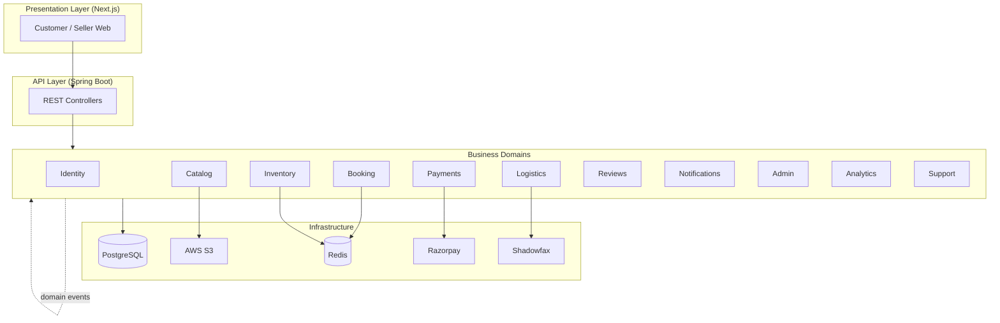

### 1.1 Domain Responsibilities

| Domain | Bounded Context | Primary Responsibilities | Owns |
|---|---|---|---|
| **Identity** | Who can access the platform | Phone OTP auth, JWT sessions, user profiles, addresses, role assignment (CUSTOMER, SELLER, ADMIN) | `User`, `Role`, `Address`, `OtpSession` |
| **Catalog** | What can be rented | Products, variants, categories, brands, dynamic attributes, media references, discovery metadata | `Product`, `ProductVariant`, `Category`, `Brand` |
| **Inventory** | What physical units exist and when they are free | Inventory items, date reservations, blocks, availability engine, concurrency control | `InventoryItem`, `InventoryReservation`, `InventoryBlock` |
| **Booking** | Rental transactions | Holds, booking lifecycle, trial, cancellation, return, extensions, timeline | `Booking`, `BookingTimeline`, `TrialSession` |
| **Payments** | Money movement | Razorpay orders, captures, refunds, deposits, commission, seller wallet, settlements | `Payment`, `Refund`, `Wallet`, `Settlement` |
| **Logistics** | Physical movement | Shipment creation, tracking, provider webhooks, SLA monitoring | `Shipment`, `ShipmentEvent`, `LogisticsProvider` |
| **Reviews** | Trust signals | Product/seller reviews, image attachments, moderation | `Review`, `ReviewModeration` |
| **Notifications** | User communication | Push, email, SMS, in-app; preferences; delivery history | `Notification`, `NotificationPreference` |
| **Admin** | Platform governance | Seller verification, KYC review, config, manual overrides, audit | `SellerApplication`, `KycDocument`, `AuditLog`, `PlatformConfig` |
| **Analytics** | Business intelligence | Read-optimized aggregates; fed by events (not transactional writes) | Materialized views, event outbox (future) |
| **Support** | Customer assistance | Tickets, messages, escalation | `SupportTicket`, `SupportTicketMessage` |

### 1.2 Domain Interaction Map

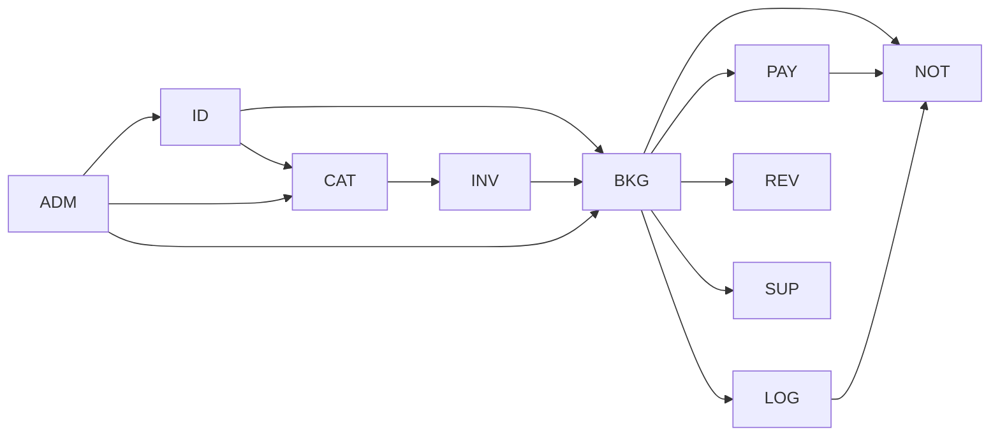

**Critical path:** Catalog → Inventory (availability) → Booking (hold) → Payment (capture) → Logistics (ship) → Booking (trial/return) → Payment (deposit refund).

### 1.3 Cross-Cutting Concerns

| Concern | Strategy |
|---|---|
| **Audit** | Append-only `audit_log` + domain-specific history tables |
| **Soft delete** | `deleted_at` on user-facing entities; hard delete prohibited for financial records |
| **Idempotency** | `idempotency_key` table for POST operations (Phase 3 API) |
| **Media** | `media_asset` centralizes S3 keys; entities reference by FK |
| **Money** | Integer minor units (`amount_paise` or whole INR per API contract); `currency_code` ISO 4217 |
| **Timestamps** | All UTC; `created_at`, `updated_at` on mutable entities |

---

## 2. Entity Catalogue

### 2.1 Entity Index

| # | Entity | Domain | Aggregate Root |
|---|---|---|---|
| 1 | User | Identity | Yes |
| 2 | Role | Identity | Yes |
| 3 | Permission | Identity | Yes |
| 4 | UserRole | Identity | — |
| 5 | UserProfile | Identity | — (part of User) |
| 6 | OtpSession | Identity | Yes |
| 7 | RefreshToken | Identity | — |
| 8 | Address | Identity | — (part of User) |
| 9 | SellerProfile | Admin/Identity | Yes |
| 10 | SellerApplication | Admin | Yes |
| 11 | KycDocument | Admin | — |
| 12 | BankAccount | Payments | — (part of SellerProfile) |
| 13 | ServiceablePincode | Identity | Yes |
| 14 | Category | Catalog | Yes |
| 15 | CategoryAttribute | Catalog | — |
| 16 | Brand | Catalog | Yes |
| 17 | Product | Catalog | Yes |
| 18 | ProductVariant | Catalog | — (part of Product) |
| 19 | ProductImage | Catalog | — |
| 20 | ProductAttributeValue | Catalog | — |
| 21 | ProductTag | Catalog | — |
| 22 | Tag | Catalog | Yes |
| 23 | MediaAsset | Catalog (shared) | Yes |
| 24 | InventoryItem | Inventory | Yes |
| 25 | InventoryReservation | Inventory | Yes |
| 26 | InventoryBlock | Inventory | Yes |
| 27 | InventoryHistory | Inventory | — (append-only) |
| 28 | Booking | Booking | Yes |
| 29 | BookingItem | Booking | — |
| 30 | BookingTimeline | Booking | — (append-only) |
| 31 | BookingCancellation | Booking | — |
| 32 | BookingExtension | Booking | — |
| 33 | TrialSession | Booking | Yes |
| 34 | ReturnRequest | Booking | Yes |
| 35 | Inspection | Booking | Yes |
| 36 | CheckoutSession | Booking/Payments | Yes |
| 37 | Payment | Payments | Yes |
| 38 | PaymentAttempt | Payments | — |
| 39 | Refund | Payments | Yes |
| 40 | Commission | Payments | — |
| 41 | Settlement | Payments | Yes |
| 42 | SettlementLine | Payments | — |
| 43 | Wallet | Payments | Yes |
| 44 | WalletTransaction | Payments | — (append-only) |
| 45 | Coupon | Payments | Yes |
| 46 | CouponRedemption | Payments | — |
| 47 | Shipment | Logistics | Yes |
| 48 | ShipmentEvent | Logistics | — (append-only) |
| 49 | LogisticsProvider | Logistics | Yes |
| 50 | LogisticsWebhookEvent | Logistics | — (append-only) |
| 51 | Review | Reviews | Yes |
| 52 | ReviewImage | Reviews | — |
| 53 | ReviewModeration | Reviews | — |
| 54 | WishlistItem | Catalog | — |
| 55 | Notification | Notifications | Yes |
| 56 | NotificationPreference | Notifications | — |
| 57 | NotificationDelivery | Notifications | — (append-only) |
| 58 | AuditLog | Admin | — (append-only) |
| 59 | PlatformConfig | Admin | Yes |
| 60 | CommissionRule | Admin | Yes |
| 61 | SupportTicket | Support | Yes |
| 62 | SupportTicketMessage | Support | — |
| 63 | IdempotencyRecord | Cross-cutting | Yes |

### 2.2 Entity Summaries

Each entity below includes **Purpose**, **Responsibilities**, **Ownership**, and **Lifecycle**.

#### Identity Domain

| Entity | Purpose | Responsibilities | Ownership | Lifecycle |
|---|---|---|---|---|
| **User** | Platform account | Authentication identity, phone (primary), optional email, display name | Identity domain | `ACTIVE` → `SUSPENDED` → `DELETED` (soft) |
| **Role** | Authorization role | CUSTOMER, SELLER, ADMIN enum values | Identity | Immutable seed data |
| **Permission** | Fine-grained access | Future admin RBAC | Identity | Seed + admin-managed |
| **UserRole** | User ↔ Role N:M | Same user may hold CUSTOMER + SELLER | Identity | Created on registration / seller approval |
| **UserProfile** | Extended profile | Avatar, bio, preferences (1:1 with User) | Identity | Created with User |
| **OtpSession** | Phone verification | OTP hash, expiry, attempt count | Identity | `PENDING` → `VERIFIED` / `EXPIRED` |
| **RefreshToken** | Session continuity | HttpOnly cookie token hash, device metadata | Identity | `ACTIVE` → `REVOKED` / `EXPIRED` |
| **Address** | Physical location | Delivery/pickup addresses with pincode | Identity (User) | CRUD by user; soft delete |

#### Seller & Admin Domain

| Entity | Purpose | Responsibilities | Ownership | Lifecycle |
|---|---|---|---|---|
| **SellerProfile** | Verified seller identity | Business name, rating aggregates, payout settings (1:1 User when SELLER) | Admin/Identity | `PENDING` → `ACTIVE` → `SUSPENDED` |
| **SellerApplication** | Onboarding workflow | KYC submission, review queue | Admin | `DRAFT` → `PENDING` → `UNDER_REVIEW` → `VERIFIED` / `REJECTED` |
| **KycDocument** | Identity proof | PAN, Aadhaar, GST refs; S3 document keys | Admin | `UPLOADED` → `VERIFIED` / `REJECTED` |
| **BankAccount** | Payout destination | Account number (encrypted), IFSC, verification status | Payments (Seller) | `PENDING` → `VERIFIED` → `INACTIVE` |
| **ServiceablePincode** | Delivery eligibility | Mumbai launch; extensible to pan-India | Admin | `ACTIVE` / `INACTIVE` |

#### Catalog Domain

| Entity | Purpose | Responsibilities | Ownership | Lifecycle |
|---|---|---|---|---|
| **Category** | Vertical taxonomy | Clothing → Saree; future Electronics → Camera | Catalog | Tree structure; `ACTIVE` / `DEPRECATED` |
| **CategoryAttribute** | Dynamic schema | Defines attribute keys per category (size, megapixels, etc.) | Catalog | Admin-managed |
| **Brand** | Designer/manufacturer | Brand name, slug | Catalog | `ACTIVE` |
| **Product** | Rentable listing | Title, description, pricing, deposit, seller, category | Catalog (Seller) | `DRAFT` → `ACTIVE` → `ARCHIVED` |
| **ProductVariant** | SKU dimension | Size/color/configuration; links to inventory pool | Catalog | Tied to Product lifecycle |
| **ProductImage** | Visual media | Ordered gallery; FK to MediaAsset | Catalog | Ordered list |
| **ProductAttributeValue** | EAV values | Category-specific attributes per product | Catalog | Updated with Product |
| **Tag / ProductTag** | Discovery labels | Occasion, trending, editorial tags | Catalog | Many-to-many |
| **MediaAsset** | S3 object registry | Bucket, key, MIME, size, uploader | Shared | `UPLOADED` → `ATTACHED` / `ORPHANED` |
| **WishlistItem** | Saved products | User ↔ Product bookmark | Catalog | Created/deleted by user |

#### Inventory Domain

| Entity | Purpose | Responsibilities | Ownership | Lifecycle |
|---|---|---|---|---|
| **InventoryItem** | Physical unit | Serial/tag, condition, warehouse location (future) | Inventory (Seller) | See §6 |
| **InventoryReservation** | Date hold/confirmation | Blocks calendar dates for one item | Inventory | `HOLD` → `CONFIRMED` → `RELEASED` / `CANCELLED` |
| **InventoryBlock** | Seller blackout | Cleaning, maintenance, personal use | Inventory (Seller) | `ACTIVE` → `REMOVED` |
| **InventoryHistory** | Audit trail | Every status/location/condition change | Inventory | Append-only |

#### Booking Domain

| Entity | Purpose | Responsibilities | Ownership | Lifecycle |
|---|---|---|---|---|
| **Booking** | Rental order | Customer, seller, dates, status, pricing snapshot | Booking | See §7 state machine |
| **BookingItem** | Line item | Product, variant, assigned inventory item, price snapshot | Booking | Immutable after confirmation |
| **BookingTimeline** | Customer-visible history | Status transitions with labels | Booking | Append-only |
| **BookingCancellation** | Cancel record | Actor, reason, refund policy applied | Booking | Created once on cancel |
| **BookingExtension** | Rental extension | New end date, additional charge | Booking | `REQUESTED` → `PAID` → `ACTIVE` |
| **TrialSession** | 15-min home trial | Start/end, accept/reject outcome | Booking | `ACTIVE` → `ACCEPTED` / `REJECTED` / `EXPIRED` |
| **ReturnRequest** | Return scheduling | Pickup slot, address | Booking | `SCHEDULED` → `PICKED_UP` → `COMPLETED` |
| **Inspection** | Post-return QC | Damage assessment, deposit deduction | Booking | `PENDING` → `PASSED` / `DAMAGE_FOUND` |
| **CheckoutSession** | Pre-payment context | Pricing breakdown, coupon, address binding | Booking | `OPEN` → `COMPLETED` / `EXPIRED` |

#### Payments Domain

| Entity | Purpose | Responsibilities | Ownership | Lifecycle |
|---|---|---|---|---|
| **Payment** | Customer charge | Razorpay order/payment IDs, amount breakdown | Payments | See §8 |
| **PaymentAttempt** | Retry/audit | Failed attempts, error codes | Payments | Append-only |
| **Refund** | Money returned | Deposit vs rental; partial/full | Payments | `PENDING` → `PROCESSED` / `FAILED` |
| **Commission** | Platform fee | Per-booking commission calculation | Payments | Created on booking completion |
| **Settlement** | Seller payout batch | Aggregated wallet debit to bank | Payments | `PENDING` → `PROCESSING` → `COMPLETED` |
| **SettlementLine** | Payout detail | Individual booking earnings in settlement | Payments | Immutable |
| **Wallet** | Seller ledger | Available/pending balance | Payments (Seller) | Continuous |
| **WalletTransaction** | Ledger entries | Credit/debit with reference | Payments | Append-only |
| **Coupon** | Discount instrument | Code, rules, validity | Payments/Admin | `ACTIVE` → `EXPIRED` / `DISABLED` |
| **CouponRedemption** | Usage record | Booking ↔ Coupon | Payments | Created on successful checkout |

#### Logistics Domain

| Entity | Purpose | Responsibilities | Ownership | Lifecycle |
|---|---|---|---|---|
| **Shipment** | Delivery unit | Outbound or return; provider reference | Logistics | See §9 |
| **ShipmentEvent** | Tracking history | Provider status updates | Logistics | Append-only |
| **LogisticsProvider** | Provider registry | Shadowfax; future Delhivery, etc. | Logistics | Config seed |
| **LogisticsWebhookEvent** | Raw webhook log | Idempotent processing | Logistics | Append-only |

#### Reviews, Notifications, Support

| Entity | Purpose | Responsibilities | Ownership | Lifecycle |
|---|---|---|---|---|
| **Review** | User feedback | Product and/or seller rating | Reviews | `PENDING` → `PUBLISHED` / `HIDDEN` |
| **ReviewImage** | Review photos | Customer-uploaded images | Reviews | Tied to Review |
| **ReviewModeration** | Admin action | Approve/reject/flag | Reviews | Append-only |
| **Notification** | User message | In-app notification record | Notifications | `UNREAD` → `READ` |
| **NotificationPreference** | Channel opt-in | Email/SMS/push per type | Notifications | User-managed |
| **NotificationDelivery** | Send attempt log | Provider message ID, status | Notifications | Append-only |
| **SupportTicket** | Help request | Linked to booking optionally | Support | `OPEN` → `RESOLVED` → `CLOSED` |
| **SupportTicketMessage** | Thread messages | Customer/agent replies | Support | Append-only |
| **AuditLog** | Platform audit | All critical admin/system actions | Admin | Append-only |

---

## 3. Relationships

### 3.1 Relationship Matrix

| From | To | Cardinality | Description |
|---|---|---|---|
| User | UserProfile | 1:1 | Profile extends account |
| User | UserRole | 1:N | Multiple roles per user |
| Role | UserRole | 1:N | Role assignment |
| User | Address | 1:N | Multiple delivery addresses |
| User | SellerProfile | 1:0..1 | Only when seller verified |
| User | SellerApplication | 1:N | Re-application allowed after reject |
| SellerApplication | KycDocument | 1:N | Multiple KYC uploads |
| SellerProfile | BankAccount | 1:N | Multiple accounts; one default |
| SellerProfile | Product | 1:N | Seller owns listings |
| SellerProfile | Wallet | 1:1 | One wallet per seller |
| Category | Category | 1:N | Self-referential tree (parent_id) |
| Category | CategoryAttribute | 1:N | Attribute schema per category |
| Category | Product | 1:N | Product classified in one leaf category |
| Brand | Product | 1:N | Optional brand association |
| Product | ProductVariant | 1:N | Size/color variants |
| Product | ProductImage | 1:N | Ordered gallery |
| Product | ProductAttributeValue | 1:N | Dynamic attributes |
| Product | Tag | N:M | Via ProductTag |
| ProductVariant | InventoryItem | 1:N | Multiple physical units per variant |
| InventoryItem | InventoryReservation | 1:N | Historical reservations |
| InventoryItem | InventoryHistory | 1:N | Lifecycle audit |
| ProductVariant | InventoryBlock | 1:N | Variant-level blocks |
| User | Booking | 1:N | Customer bookings |
| SellerProfile | Booking | 1:N | Seller-side bookings |
| Booking | BookingItem | 1:N | MVP: 1 item; schema supports N |
| Booking | BookingTimeline | 1:N | Status history |
| Booking | BookingCancellation | 1:0..1 | If cancelled |
| Booking | TrialSession | 1:0..1 | Mandatory for clothing |
| Booking | ReturnRequest | 1:0..1 | Return flow |
| Booking | Inspection | 1:0..1 | Post-return |
| Booking | Payment | 1:N | Retries create attempts; one captured |
| Booking | Shipment | 1:N | Outbound + return |
| Booking | Commission | 1:1 | On completion |
| Booking | CouponRedemption | 1:0..1 | If coupon used |
| BookingItem | InventoryItem | N:1 | Assigned physical unit |
| BookingItem | ProductVariant | N:1 | Variant snapshot |
| Payment | Refund | 1:N | Deposit + rental refunds separately |
| Payment | PaymentAttempt | 1:N | Failed attempts |
| SellerProfile | Settlement | 1:N | Periodic payouts |
| Settlement | SettlementLine | 1:N | Booking-level breakdown |
| Wallet | WalletTransaction | 1:N | Ledger |
| Shipment | ShipmentEvent | 1:N | Tracking events |
| LogisticsProvider | Shipment | 1:N | Provider reference |
| User | Review | 1:N | Author |
| Product | Review | 1:N | Product reviews |
| SellerProfile | Review | 1:N | Seller reviews |
| Booking | Review | 1:0..1 | Verified purchase review |
| User | WishlistItem | 1:N | Saved products |
| Product | WishlistItem | 1:N | Wishlisted by users |
| User | Notification | 1:N | In-app notifications |
| User | NotificationPreference | 1:N | Per notification type |
| User | SupportTicket | 1:N | Customer tickets |
| Booking | SupportTicket | 1:0..1 | Optional link |
| MediaAsset | ProductImage | 1:N | Reusable assets |
| MediaAsset | KycDocument | 1:N | Document storage |
| MediaAsset | ReviewImage | 1:N | Review photos |

### 3.2 Aggregate Boundaries

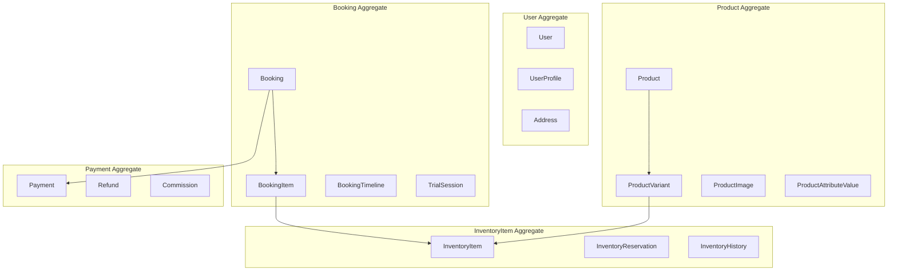

**Rule:** External references between aggregates use IDs only. Booking confirms inventory via Inventory domain service + reservation FK.

### 3.3 Key Relationship Diagram

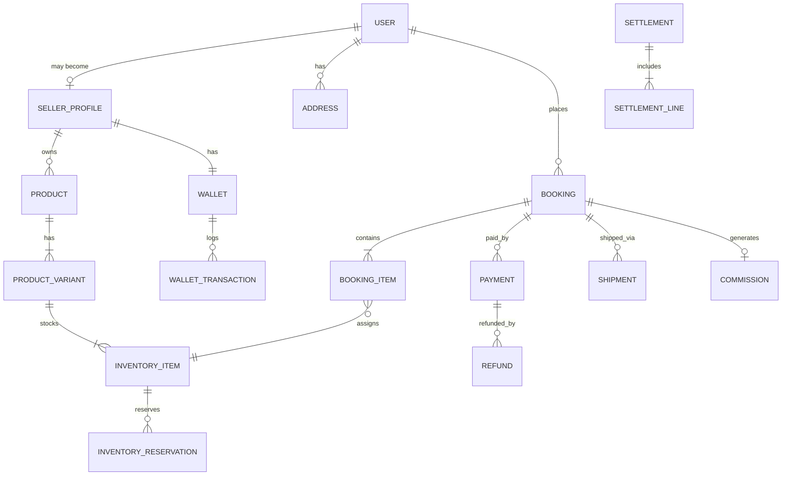

---

## 4. ER Diagrams

### 4.1 Complete Domain ER Diagram

> **Note:** Diagram is organized by domain color-grouping in subgraphs. PK = UUID v7 (time-sortable) unless noted.

```mermaid
erDiagram
    USER {
        uuid id PK
        varchar phone UK
        varchar email
        varchar status
        timestamptz created_at
        timestamptz deleted_at
    }

    USER_PROFILE {
        uuid user_id PK_FK
        varchar first_name
        varchar last_name
        varchar display_name
        uuid avatar_media_id FK
    }

    ROLE {
        smallint id PK
        varchar code UK
    }

    USER_ROLE {
        uuid user_id PK_FK
        smallint role_id PK_FK
    }

    ADDRESS {
        uuid id PK
        uuid user_id FK
        varchar line1
        varchar pincode
        boolean is_default
    }

    SELLER_PROFILE {
        uuid id PK
        uuid user_id FK_UK
        varchar business_name
        varchar status
        decimal avg_rating
    }

    SELLER_APPLICATION {
        uuid id PK
        uuid user_id FK
        varchar status
        timestamptz submitted_at
    }

    KYC_DOCUMENT {
        uuid id PK
        uuid application_id FK
        varchar document_type
        uuid media_asset_id FK
        varchar status
    }

    BANK_ACCOUNT {
        uuid id PK
        uuid seller_profile_id FK
        varchar ifsc
        varchar account_number_enc
        boolean is_default
    }

    CATEGORY {
        uuid id PK
        uuid parent_id FK
        varchar slug UK
        varchar name
        varchar vertical_code
    }

    CATEGORY_ATTRIBUTE {
        uuid id PK
        uuid category_id FK
        varchar attribute_key
        varchar data_type
    }

    BRAND {
        uuid id PK
        varchar slug UK
        varchar name
    }

    PRODUCT {
        uuid id PK
        uuid seller_profile_id FK
        uuid category_id FK
        uuid brand_id FK
        varchar slug UK
        varchar title
        bigint price_per_day
        bigint deposit_amount
        varchar currency_code
        varchar status
    }

    PRODUCT_VARIANT {
        uuid id PK
        uuid product_id FK
        varchar sku UK
        varchar variant_label
        varchar status
    }

    PRODUCT_IMAGE {
        uuid id PK
        uuid product_id FK
        uuid media_asset_id FK
        smallint sort_order
    }

    PRODUCT_ATTRIBUTE_VALUE {
        uuid id PK
        uuid product_id FK
        uuid category_attribute_id FK
        text value
    }

    MEDIA_ASSET {
        uuid id PK
        varchar s3_bucket
        varchar s3_key UK
        varchar mime_type
        uuid uploaded_by FK
    }

    INVENTORY_ITEM {
        uuid id PK
        uuid product_variant_id FK
        varchar serial_number UK
        varchar condition_grade
        varchar status
        uuid warehouse_id FK
    }

    INVENTORY_RESERVATION {
        uuid id PK
        uuid inventory_item_id FK
        uuid booking_id FK
        date start_date
        date end_date
        varchar reservation_type
        varchar status
        timestamptz hold_expires_at
    }

    INVENTORY_BLOCK {
        uuid id PK
        uuid product_variant_id FK
        uuid inventory_item_id FK
        date start_date
        date end_date
        varchar reason
    }

    INVENTORY_HISTORY {
        bigint id PK
        uuid inventory_item_id FK
        varchar event_type
        jsonb payload
        timestamptz occurred_at
    }

    BOOKING {
        uuid id PK
        varchar booking_number UK
        uuid customer_id FK
        uuid seller_profile_id FK
        varchar status
        date rental_start_date
        date rental_end_date
        bigint rental_amount
        bigint deposit_amount
        bigint discount_amount
        bigint total_amount
        varchar currency_code
    }

    BOOKING_ITEM {
        uuid id PK
        uuid booking_id FK
        uuid product_id FK
        uuid product_variant_id FK
        uuid inventory_item_id FK
        jsonb price_snapshot
    }

    BOOKING_TIMELINE {
        bigint id PK
        uuid booking_id FK
        varchar status
        varchar label
        timestamptz occurred_at
        uuid actor_id FK
    }

    TRIAL_SESSION {
        uuid id PK
        uuid booking_id FK_UK
        timestamptz started_at
        timestamptz expires_at
        varchar outcome
    }

    BOOKING_CANCELLATION {
        uuid id PK
        uuid booking_id FK_UK
        varchar cancelled_by
        varchar reason_code
        bigint refund_amount
    }

    RETURN_REQUEST {
        uuid id PK
        uuid booking_id FK_UK
        uuid pickup_address_id FK
        varchar status
        timestamptz scheduled_at
    }

    INSPECTION {
        uuid id PK
        uuid booking_id FK_UK
        varchar result
        bigint deposit_deduction
        text notes
    }

    CHECKOUT_SESSION {
        uuid id PK
        uuid booking_id FK
        uuid customer_id FK
        varchar status
        jsonb pricing_breakdown
        timestamptz expires_at
    }

    PAYMENT {
        uuid id PK
        uuid booking_id FK
        uuid customer_id FK
        varchar provider_code
        varchar provider_order_id UK
        varchar provider_payment_id
        bigint amount
        varchar status
        varchar payment_type
    }

    REFUND {
        uuid id PK
        uuid payment_id FK
        uuid booking_id FK
        varchar refund_type
        bigint amount
        varchar status
        varchar provider_refund_id
    }

    COMMISSION {
        uuid id PK
        uuid booking_id FK_UK
        bigint gross_amount
        bigint commission_amount
        decimal commission_rate
    }

    WALLET {
        uuid id PK
        uuid seller_profile_id FK_UK
        bigint available_balance
        bigint pending_balance
        varchar currency_code
    }

    WALLET_TRANSACTION {
        bigint id PK
        uuid wallet_id FK
        varchar txn_type
        bigint amount
        uuid reference_id
        varchar reference_type
    }

    SETTLEMENT {
        uuid id PK
        uuid seller_profile_id FK
        uuid bank_account_id FK
        bigint total_amount
        varchar status
    }

    SETTLEMENT_LINE {
        uuid id PK
        uuid settlement_id FK
        uuid booking_id FK
        bigint net_amount
    }

    COUPON {
        uuid id PK
        varchar code UK
        varchar discount_type
        bigint discount_value
        timestamptz valid_from
        timestamptz valid_until
    }

    SHIPMENT {
        uuid id PK
        uuid booking_id FK
        uuid logistics_provider_id FK
        varchar shipment_type
        varchar provider_shipment_id UK
        varchar tracking_number
        varchar status
    }

    SHIPMENT_EVENT {
        bigint id PK
        uuid shipment_id FK
        varchar status
        varchar location
        timestamptz occurred_at
    }

    LOGISTICS_PROVIDER {
        smallint id PK
        varchar code UK
        varchar name
        boolean is_active
    }

    REVIEW {
        uuid id PK
        uuid author_id FK
        uuid product_id FK
        uuid seller_profile_id FK
        uuid booking_id FK
        smallint rating
        text body
        varchar status
    }

    NOTIFICATION {
        uuid id PK
        uuid user_id FK
        varchar notification_type
        varchar title
        jsonb payload
        boolean is_read
    }

    AUDIT_LOG {
        bigint id PK
        varchar entity_type
        uuid entity_id
        varchar action
        uuid actor_id
        jsonb before_state
        jsonb after_state
        timestamptz occurred_at
    }

    WISHLIST_ITEM {
        uuid user_id PK_FK
        uuid product_id PK_FK
        timestamptz created_at
    }

    USER ||--o| USER_PROFILE : has
    USER ||--o{ USER_ROLE : has
    ROLE ||--o{ USER_ROLE : assigned
    USER ||--o{ ADDRESS : owns
    USER ||--o| SELLER_PROFILE : operates
    USER ||--o{ SELLER_APPLICATION : submits
    SELLER_APPLICATION ||--o{ KYC_DOCUMENT : includes
    SELLER_PROFILE ||--o{ BANK_ACCOUNT : receives_payout
    SELLER_PROFILE ||--o{ PRODUCT : lists
    CATEGORY ||--o{ CATEGORY : parent
    CATEGORY ||--o{ CATEGORY_ATTRIBUTE : defines
    CATEGORY ||--o{ PRODUCT : classifies
    BRAND ||--o{ PRODUCT : brands
    PRODUCT ||--|{ PRODUCT_VARIANT : has
    PRODUCT ||--o{ PRODUCT_IMAGE : displays
    PRODUCT ||--o{ PRODUCT_ATTRIBUTE_VALUE : attributes
    MEDIA_ASSET ||--o{ PRODUCT_IMAGE : stores
    PRODUCT_VARIANT ||--|{ INVENTORY_ITEM : instances
    INVENTORY_ITEM ||--o{ INVENTORY_RESERVATION : reserved
    INVENTORY_ITEM ||--o{ INVENTORY_HISTORY : tracks
    PRODUCT_VARIANT ||--o{ INVENTORY_BLOCK : blocks
    USER ||--o{ BOOKING : books
    SELLER_PROFILE ||--o{ BOOKING : fulfills
    BOOKING ||--|{ BOOKING_ITEM : contains
    BOOKING ||--o{ BOOKING_TIMELINE : history
    BOOKING ||--o| TRIAL_SESSION : trial
    BOOKING ||--o| BOOKING_CANCELLATION : cancel
    BOOKING ||--o| RETURN_REQUEST : return
    BOOKING ||--o| INSPECTION : inspect
    BOOKING ||--o{ PAYMENT : payment
    BOOKING ||--o{ SHIPMENT : ships
    PAYMENT ||--o{ REFUND : refunds
    BOOKING ||--o| COMMISSION : fee
    SELLER_PROFILE ||--|| WALLET : ledger
    WALLET ||--o{ WALLET_TRANSACTION : entries
    SELLER_PROFILE ||--o{ SETTLEMENT : payout
    SETTLEMENT ||--|{ SETTLEMENT_LINE : lines
    SHIPMENT ||--o{ SHIPMENT_EVENT : events
    LOGISTICS_PROVIDER ||--o{ SHIPMENT : provides
    USER ||--o{ REVIEW : writes
    PRODUCT ||--o{ REVIEW : reviewed
    SELLER_PROFILE ||--o{ REVIEW : rated
    USER ||--o{ NOTIFICATION : receives
    USER ||--o{ WISHLIST_ITEM : saves
    PRODUCT ||--o{ WISHLIST_ITEM : saved
```

### 4.2 Inventory & Booking Focus Diagram

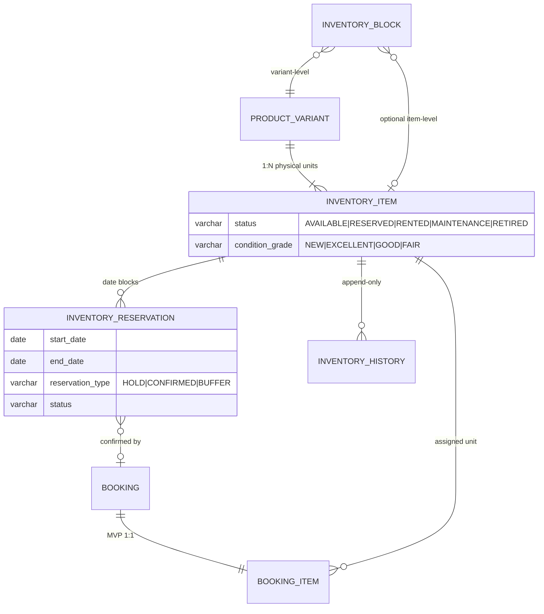

---

## 5. Entity Specifications

> **Conventions (all entities unless noted):**
> - **PK:** `UUID` v7 generated application-side
> - **Audit fields:** `created_at TIMESTAMPTZ NOT NULL DEFAULT now()`, `updated_at TIMESTAMPTZ NOT NULL`, `created_by UUID`, `updated_by UUID` (nullable for system actions)
> - **Soft delete:** `deleted_at TIMESTAMPTZ NULL` where applicable
> - **Money:** `BIGINT` whole INR (aligns with Phase 3 API); column suffix `_amount`; `currency_code VARCHAR(3) DEFAULT 'INR'`

### 5.1 Identity Entities

#### User

| Attribute | Specification |
|---|---|
| **Purpose** | Root identity for customers, sellers, admins |
| **PK** | `id` UUID |
| **Foreign Keys** | — |
| **Business Fields** | `phone VARCHAR(15) NOT NULL`, `phone_verified BOOLEAN`, `email VARCHAR(255)`, `email_verified BOOLEAN`, `password_hash VARCHAR(255) NULL` (optional; OTP-primary), `status ENUM('ACTIVE','SUSPENDED','DELETED')` |
| **Audit Fields** | Standard + `last_login_at` |
| **Unique Constraints** | `UNIQUE(phone) WHERE deleted_at IS NULL`, `UNIQUE(email) WHERE email IS NOT NULL AND deleted_at IS NULL` |
| **Indexes** | `idx_user_phone`, `idx_user_status`, `idx_user_created_at` |
| **Validation** | Phone E.164; India +91 default; email RFC 5322 |
| **Soft Delete** | Yes — `deleted_at`; PII anonymization job after retention period |

#### Address

| Attribute | Specification |
|---|---|
| **Purpose** | Delivery and pickup locations |
| **PK** | `id` UUID |
| **FK** | `user_id → user.id` |
| **Business Fields** | `label`, `line1`, `line2`, `city`, `state`, `pincode VARCHAR(6)`, `country_code DEFAULT 'IN'`, `latitude DECIMAL(9,6)`, `longitude DECIMAL(9,6)`, `is_default BOOLEAN` |
| **Unique Constraints** | Partial: one default per user |
| **Indexes** | `idx_address_user_id`, `idx_address_pincode` |
| **Validation** | Pincode 6 digits; geocode optional |
| **Soft Delete** | Yes |

#### OtpSession

| Attribute | Specification |
|---|---|
| **Purpose** | Phone OTP verification sessions |
| **PK** | `id` UUID |
| **Business Fields** | `phone`, `otp_hash`, `purpose ENUM('REGISTER','LOGIN','RESET')`, `attempts SMALLINT`, `expires_at`, `verified_at`, `status` |
| **Indexes** | `idx_otp_phone_status`, `idx_otp_expires_at` |
| **Validation** | Max 5 attempts; 5-minute expiry (Phase 3) |
| **Soft Delete** | No — TTL purge job |

### 5.2 Catalog Entities

#### Product

| Attribute | Specification |
|---|---|
| **Purpose** | Seller listing — commercial terms and merchandising |
| **PK** | `id` UUID |
| **FK** | `seller_profile_id`, `category_id`, `brand_id NULL`, `primary_image_id NULL` |
| **Business Fields** | `slug`, `title`, `description TEXT`, `price_per_day BIGINT`, `deposit_amount BIGINT`, `currency_code`, `min_rental_days SMALLINT DEFAULT 1`, `max_rental_days SMALLINT`, `cleaning_buffer_days SMALLINT DEFAULT 1`, `includes_trial BOOLEAN DEFAULT true`, `trial_duration_minutes SMALLINT DEFAULT 15`, `status ENUM('DRAFT','PENDING_REVIEW','ACTIVE','ARCHIVED')`, `city`, `avg_rating DECIMAL(2,1)`, `review_count INT`, `published_at` |
| **Status Fields** | `status` |
| **Unique Constraints** | `UNIQUE(slug)`, `UNIQUE(seller_profile_id, title) WHERE deleted_at IS NULL` (optional) |
| **Indexes** | `idx_product_seller`, `idx_product_category`, `idx_product_status`, `idx_product_price`, GIN on `title` for search (future tsvector) |
| **Validation** | `price_per_day > 0`, `deposit_amount >= 0`, slug kebab-case |
| **Soft Delete** | Yes — archived preferred over delete |

#### ProductVariant

| Attribute | Specification |
|---|---|
| **Purpose** | SKU dimension (size, color, config) |
| **PK** | `id` UUID |
| **FK** | `product_id` |
| **Business Fields** | `sku`, `variant_label` (e.g. "S", "256GB Black"), `status ENUM('ACTIVE','INACTIVE')`, `sort_order` |
| **Unique Constraints** | `UNIQUE(product_id, sku)` |
| **Indexes** | `idx_variant_product_id` |
| **Soft Delete** | No — set INACTIVE |

#### Category

| Attribute | Specification |
|---|---|
| **Purpose** | Hierarchical taxonomy with vertical code |
| **PK** | `id` UUID |
| **FK** | `parent_id NULL` (self) |
| **Business Fields** | `slug`, `name`, `vertical_code ENUM('CLOTHING','ELECTRONICS','FURNITURE','CAMERAS','ACCESSORIES','SPORTS')`, `depth SMALLINT`, `sort_order`, `status` |
| **Indexes** | `idx_category_parent`, `idx_category_vertical`, `UNIQUE(slug)` |
| **Soft Delete** | DEPRECATED status preferred |

#### CategoryAttribute

| Attribute | Specification |
|---|---|
| **Purpose** | Defines extensible attribute schema per category |
| **PK** | `id` UUID |
| **FK** | `category_id` |
| **Business Fields** | `attribute_key`, `display_name`, `data_type ENUM('STRING','NUMBER','BOOLEAN','ENUM','JSON')`, `is_required`, `is_variant_axis BOOLEAN`, `enum_values JSONB`, `unit` |
| **Unique Constraints** | `UNIQUE(category_id, attribute_key)` |

#### MediaAsset

| Attribute | Specification |
|---|---|
| **Purpose** | Central S3 object registry |
| **PK** | `id` UUID |
| **FK** | `uploaded_by → user.id` |
| **Business Fields** | `s3_bucket`, `s3_key`, `original_filename`, `mime_type`, `file_size_bytes`, `width`, `height`, `status ENUM('UPLOADED','ATTACHED','ORPHANED')`, `checksum_sha256` |
| **Unique Constraints** | `UNIQUE(s3_bucket, s3_key)` |
| **Indexes** | `idx_media_uploaded_by`, `idx_media_status` |
| **Soft Delete** | No — lifecycle via status + S3 lifecycle policy |

### 5.3 Inventory Entities

#### InventoryItem

| Attribute | Specification |
|---|---|
| **Purpose** | One physical rentable unit |
| **PK** | `id` UUID |
| **FK** | `product_variant_id`, `warehouse_id NULL` (future) |
| **Business Fields** | `serial_number`, `internal_tag`, `condition_grade ENUM('NEW','EXCELLENT','GOOD','FAIR','DAMAGED')`, `status ENUM('AVAILABLE','RESERVED','RENTED','IN_TRANSIT','MAINTENANCE','RETIRED')`, `acquired_at`, `retired_at`, `retire_reason`, `last_inspection_at`, `notes TEXT` |
| **Status Fields** | `status`, `condition_grade` |
| **Unique Constraints** | `UNIQUE(serial_number)` platform-wide |
| **Indexes** | `idx_inv_item_variant`, `idx_inv_item_status`, `idx_inv_item_warehouse` |
| **Validation** | Must belong to active variant; RETIRED items excluded from availability |
| **Soft Delete** | No — use RETIRED status |

#### InventoryReservation

| Attribute | Specification |
|---|---|
| **Purpose** | Date-range allocation preventing double booking |
| **PK** | `id` UUID |
| **FK** | `inventory_item_id`, `booking_id NULL` (null during orphan hold cleanup) |
| **Business Fields** | `start_date DATE`, `end_date DATE`, `reservation_type ENUM('HOLD','CONFIRMED','BUFFER')`, `status ENUM('ACTIVE','RELEASED','CANCELLED','EXPIRED')`, `hold_expires_at TIMESTAMPTZ NULL`, `buffer_reason VARCHAR(50)` |
| **Unique Constraints** | **Exclusion constraint (implementation):** no overlapping `ACTIVE` reservations for same `inventory_item_id` on `[start_date, end_date]` — PostgreSQL `daterange` + `EXCLUDE USING gist` |
| **Indexes** | `idx_reservation_item_dates`, `idx_reservation_booking`, `idx_reservation_hold_expires` (partial WHERE status='ACTIVE' AND reservation_type='HOLD') |
| **Validation** | `end_date >= start_date`; HOLD must have `hold_expires_at` |
| **Soft Delete** | No — status transition to RELEASED/CANCELLED |

#### InventoryBlock

| Attribute | Specification |
|---|---|
| **Purpose** | Seller-initiated unavailability |
| **PK** | `id` UUID |
| **FK** | `product_variant_id`, `inventory_item_id NULL`, `created_by → user.id` |
| **Business Fields** | `start_date`, `end_date`, `reason`, `status ENUM('ACTIVE','REMOVED')` |
| **Indexes** | `idx_block_variant_dates`, `idx_block_item_dates` |
| **Soft Delete** | Status REMOVED |

#### InventoryHistory

| Attribute | Specification |
|---|---|
| **Purpose** | Append-only inventory audit |
| **PK** | `id BIGSERIAL` |
| **FK** | `inventory_item_id`, `actor_id NULL` |
| **Business Fields** | `event_type`, `from_status`, `to_status`, `payload JSONB`, `occurred_at` |
| **Indexes** | `idx_inv_history_item_occurred` |
| **Soft Delete** | Never |

### 5.4 Booking Entities

#### Booking

| Attribute | Specification |
|---|---|
| **Purpose** | Rental order aggregate root |
| **PK** | `id` UUID |
| **FK** | `customer_id → user.id`, `seller_profile_id`, `delivery_address_id`, `checkout_session_id NULL` |
| **Business Fields** | `booking_number VARCHAR(20) UK` (format `BK-YYYY-NNNNNN`), `order_number VARCHAR(20) UK` (format `VQ-NNNNN`), `status` (enum — Phase 3 §3.5), `rental_start_date`, `rental_end_date`, `rental_days SMALLINT`, `rental_amount`, `deposit_amount`, `discount_amount`, `total_amount`, `currency_code`, `includes_trial BOOLEAN`, `coupon_id NULL`, `idempotency_key`, `confirmed_at`, `completed_at`, `cancelled_at` |
| **Status Fields** | `status` — 16 values per Phase 3 state machine |
| **Unique Constraints** | `booking_number`, `order_number`, `idempotency_key` |
| **Indexes** | `idx_booking_customer`, `idx_booking_seller`, `idx_booking_status`, `idx_booking_rental_dates`, `idx_booking_created_at` |
| **Validation** | Rental start ≥ today + lead time; pincode serviceable before confirm |
| **Soft Delete** | No — terminal states only |

#### BookingItem

| Attribute | Specification |
|---|---|
| **Purpose** | Line item with immutable price snapshot |
| **PK** | `id` UUID |
| **FK** | `booking_id`, `product_id`, `product_variant_id`, `inventory_item_id` |
| **Business Fields** | `price_snapshot JSONB` — `{ pricePerDay, deposit, productTitle, variantLabel, imageUrl }`, `quantity SMALLINT DEFAULT 1` |
| **Indexes** | `idx_booking_item_booking`, `idx_booking_item_inventory` |
| **Soft Delete** | No |

#### BookingTimeline

| Attribute | Specification |
|---|---|
| **Purpose** | Customer-facing status history |
| **PK** | `id BIGSERIAL` |
| **FK** | `booking_id`, `actor_id NULL` |
| **Business Fields** | `status`, `label`, `description`, `occurred_at`, `metadata JSONB` |
| **Indexes** | `idx_timeline_booking_occurred` |
| **Soft Delete** | Never — append-only |

#### TrialSession

| Attribute | Specification |
|---|---|
| **Purpose** | 15-minute mandatory home trial |
| **PK** | `id` UUID |
| **FK** | `booking_id` UNIQUE |
| **Business Fields** | `started_at`, `expires_at`, `accepted_at`, `rejected_at`, `outcome ENUM('PENDING','ACCEPTED','REJECTED','EXPIRED')`, `reject_reason` |
| **Validation** | `expires_at = started_at + 15 minutes`; accept/reject only while ACTIVE |
| **Soft Delete** | No |

### 5.5 Payment Entities

#### Payment

| Attribute | Specification |
|---|---|
| **Purpose** | Customer payment record |
| **PK** | `id` UUID |
| **FK** | `booking_id`, `customer_id` |
| **Business Fields** | `provider_code DEFAULT 'RAZORPAY'`, `provider_order_id`, `provider_payment_id`, `amount`, `rental_component`, `deposit_component`, `discount_component`, `currency_code`, `status ENUM('CREATED','AUTHORIZED','CAPTURED','FAILED','REFUNDED','PARTIALLY_REFUNDED')`, `payment_method`, `captured_at`, `failed_at`, `failure_reason` |
| **Unique Constraints** | `UNIQUE(provider_order_id)`, `UNIQUE(provider_payment_id) WHERE provider_payment_id IS NOT NULL` |
| **Indexes** | `idx_payment_booking`, `idx_payment_customer`, `idx_payment_status`, `idx_payment_provider_order` |
| **Soft Delete** | No |

#### Refund

| Attribute | Specification |
|---|---|
| **Purpose** | Refund tracking (deposit vs rental) |
| **PK** | `id` UUID |
| **FK** | `payment_id`, `booking_id`, `initiated_by NULL` |
| **Business Fields** | `refund_type ENUM('RENTAL','DEPOSIT','FULL','PARTIAL','PENALTY')`, `amount`, `status ENUM('PENDING','PROCESSING','PROCESSED','FAILED')`, `provider_refund_id`, `reason`, `initiated_at`, `processed_at`, `expected_by` |
| **Indexes** | `idx_refund_payment`, `idx_refund_booking`, `idx_refund_status` |
| **Soft Delete** | No |

#### Wallet / WalletTransaction

| Attribute | Specification |
|---|---|
| **Purpose** | Seller ledger |
| **PK** | `wallet.id` UUID; `wallet_transaction.id` BIGSERIAL |
| **FK** | `seller_profile_id`; `wallet_id` |
| **Business Fields (Wallet)** | `available_balance`, `pending_balance`, `currency_code`, `last_settled_at` |
| **Business Fields (Txn)** | `txn_type ENUM('CREDIT_EARNING','DEBIT_COMMISSION','DEBIT_PAYOUT','DEBIT_PENALTY','CREDIT_ADJUSTMENT')`, `amount`, `balance_after`, `reference_type`, `reference_id`, `description` |
| **Unique Constraints** | One wallet per seller |
| **Indexes** | `idx_wallet_txn_wallet_created` |
| **Soft Delete** | No — financial immutability |

#### Settlement

| Attribute | Specification |
|---|---|
| **Purpose** | Batch seller payout |
| **PK** | `id` UUID |
| **FK** | `seller_profile_id`, `bank_account_id` |
| **Business Fields** | `settlement_number UK`, `total_amount`, `status ENUM('PENDING','PROCESSING','COMPLETED','FAILED')`, `provider_payout_id`, `scheduled_at`, `completed_at` |
| **Indexes** | `idx_settlement_seller`, `idx_settlement_status` |

#### Coupon

| Attribute | Specification |
|---|---|
| **Purpose** | Promotional discount |
| **PK** | `id` UUID |
| **Business Fields** | `code UK`, `discount_type ENUM('PERCENTAGE','FIXED')`, `discount_value`, `max_discount_amount`, `min_order_amount`, `valid_from`, `valid_until`, `usage_limit`, `usage_count`, `status`, `applicable_category_ids JSONB` |
| **Indexes** | `idx_coupon_code`, `idx_coupon_validity` |

### 5.6 Logistics Entities

#### Shipment

| Attribute | Specification |
|---|---|
| **Purpose** | Outbound or return delivery |
| **PK** | `id` UUID |
| **FK** | `booking_id`, `logistics_provider_id`, `origin_address_id`, `destination_address_id` |
| **Business Fields** | `shipment_type ENUM('OUTBOUND','RETURN')`, `provider_shipment_id`, `tracking_number`, `status` (Phase 3 enum), `pickup_scheduled_at`, `picked_up_at`, `delivered_at`, `estimated_delivery_at`, `failure_reason`, `agent_name`, `agent_phone_masked` |
| **Unique Constraints** | `UNIQUE(booking_id, shipment_type)` — one outbound + one return max |
| **Indexes** | `idx_shipment_booking`, `idx_shipment_tracking`, `idx_shipment_status` |
| **Soft Delete** | No |

#### ShipmentEvent

| Attribute | Specification |
|---|---|
| **Purpose** | Tracking event history |
| **PK** | `id BIGSERIAL` |
| **FK** | `shipment_id` |
| **Business Fields** | `status`, `label`, `location`, `occurred_at`, `provider_event_id`, `raw_payload JSONB` |
| **Unique Constraints** | `UNIQUE(shipment_id, provider_event_id)` — idempotent webhook |
| **Indexes** | `idx_shipment_event_shipment_occurred` |

### 5.7 Review, Notification, Audit

#### Review

| Attribute | Specification |
|---|---|
| **Purpose** | Product and/or seller feedback |
| **PK** | `id` UUID |
| **FK** | `author_id`, `product_id NULL`, `seller_profile_id NULL`, `booking_id` |
| **Business Fields** | `rating SMALLINT CHECK 1-5`, `title`, `body TEXT`, `status ENUM('PENDING','PUBLISHED','HIDDEN','FLAGGED')`, `is_verified_purchase BOOLEAN`, `published_at` |
| **Unique Constraints** | `UNIQUE(booking_id, author_id)` — one review per booking |
| **Indexes** | `idx_review_product`, `idx_review_seller`, `idx_review_status` |

#### Notification

| Attribute | Specification |
|---|---|
| **Purpose** | In-app notification |
| **PK** | `id` UUID |
| **FK** | `user_id` |
| **Business Fields** | `notification_type`, `title`, `body`, `payload JSONB`, `deep_link`, `is_read BOOLEAN`, `read_at`, `expires_at` |
| **Indexes** | `idx_notification_user_read`, `idx_notification_created` |

#### AuditLog

| Attribute | Specification |
|---|---|
| **Purpose** | Platform-wide critical action audit |
| **PK** | `id BIGSERIAL` |
| **Business Fields** | `entity_type`, `entity_id`, `action`, `actor_id`, `actor_type ENUM('USER','SYSTEM','ADMIN','WEBHOOK')`, `ip_address`, `user_agent`, `before_state JSONB`, `after_state JSONB`, `occurred_at`, `correlation_id` |
| **Indexes** | `idx_audit_entity`, `idx_audit_actor`, `idx_audit_occurred`, `idx_audit_action` |
| **Soft Delete** | Never — retention policy only |

---

## 6. Inventory Model

### 6.1 Product vs Inventory Item

| Concept | Product / ProductVariant | InventoryItem |
|---|---|---|
| **Nature** | Commercial listing (what is offered) | Physical asset (what is shipped) |
| **Quantity** | Variant implies a pool ("2 left") | Exactly one physical unit per row |
| **Pricing** | Defined on Product | Snapshot copied to BookingItem |
| **Availability** | Derived from inventory items | Source of truth for calendar |
| **Lifecycle** | Draft → Active → Archived | Available → Rented → Maintenance → Retired |
| **Identity** | SKU, size label | Serial number, condition grade |
| **Ownership** | SellerProfile | SellerProfile (via Product) |

**Example:** A lehenga listing (Product) in Size M (ProductVariant) with 2 physical pieces → 2 `InventoryItem` rows, each with unique serial numbers. Customer books one piece → one `InventoryItem` assigned; the other remains available for overlapping dates only if dates don't conflict.

### 6.2 Inventory Lifecycle

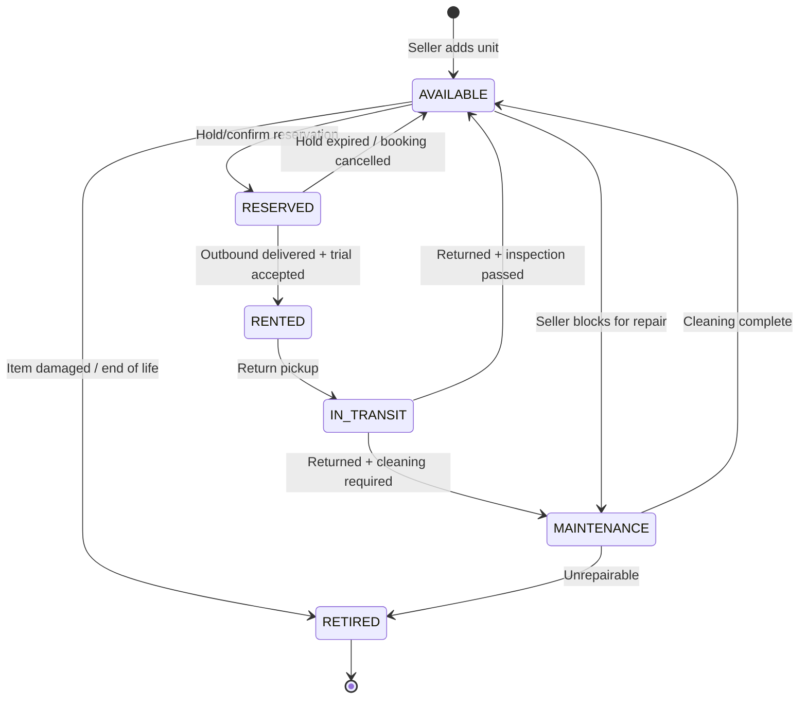

Every transition writes to `inventory_history`.

### 6.3 Reservation Strategy

| Reservation Type | When Created | TTL | Blocks Availability |
|---|---|---|---|
| **HOLD** | `POST /bookings` (create hold) | 15 minutes (Phase 3) | Yes |
| **CONFIRMED** | Payment captured | Until rental end + buffer | Yes |
| **BUFFER** | Auto after return | `cleaning_buffer_days` from Product | Yes |

**Date range semantics:**

- Rental period: `[rental_start_date, rental_end_date]` inclusive
- Effective block: `[rental_start_date, rental_end_date + cleaning_buffer_days]`
- HOLD uses same range; released on expiry or cancellation

### 6.4 Availability Engine

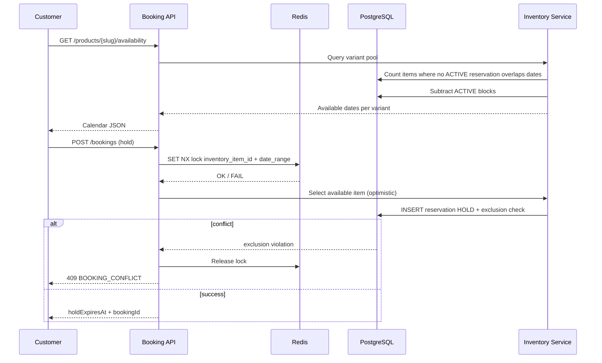

**Availability query (conceptual):**

For each `ProductVariant`, available count on date `D` = count of `InventoryItem` where:
- `status IN ('AVAILABLE', 'RESERVED')` — RESERVED only if not overlapping
- No `InventoryReservation` with `status='ACTIVE'` overlapping `D`
- No `InventoryBlock` with `status='ACTIVE'` overlapping `D`

### 6.5 Inventory Locking & Concurrent Booking Prevention

Three-layer defense (Phase 1 ADR-004):

| Layer | Mechanism | Purpose |
|---|---|---|
| **1. Redis** | `SET booking:hold:{variantId}:{dateHash} NX EX 900` | Fast fail under contention |
| **2. PostgreSQL** | `EXCLUDE USING gist (inventory_item_id WITH =, daterange(start_date, end_date, '[]') WITH &&) WHERE (status = 'ACTIVE')` | Authoritative no-overlap guarantee |
| **3. Application** | Serializable transaction around hold creation | Consistent item selection |

**Item selection algorithm:**

1. Lock variant in Redis
2. Begin serializable transaction
3. Select `InventoryItem` with fewest future reservations (load balancing) where no overlap
4. Insert `InventoryReservation` type HOLD
5. Commit
6. On payment: upgrade HOLD → CONFIRMED; assign `inventory_item_id` on `BookingItem`

### 6.6 Inventory History

Every event recorded in `inventory_history`:

| Event Type | Trigger |
|---|---|
| `ITEM_CREATED` | Seller adds inventory unit |
| `STATUS_CHANGED` | Any status transition |
| `CONDITION_UPDATED` | Post-rental inspection |
| `RESERVATION_CREATED` | Hold/confirm |
| `RESERVATION_RELEASED` | Cancel/expiry |
| `BLOCK_CREATED` / `BLOCK_REMOVED` | Seller calendar |
| `LOCATION_CHANGED` | Future warehouse move |

### 6.7 Warehouse Readiness (Future)

Reserved schema extension — no MVP implementation:

| Entity | Purpose |
|---|---|
| `Warehouse` | Seller or platform warehouse |
| `WarehouseLocation` | Bin/shelf within warehouse |
| `InventoryTransfer` | Move item between locations |

`inventory_item.warehouse_id` and `warehouse_location_id` FKs are nullable in MVP schema design.

### 6.8 Future Expansion

| Vertical | Inventory Implication |
|---|---|
| **Electronics** | Serial + IMEI; condition checklist JSON; mandatory deposit higher |
| **Furniture** | Bulky flag; extended buffer; warehouse storage |
| **Cameras** | Lens serials as child items (composition) |
| **Sports** | Seasonal availability rules |

CategoryAttribute drives variant axes; InventoryItem remains the universal physical unit.

---

## 7. Booking Model

### 7.1 Booking Ownership

| Role | Ownership |
|---|---|
| **Customer** | `booking.customer_id` — initiates, pays, trial accept/reject, requests return |
| **Seller** | `booking.seller_profile_id` — accepts/rejects, prepares, inspects |
| **Platform** | Orchestrates state machine, logistics, payments; no inventory ownership |
| **Inventory Item** | Assigned at hold; immutable after CONFIRMED |

### 7.2 Booking Lifecycle

Aligned with Phase 3 §18.2:

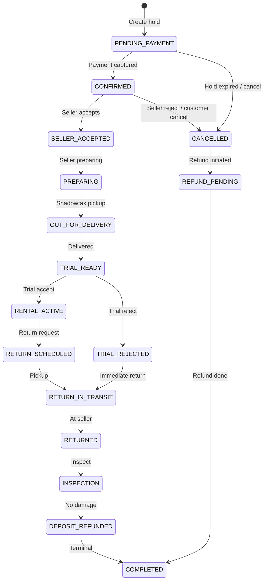

Each transition appends to `booking_timeline` and emits domain event.

### 7.3 Booking Timeline

`booking_timeline` is the **immutable customer-facing audit**. Fields:

- `status` — matches booking status at transition
- `label` — localized display string (API returns English MVP)
- `occurred_at` — event timestamp
- `actor_id` — user or NULL for system/webhook
- `metadata` — e.g. `{ "trackingNumber": "SFX123" }`

Timeline is **never updated or deleted** — corrections add new entries with explanatory metadata.

### 7.4 Trial Lifecycle

| Phase | DB State | TrialSession |
|---|---|---|
| Delivery complete | `TRIAL_READY` | `started_at` set; `expires_at = started_at + 15 min` |
| Customer accepts | `RENTAL_ACTIVE` | `outcome = ACCEPTED` |
| Customer rejects | `TRIAL_REJECTED` | `outcome = REJECTED`; triggers rental refund |
| No action | Auto-reject policy TBD | `outcome = EXPIRED` |

Trial is **mandatory for clothing** (`product.includes_trial = true`). Future verticals may set `includes_trial = false` — `trial_session` row omitted.

### 7.5 Cancellation

`booking_cancellation` records:

| Field | Description |
|---|---|
| `cancelled_by` | `CUSTOMER`, `SELLER`, `SYSTEM`, `ADMIN` |
| `reason_code` | Phase 3 enums |
| `refund_policy_applied` | JSON snapshot of tier rules |
| `rental_refund_amount` | Calculated |
| `deposit_refund_amount` | Usually full if pre-trial |
| `penalty_amount` | Seller compensation if applicable |

**Effects:** Release `InventoryReservation`; initiate `Refund` rows; transition to `CANCELLED` → `REFUND_PENDING`.

### 7.6 Return

`return_request` created when customer schedules return:

- Links `pickup_address_id` (usually same as delivery)
- Creates RETURN `Shipment` via Logistics domain
- Transitions: `RETURN_SCHEDULED` → `RETURN_IN_TRANSIT` → `RETURNED`

### 7.7 Extensions

`booking_extension` supports mid-rental extension:

| Status | Meaning |
|---|---|
| `REQUESTED` | Customer asks for N extra days |
| `PENDING_PAYMENT` | Additional charge calculated |
| `ACTIVE` | Paid; `rental_end_date` updated; reservation extended |
| `DECLINED` | Seller or availability conflict |

Extension modifies `inventory_reservation.end_date` atomically with payment.

### 7.8 Late Return Handling

| Scenario | Action |
|---|---|
| Grace period (configurable, e.g. 24h) | Warning notification; no charge |
| Late fee | `WalletTransaction` penalty to seller; customer charged via additional Payment |
| Severe delay | `SupportTicket` auto-created; deposit hold extended |
| Item lost | Deposit captured; `Inspection.result = LOST` |

Late policies stored in `platform_config`; applied amounts snapshotted on booking.

### 7.9 Security Deposit Linkage

| Stage | Deposit State |
|---|---|
| Payment captured | `deposit_component` in Payment; held by Razorpay |
| Trial rejected | Full deposit refund initiated immediately |
| Rental active | Deposit held |
| Inspection passed | `Refund` type DEPOSIT → `DEPOSIT_REFUNDED` status |
| Damage found | Partial deposit retention; remainder refunded via `Inspection.deposit_deduction` |

Deposit never passes through seller wallet — platform-held escrow model.

---

## 8. Payment Model

### 8.1 Payment Flow

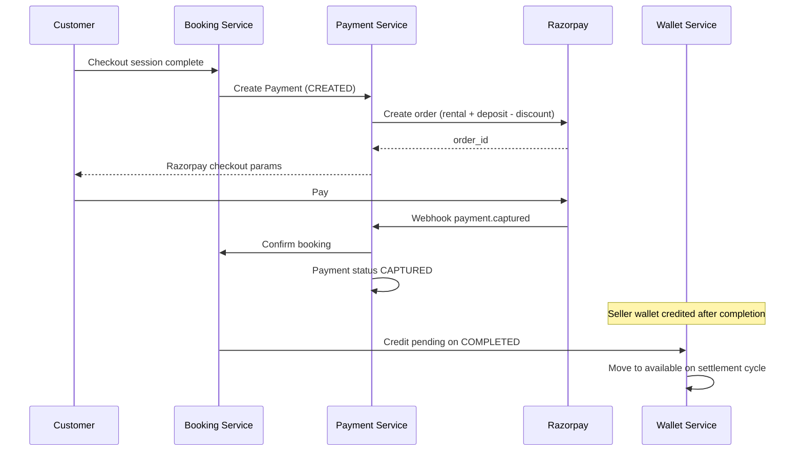

### 8.2 Payment Entity Roles

| payment_type | Description |
|---|---|
| `INITIAL` | Rental + deposit at checkout |
| `EXTENSION` | Additional rental days |
| `LATE_FEE` | Late return penalty |
| `ADJUSTMENT` | Admin manual charge |

Single Razorpay order combines rental + deposit (Phase 3 business rule — atomic confirmation).

### 8.3 Refund Model

| refund_type | When |
|---|---|
| `RENTAL` | Cancellation, trial reject |
| `DEPOSIT` | Post-inspection release |
| `FULL` | Seller reject, system cancel |
| `PARTIAL` | Partial cancellation tier |
| `PENALTY` | Reversal of incorrect charge |

Each refund links to `payment_id` and stores `provider_refund_id` for reconciliation. Multiple refunds per payment allowed (deposit + rental separate).

### 8.4 Commission

Created when booking reaches `COMPLETED`:

```
commission_amount = rental_amount * commission_rate
net_seller_earning = rental_amount - commission_amount - penalties
```

`commission_rate` snapshotted from `commission_rule` at booking confirmation. Category-based rules supported via `CommissionRule.category_id`.

### 8.5 Settlement & Wallet

| Balance | Meaning |
|---|---|
| `pending_balance` | Earnings from completed bookings not yet settled |
| `available_balance` | Ready for payout |

**Settlement cycle:** Seller initiates or auto-weekly → `Settlement` aggregates `SettlementLine` per booking → Razorpay Route/payout to `BankAccount` → `WalletTransaction` DEBIT_PAYOUT.

### 8.6 Future Payment Providers

| Extension Point | Design |
|---|---|
| `payment.provider_code` | `RAZORPAY`, future `STRIPE`, `PAYU` |
| `provider_order_id` / `provider_payment_id` | Provider-specific |
| `payment_provider_config` table (future) | API keys, webhook secrets per region |
| Gateway interface | Phase 1 ADR-005 — domain never imports Razorpay types |

### 8.7 Webhook Events

`payment_webhook_event` (append-only):

| Field | Purpose |
|---|---|
| `provider_code` | Source |
| `event_type` | e.g. `payment.captured`, `refund.processed` |
| `provider_event_id` | Idempotency key |
| `payload JSONB` | Raw body |
| `processed_at` | NULL until handled |
| `processing_status` | `PENDING`, `PROCESSED`, `FAILED`, `SKIPPED` |

### 8.8 Payment History

Immutable chain: `Payment` → `PaymentAttempt` (failures) → `Refund` → `AuditLog`. No UPDATE on financial amounts after capture — corrections via adjustment transactions.

---

## 9. Logistics Model

### 9.1 Shipment Types

| Type | Direction | Created When |
|---|---|---|
| `OUTBOUND` | Seller → Customer | Seller marks ready for pickup |
| `RETURN` | Customer → Seller | Return scheduled or trial rejected |

### 9.2 Shipment Lifecycle

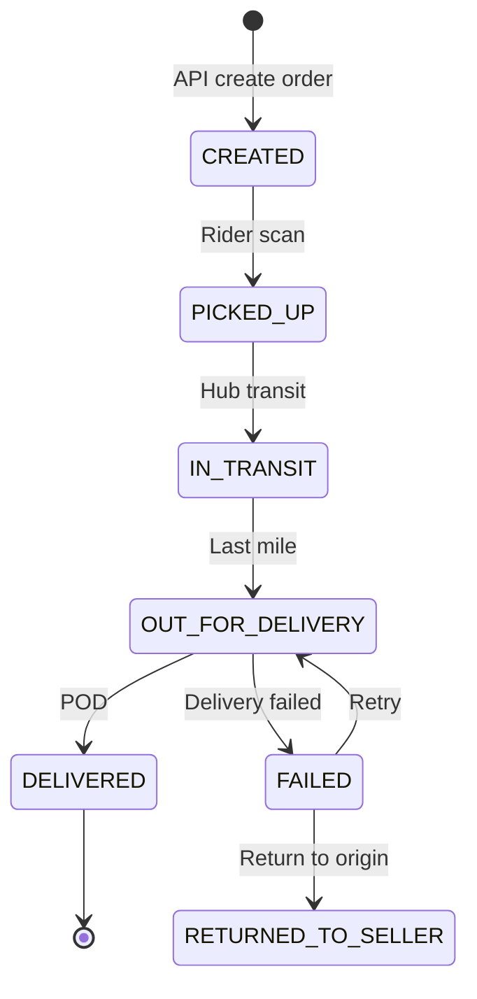

### 9.3 Shipment Events

Each webhook/status poll appends `shipment_event`:

- Idempotent on `provider_event_id`
- Drives booking state transitions (e.g. DELIVERED → `TRIAL_READY`)
- `raw_payload` preserved for dispute resolution

### 9.4 Tracking

Customer/seller API reads `shipment` + ordered `shipment_event`. Live agent info from latest provider API call — cached in Redis (`shipment:track:{id}`, TTL 60s).

### 9.5 Webhook Synchronization

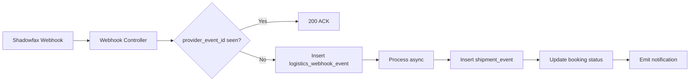

Signature verification required (Phase 3 §18.5).

### 9.6 Provider Abstraction

| Table | Role |
|---|---|
| `logistics_provider` | Registry: SHADOWFAX, future DELHIVERY, BORZO |
| `shipment.logistics_provider_id` | FK per shipment |
| `logistics_provider_config` (future) | Region, API credentials, priority |

Booking domain calls `LogisticsGateway.createShipment()` — never Shadowfax SDK directly.

### 9.7 Multiple Logistics Providers

Selection logic (future, config-driven):

1. Pincode pair serviceability matrix
2. Category constraints (furniture → different provider)
3. Cost/SLA optimization

Schema supports via `logistics_provider_id` per shipment — no booking table changes.

### 9.8 Failure Handling & Retry

| Failure | Strategy |
|---|---|
| Provider API timeout | Exponential backoff 3 attempts; `shipment.status = CREATION_FAILED` |
| Pickup failed | Seller notified; reschedule window |
| Delivery failed | `FAILED` status; max 3 retries then support ticket |
| Webhook processing error | `logistics_webhook_event.processing_status = FAILED`; retry job |

Dead letter queue for events failing > 5 attempts.

---

## 10. Review Model

### 10.1 Review Types

| Type | FK Populated | Constraint |
|---|---|---|
| **Product review** | `product_id`, `booking_id` | Verified purchase only |
| **Seller review** | `seller_profile_id`, `booking_id` | Same booking as product review |
| **Combined** | Both product and seller FKs | Single form, one row (recommended MVP) |

### 10.2 Review Images

`review_image` → `media_asset` (max 5 images per review, configurable).

### 10.3 Review Moderation

| Status | Visible |
|---|---|
| `PENDING` | Author only |
| `PUBLISHED` | Public |
| `HIDDEN` | Admin Suppressed |
| `FLAGGED` | Under review |

`review_moderation` append-only: moderator, action, reason, timestamp.

### 10.4 Aggregates

Product `avg_rating` / `review_count` and SellerProfile `avg_rating` updated asynchronously via domain event — avoid heavy JOINs on catalog browse. Denormalization acceptable here (see §13).

### 10.5 Review Rules

- One review per `booking_id` per author
- Only bookings in `COMPLETED` status
- Edit window: 7 days (updates create `review_moderation` entry; original preserved in audit)

---

## 11. Notification Model

### 11.1 Channels

| Channel | Storage | Delivery |
|---|---|---|
| **In-app** | `notification` table | Real-time via WebSocket/SSE (future) |
| **Push** | `notification_delivery` | Firebase FCM |
| **Email** | `notification_delivery` | SES/SendGrid |
| **SMS** | `notification_delivery` | MSG91/Twilio |

### 11.2 Notification Types

Aligned with Phase 3: `TRIAL_READY`, `OUT_FOR_DELIVERY`, `BOOKING_CONFIRMED`, `RETURN_SCHEDULED`, `DEPOSIT_REFUNDED`, `SELLER_NEW_BOOKING`, `SELLER_PAYOUT`, `PROMOTION`.

### 11.3 Preferences

`notification_preference`: `(user_id, notification_type, channel, enabled)`.

System-critical notifications (booking confirmed, trial ready) cannot be disabled — enforced in application layer.

### 11.4 Delivery History

`notification_delivery`:

| Field | Description |
|---|---|
| `notification_id` | Parent in-app record |
| `channel` | PUSH, EMAIL, SMS |
| `provider_message_id` | FCM/SMS gateway ID |
| `status` | QUEUED, SENT, DELIVERED, FAILED, BOUNCED |
| `attempt_count` | Retry tracking |
| `sent_at`, `delivered_at` | Timestamps |

### 11.5 Read Status

In-app: `notification.is_read`, `read_at`. Bulk mark-read updates by `user_id` + `created_at` cursor.

---

## 12. Audit Model

### 12.1 Audit Scope

All critical actions logged to `audit_log`:

| Category | Actions |
|---|---|
| **Booking** | CREATED, CONFIRMED, CANCELLED, STATUS_CHANGED, EXTENDED |
| **Inventory** | ITEM_CREATED, STATUS_CHANGED, RESERVATION_CREATED, BLOCK_CREATED |
| **Payment** | PAYMENT_CAPTURED, REFUND_INITIATED, REFUND_PROCESSED |
| **Settlement** | SETTLEMENT_CREATED, COMPLETED |
| **Seller** | APPLICATION_SUBMITTED, VERIFIED, SUSPENDED |
| **Admin** | MANUAL_OVERRIDE, CONFIG_CHANGED |
| **Review** | MODERATED, HIDDEN |

### 12.2 Audit Record Structure

```
audit_log:
  entity_type: 'BOOKING'
  entity_id: <uuid>
  action: 'STATUS_CHANGED'
  actor_id: <user or admin uuid>
  actor_type: 'USER' | 'SYSTEM' | 'ADMIN' | 'WEBHOOK'
  before_state: { "status": "CONFIRMED" }
  after_state: { "status": "SELLER_ACCEPTED" }
  correlation_id: <X-Request-Id>
  occurred_at: timestamptz
```

### 12.3 Domain-Specific History

| Domain | History Table | Why Separate |
|---|---|---|
| Booking | `booking_timeline` | Customer UX optimized |
| Inventory | `inventory_history` | Operational queries |
| Shipment | `shipment_event` | Provider sync |
| Payment | `payment_attempt`, `refund` | Financial reconciliation |
| Wallet | `wallet_transaction` | Ledger integrity |

### 12.4 Compliance

- **Retention:** 7 years financial; 2 years operational (configurable)
- **PII in audit:** Mask phone/email in `before_state`/`after_state` for non-admin readers
- **Immutability:** INSERT-only; DB permissions deny UPDATE/DELETE on audit tables

---

## 13. Normalization

### 13.1 First Normal Form (1NF)

| Rule | Application |
|---|---|
| Atomic columns | Address line fields separate; no comma-separated tags (use `product_tag`) |
| No repeating groups | Product images in `product_image`; variants in `product_variant` |
| Primary key on every table | UUID or BIGSERIAL |

### 13.2 Second Normal Form (2NF)

| Rule | Application |
|---|---|
| No partial dependencies | `booking_item` separates product snapshots from `booking` header |
| Composite keys | `user_role(user_id, role_id)` — attributes depend on full key |

### 13.3 Third Normal Form (3NF)

| Rule | Application |
|---|---|
| No transitive dependencies | Seller rating denormalized to `seller_profile.avg_rating` intentionally (see below) |
| Reference data isolated | `category`, `brand`, `logistics_provider` independent |
| Financial separation | Payment amounts not duplicated on booking except snapshotted totals |

### 13.4 Intentional Denormalization (Future / Selective)

| Location | Denormalized Field | Justification |
|---|---|---|
| `product` | `avg_rating`, `review_count` | Catalog browse performance |
| `seller_profile` | `avg_rating`, `total_bookings` | Seller card display |
| `booking` | `rental_amount`, `total_amount` | Immutable checkout snapshot |
| `booking_item` | `price_snapshot JSONB` | Product price may change |
| `category` | `depth`, `path` (materialized path) | Tree queries |

**Strategy:** Write-through on event; accept eventual consistency for aggregates; source of truth remains normalized tables.

### 13.5 Normalization vs Performance

| Query Pattern | Approach |
|---|---|
| Product listing | Denormalized ratings + Redis cache |
| Availability calendar | Real-time JOIN inventory_reservation — indexed, not cached |
| Seller dashboard | Read replica + materialized view (Phase 2 analytics) |
| Financial reports | jOOQ/read replica querying normalized payment/refund |

---

## 14. Future Readiness

### 14.1 Multi-Vertical Expansion

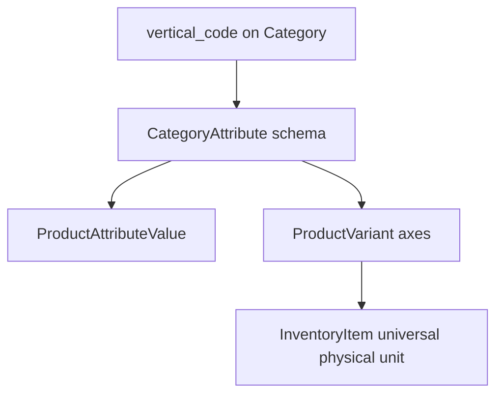

| Vertical | Schema Lever |
|---|---|
| **Electronics** | Attributes: `storage_gb`, `warranty_months`; condition checklist JSON on InventoryItem |
| **Furniture** | Attributes: `dimensions_cm`, `weight_kg`; `bulky_shipping` flag on Product |
| **Cameras** | Kit composition: `inventory_item_parent_id` self-FK for lens/body bundles |
| **Luxury Accessories** | Authentication cert as MediaAsset; higher deposit rules via CommissionRule |
| **Sports Equipment** | Seasonal pricing via `product_seasonal_price` extension table |

**No change to:** Booking, Payment, Shipment core tables.

### 14.2 Warehouse Management

| Addition | Purpose |
|---|---|
| `warehouse` | Physical storage locations |
| `warehouse_location` | Bin-level tracking |
| `inventory_transfer` | Movement audit |
| `pick_list` / `pick_list_item` | Fulfillment operations |

`inventory_item.warehouse_id` FK already reserved.

### 14.3 International Expansion

| Concern | Schema Support |
|---|---|
| Multi-currency | `currency_code` on Product, Booking, Payment, Wallet |
| Exchange rates | `exchange_rate` table (date, from, to, rate) |
| Regions | `region` → `serviceable_pincode` generalizes to postal codes |
| Tax | `tax_line` on Booking (GST today; VAT future) |
| Localization | Content tables `product_translation` (product_id, locale, title, description) |

### 14.4 Insurance

| Entity | Purpose |
|---|---|
| `insurance_policy` | Optional coverage per booking |
| `insurance_claim` | Damage claim workflow |

Links to `booking_id`; premium as separate `payment_type`.

### 14.5 Subscriptions

| Entity | Purpose |
|---|---|
| `subscription_plan` | Monthly rental allowance |
| `user_subscription` | Active subscription |
| `subscription_usage` | Bookings against quota |

Booking references `user_subscription_id` nullable — discount engine adjustment.

### 14.6 AI Recommendations

| Approach | Schema |
|---|---|
| Event collection | `user_event` (view, wishlist, book) — analytics domain |
| Feature store | External (Redis/Vector DB); not in transactional PG |
| Recommendations | No schema change — reads catalog + events |

### 14.7 Dynamic Pricing

| Entity | Purpose |
|---|---|
| `pricing_rule` | Seller or platform rules (demand, seasonality) |
| `price_override` | Date-specific price on ProductVariant |

`booking_item.price_snapshot` preserves historical pricing regardless.

### 14.8 Multiple Logistics Providers

Already supported via `logistics_provider_id` on `shipment` and gateway pattern. Future: `serviceability_matrix(provider, origin_pin, dest_pin, category)`.

### 14.9 Extensibility Summary

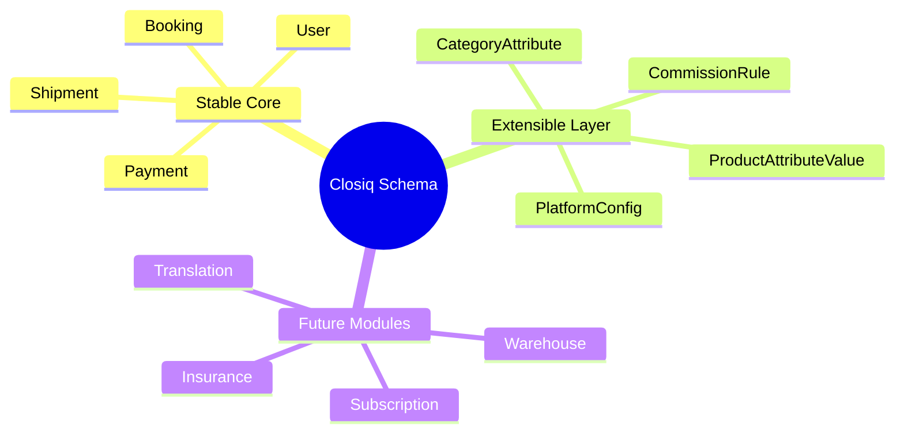

---

## 15. Appendix

### 15.1 Naming Conventions

| Object | Convention | Example |
|---|---|---|
| Tables | snake_case, plural | `inventory_items` |
| PK column | `id` | UUID |
| FK column | `{entity}_id` | `seller_profile_id` |
| Indexes | `idx_{table}_{columns}` | `idx_booking_customer` |
| Enums | SCREAMING_SNAKE in DB check constraints | `PENDING_PAYMENT` |
| Timestamps | `_at` suffix | `created_at`, `confirmed_at` |
| Booleans | `is_` prefix | `is_default` |
| Money | `_amount` suffix | `rental_amount` |

### 15.2 Standard Enum Reference

#### Booking Status (16 values)

`PENDING_PAYMENT`, `CONFIRMED`, `SELLER_ACCEPTED`, `PREPARING`, `OUT_FOR_DELIVERY`, `TRIAL_READY`, `TRIAL_REJECTED`, `RENTAL_ACTIVE`, `RETURN_SCHEDULED`, `RETURN_IN_TRANSIT`, `RETURNED`, `INSPECTION`, `DEPOSIT_REFUNDED`, `COMPLETED`, `CANCELLED`, `REFUND_PENDING`

#### Inventory Item Status

`AVAILABLE`, `RESERVED`, `RENTED`, `IN_TRANSIT`, `MAINTENANCE`, `RETIRED`

#### Payment Status

`CREATED`, `AUTHORIZED`, `CAPTURED`, `FAILED`, `REFUNDED`, `PARTIALLY_REFUNDED`

### 15.3 Redis Key Patterns

| Key | TTL | Purpose |
|---|---|---|
| `booking:hold:{variantId}:{dateHash}` | 900s | Variant-level hold lock |
| `booking:item:{inventoryItemId}` | 30s | Item selection mutex |
| `availability:{variantId}:{month}` | 300s | Calendar cache |
| `shipment:track:{shipmentId}` | 60s | Tracking cache |
| `otp:rate:{phone}` | 3600s | OTP rate limit |
| `idempotency:{key}` | 86400s | POST deduplication |

### 15.4 Implementation Order (Recommended)

| Phase | Tables | Unblocks |
|---|---|---|
| 1 | user, role, address, otp_session | Auth APIs |
| 2 | category, brand, product, variant, media | Catalog APIs |
| 3 | inventory_item, reservation, block | Availability + seller inventory |
| 4 | booking, booking_item, timeline, checkout_session | Booking hold |
| 5 | payment, refund | Checkout |
| 6 | shipment, shipment_event, logistics_provider | Fulfillment |
| 7 | wallet, commission, settlement | Seller payouts |
| 8 | review, notification, audit_log | Trust + comms |

### 15.5 Traceability Matrix

| Phase 3 API Domain | Primary Tables |
|---|---|
| Auth | user, otp_session, refresh_token |
| User | user, user_profile, address, wishlist_item |
| Seller | seller_profile, seller_application, kyc_document, bank_account, wallet |
| Product | product, product_variant, product_image, category |
| Booking | booking, booking_item, booking_timeline, trial_session |
| Checkout | checkout_session, coupon, coupon_redemption |
| Payment | payment, refund |
| Shipment | shipment, shipment_event |
| Review | review, review_image |
| Notifications | notification, notification_preference, notification_delivery |

### 15.6 Open Decisions (Inherited from Phase 3)

| # | Decision | Schema Impact |
|---|---|---|
| 1 | Minimum rental period | `product.min_rental_days` default 1 |
| 2 | Deposit refund SLA | `refund.expected_by` calculation |
| 3 | Commission model | `commission_rule` seed data |
| 4 | Cancellation tiers | `booking_cancellation.refund_policy_applied` JSON |
| 5 | Seller accept SLA | Scheduled job referencing `booking.confirmed_at` |

### 15.7 Document Changelog

| Version | Date | Changes |
|---|---|---|
| 1.0 | 2026-08-04 | Initial database & domain design — Phase 4 |

---

*This document is the single source of truth for database and domain implementation. Backend engineers should derive JPA entities, Flyway migrations, and repository interfaces from this specification — not the reverse.*
