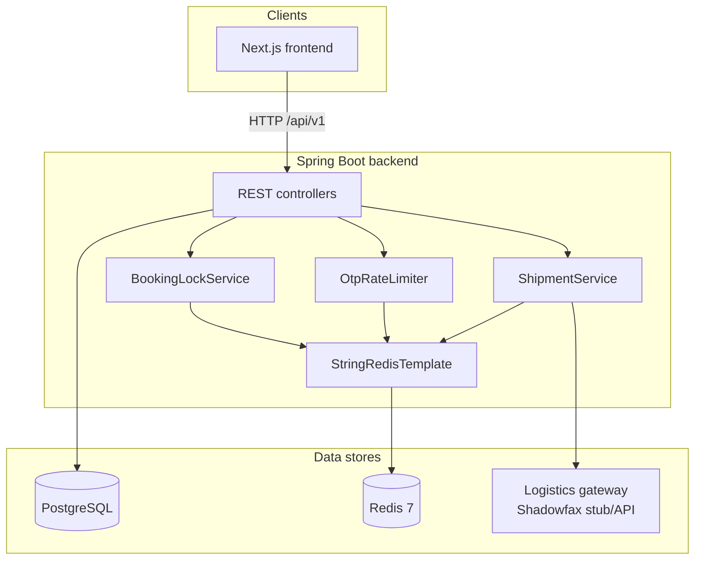
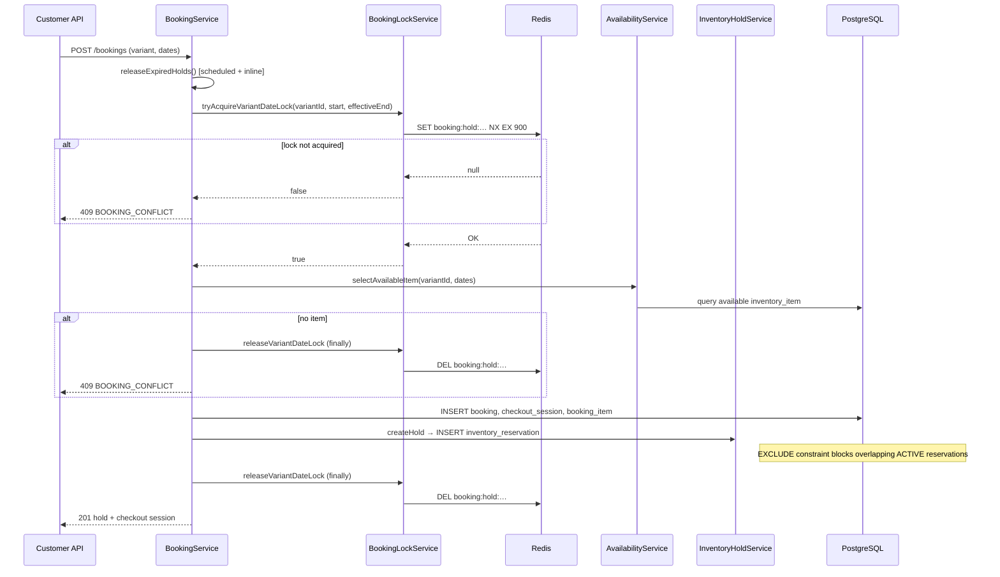
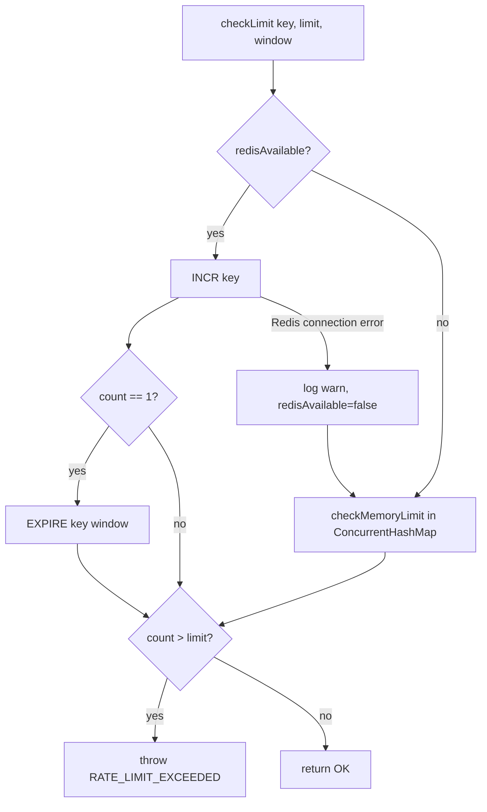
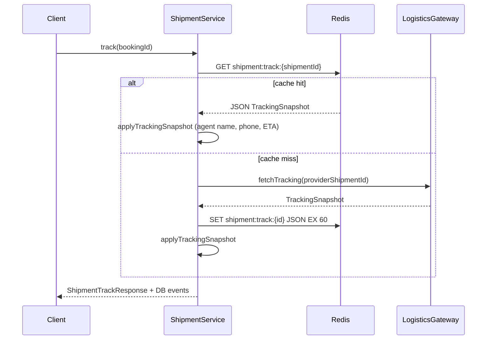

# Redis in Closiq — Full Flow Reference

Redis is used **only by the Spring Boot backend**. The Next.js frontend does not connect to Redis. All Redis traffic goes through `StringRedisTemplate` (Spring Data Redis with the default Lettuce client).

Closiq uses Redis as a **fast, ephemeral sidecar** for three production concerns:

| Use case | Service | Redis operation | Fallback if Redis fails |
|---|---|---|---|
| Booking concurrency | `BookingLockService` | `SET NX` with TTL | Request fails (`BOOKING_CONFLICT`) — no fallback |
| OTP abuse prevention | `OtpRateLimiter` | `INCR` + `EXPIRE` | In-memory `ConcurrentHashMap` per JVM |
| Shipment tracking cache | `ShipmentService` | `GET` / `SET` with TTL | Skips cache; calls logistics API every time |

PostgreSQL remains the **source of truth** for bookings, inventory holds, OTP sessions, and shipments. Redis never stores durable business data.

---

## Architecture overview



---

## Infrastructure & configuration

### Local / Docker

`docker-compose.yml` runs **Redis 7 Alpine** on port **6379**:

```yaml
redis:
  image: redis:7-alpine
  container_name: closiq-redis
  ports:
    - "6379:6379"
```

The backend container receives:

| Env var | Docker value | Default (local dev) |
|---|---|---|
| `REDIS_HOST` | `redis` | `localhost` |
| `REDIS_PORT` | `6379` | `6379` |
| `REDIS_PASSWORD` | _(unset)_ | empty |
| `REDIS_SSL` | _(unset)_ | `false` |

Start Redis locally:

```bash
docker compose up -d redis
```

### Spring configuration

Redis settings live in profile-specific property files:

| Profile | File | Redis properties |
|---|---|---|
| `dev` | `application-dev.properties` | host, port, password, SSL |
| `test` | `application-test.properties` (gitignored; copy from `.example`) | host, port |

```properties
spring.data.redis.host=${REDIS_HOST:localhost}
spring.data.redis.port=${REDIS_PORT:6379}
spring.data.redis.password=${REDIS_PASSWORD:}
spring.data.redis.ssl.enabled=${REDIS_SSL:false}
```

IntelliJ run config **Closiq Backend (dev - local)** sets `REDIS_HOST=localhost` and `REDIS_PORT=6379`.

### Dependency & bean wiring

**Maven:** `spring-boot-starter-data-redis` in `backend/pom.xml`.

**Config class:** `RedisConfig` exposes a single bean:

```java
@Bean
public StringRedisTemplate stringRedisTemplate(RedisConnectionFactory connectionFactory) {
    return new StringRedisTemplate(connectionFactory);
}
```

Spring Boot auto-configures `RedisConnectionFactory` (Lettuce) from `spring.data.redis.*`. No custom serializers, connection pooling, or cluster setup — plain string keys and values.

### Related app settings (not Redis keys, but tied to TTL behavior)

| Property | Default | Used by |
|---|---|---|
| `closiq.booking.hold-ttl-minutes` | `15` | Redis lock TTL + DB `hold_expires_at` |
| `closiq.booking.hold-expiry-poll-ms` | `60000` | Scheduled job to cancel expired holds (PostgreSQL only) |
| `closiq.otp.expiry-seconds` | `300` | OTP session row in PostgreSQL |
| `closiq.otp.resend-cooldown-seconds` | `60` | API response hint (not Redis) |

---

## Redis key catalog (implemented)

| Key pattern | Example | TTL | Value | Writer | Reader |
|---|---|---|---|---|---|
| `booking:hold:{variantId}:{start}:{end}` | `booking:hold:019…:2026-08-15:2026-08-18` | 15 min | `"1"` | `BookingLockService` | same |
| `otp:send:{phone}` | `otp:send:+919876543210` | 15 min (on first incr) | counter string | `OtpRateLimiter` | same |
| `otp:verify:{phone}` | `otp:verify:+919876543210` | 15 min (on first incr) | counter string | `OtpRateLimiter` | same |
| `shipment:track:{shipmentId}` | `shipment:track:019…` | 60 sec | JSON `TrackingSnapshot` | `ShipmentService` | same |

### Planned in design docs but **not implemented**

From `docs/PHASE-4-DATABASE-DOMAIN-DESIGN.md` §15.3 — these keys do not exist in code today:

- `booking:item:{inventoryItemId}` — item selection mutex
- `availability:{variantId}:{month}` — calendar cache
- `otp:rate:{phone}` — superseded by separate `otp:send` / `otp:verify` keys
- `idempotency:{key}` — idempotency is stored on the `booking` row in PostgreSQL

---

## Flow 1 — Booking hold lock (double-booking prevention)

**ADR-004 layered defense:** Redis lock → PostgreSQL availability check → PostgreSQL exclusion constraint on `inventory_reservation`.

### Entry point

`POST /api/v1/bookings` → `BookingService.createHold()`

### Sequence



### Lock details

**Key:** `booking:hold:{variantId}:{startDate}:{effectiveEndDate}`

- `effectiveEndDate` = rental end date + product `cleaningBufferDays`
- **Acquire:** `setIfAbsent(key, "1", holdTtlMinutes)` — atomic SET NX with expiry
- **Release:** explicit `DELETE` in a `finally` block after hold creation

The lock is held **only for the duration of the transaction** (milliseconds), not for the full 15-minute checkout window. Its job is to serialize concurrent hold attempts for the same variant + date range so two requests do not pass availability checks at the same time.

The **15-minute hold window** is enforced by:

1. Redis key TTL (if lock were ever left behind — normally deleted immediately)
2. `booking.hold_expires_at` in PostgreSQL
3. `inventory_reservation.hold_expires_at` + `BookingHoldExpiryService` scheduled job (every 60s)

### PostgreSQL safety net

`V6__inventory_schema.sql` defines a **GiST exclusion constraint** on `inventory_reservation` date ranges. Even if Redis fails open, overlapping active reservations cannot commit.

---

## Flow 2 — OTP rate limiting

**Entry points:**

| Action | Code path | Rate limit check |
|---|---|---|
| Send OTP (register / login / reset) | `OtpService.createSession()` | `checkSendAllowed(phone)` |
| Verify OTP | `AuthService.verifyOtp()` | `checkVerifyAllowed(phone)` |

### Limits

| Key prefix | Window | Max requests | Error |
|---|---|---|---|
| `otp:send:{phone}` | 15 minutes | 5 | `RATE_LIMIT_EXCEEDED` |
| `otp:verify:{phone}` | 15 minutes | 10 | `RATE_LIMIT_EXCEEDED` |

### Algorithm



**Redis path:** `INCR` then `EXPIRE` on first increment (fixed window counter).

**Fallback path:** per-JVM `ConcurrentHashMap` with the same window semantics. Once Redis errors, `redisAvailable` flips to `false` for the lifetime of that process — all subsequent checks use memory only (not shared across instances).

OTP **session state** (hash, expiry, attempts) lives in PostgreSQL (`otp_session` table), not Redis.

---

## Flow 3 — Shipment tracking cache

**Entry point:** `GET /api/v1/bookings/{id}/shipments/track` → `ShipmentService.track()`

When a shipment has a `providerShipmentId`, the service enriches the response with live agent info from the logistics provider.

### Sequence



**Key:** `shipment:track:{shipmentId}`  
**TTL:** 60 seconds (`Duration.ofSeconds(60)`)  
**Value:** JSON serialized `TrackingSnapshot` (`agentName`, `agentPhoneMasked`, `estimatedDeliveryAt`)

Shipment **status events** always come from PostgreSQL (`shipment_event` table). Redis only caches the optional live agent/ETA fields from the external API.

If Redis read/write fails, the catch block logs at debug and the request still succeeds (may hit the logistics API more often).

---

## Failure modes & operational notes

| Scenario | Booking lock | OTP limiter | Shipment cache |
|---|---|---|---|
| Redis down at startup | App starts; lock ops throw → hold fails | Falls back to in-memory after first error | Uncached API calls |
| Redis slow | Hold latency increases | Same | Slower track responses |
| Multiple backend instances | Locks work cluster-wide | Rate limits shared cluster-wide | Cache shared cluster-wide |
| Lock deleted in `finally` before TX commits | Another request could start; PG constraint still prevents double book | — | — |

**Health checks:** Actuator exposes `/actuator/health` but Redis is not explicitly configured as a health indicator in `application.properties`. Backend Docker healthcheck only probes HTTP UP.

**No Redis persistence requirement:** All keys are ephemeral. Losing Redis data does not corrupt PostgreSQL; worst case is extra API calls or briefly weaker OTP limits on fallback.

---

## Testing

Integration test `AuthIntegrationTest` spins up Testcontainers:

- `postgres:16-alpine`
- `redis:7-alpine` (generic container, port 6379)

Dynamic properties wire `spring.data.redis.host` and `spring.data.redis.port` to the container.

`pom.xml` also declares `testcontainers-redis` (2.2.2) though the current test uses `GenericContainer` directly.

Unit tests mock `OtpRateLimiter` in `OtpServiceTest`; booking and shipment Redis usage are not covered by dedicated unit tests.

---

## Quick reference — source files

| File | Role |
|---|---|
| `backend/src/main/java/com/closiq/config/RedisConfig.java` | `StringRedisTemplate` bean |
| `backend/src/main/java/com/closiq/booking/service/BookingLockService.java` | Hold lock acquire/release |
| `backend/src/main/java/com/closiq/booking/service/BookingService.java` | Orchestrates lock + DB hold |
| `backend/src/main/java/com/closiq/booking/service/BookingHoldExpiryService.java` | Expired hold cleanup (PG only) |
| `backend/src/main/java/com/closiq/identity/service/OtpRateLimiter.java` | OTP send/verify limits |
| `backend/src/main/java/com/closiq/shipment/service/ShipmentService.java` | Tracking cache |
| `docker-compose.yml` | Redis service definition |
| `backend/src/main/resources/application-dev.properties` | Dev Redis connection |
| `backend/src/main/resources/application-test.properties.example` | Test Redis connection template |

---

## Summary

Redis in Closiq is intentionally narrow: **three string-key patterns**, no pub/sub, no sessions in Redis, no catalog cache yet. It provides fast mutual exclusion during booking holds, distributed OTP throttling with a single-node fallback, and a 60-second cache for logistics tracking snapshots. Durability and correctness always fall back to PostgreSQL constraints and scheduled expiry jobs.
